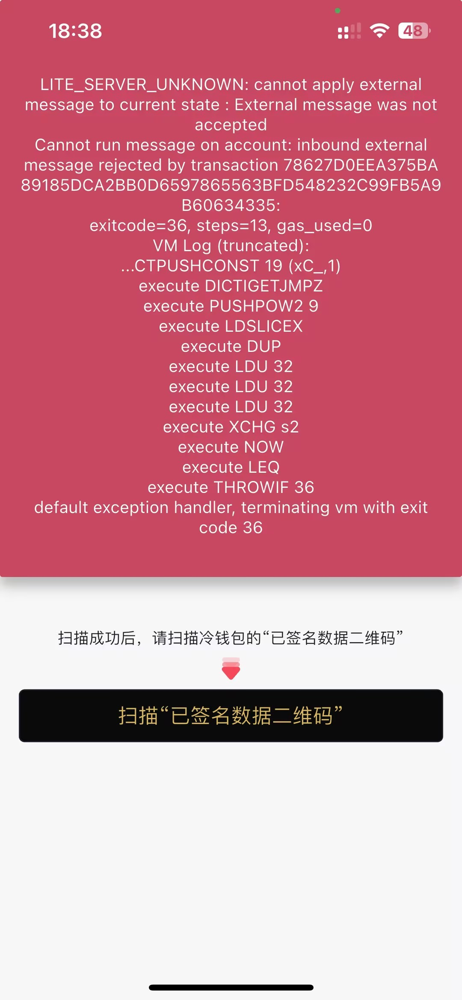

# 手机扫码冷钱包时错误



```
{
  "type": "send",
  "httpBody": {
    "cType": "TON",
    "from": "UQB4Yn0O6jdbqJGF3KK7DWWXhlVjv9VIIyyZ-1qbYGNDNYvf",
    "to": "EQDOPm18wZzLBbhwkR04A2ogbIJr7lZnuC2F8VW1N6wORSXV",
    "amount": "3870979000",
    "fee": "4694900",
    "orderID": "ewtndfa33140a3954e7792fcb2b163c5964e",
    "gasPrice": "4694900",
    "gasLimit": "0",
    "pubkey": "6C3D8CB33CFB2AC70F220AFEBD2C24636E19DC510F05B24DB0D8C79BFB24E14B",
    "sig": "933D20BECA98D226DF5E03A68370562887300168FFB95BCF6B02BE9CD166A4F39000CE5679388B8A3584D51FFE50E88525BBC21FE1D8E07BEB66B2CBEC8F6204",
    "tx": "0x0a011c29a9a317671b6d58000000020003000000686200671f36be60ce6582dc38488e9c01b510364135f72b33dc16c2f8aada9bd60722a735d39dc000000000000000000000000000",
    "tx_unsigned": "0x0a011c29a9a317671b6d58000000020003000000686200671f36be60ce6582dc38488e9c01b510364135f72b33dc16c2f8aada9bd60722a735d39dc000000000000000000000000000",
    "gLang": "zh-cn",
    "newLange": "zh-cn",
    "version": "v2",
    "gVersion": "262",
    "gJpushID": "dpD8NC7j1EpsvLVAoMeVYi:APA91bHvbe95kvYEBntYDqL4cOTsWyzicdry1KjESKLm1T7Q_KpHEijX1hOBUWpfhx_-rJ9cNrk3p1-ilL-G5TfJYrrff1IHuMNbp2S5PhMbcAswUZLcCxIf9SU9JIX7xD0D1VpZsi9X",
    "gDeviceID": "CFB0EB45-BD87-4601-AA80-9009B3D453B4",
    "gApikey": "59f5b60196e501c5861f1e305d0533fa",
    "gPlatform": "iOS",
    "walletType": "c_EC02_V4.2.0",
    "currency": "USD",
    "did": "4FC478CDA7A0D901D615E129BF65DB496DBDD64A"
  },
  "nodeReqData": {
    "from": "UQB4Yn0O6jdbqJGF3KK7DWWXhlVjv9VIIyyZ-1qbYGNDNYvf",
    "masteraddress": "",
    "orderID": "ewtndfa33140a3954e7792fcb2b163c5964e",
    "payload": "",
    "pubkey": "6C3D8CB33CFB2AC70F220AFEBD2C24636E19DC510F05B24DB0D8C79BFB24E14B",
    "sig": "933D20BECA98D226DF5E03A68370562887300168FFB95BCF6B02BE9CD166A4F39000CE5679388B8A3584D51FFE50E88525BBC21FE1D8E07BEB66B2CBEC8F6204",
    "to": "EQDOPm18wZzLBbhwkR04A2ogbIJr7lZnuC2F8VW1N6wORSXV",
    "tx": "0x0a011c29a9a317671b6d58000000020003000000686200671f36be60ce6582dc38488e9c01b510364135f72b33dc16c2f8aada9bd60722a735d39dc000000000000000000000000000",
    "type": 1,
    "value": "3870979000"
  },
  "nodeRespData": {
    "status": "error",
    "code": 50300,
    "msg": "LITE_SERVER_UNKNOWN: cannot apply external message to current state : External message was not accepted\nCannot run message on account: inbound external message rejected by transaction 78627D0EEA375BA89185DCA2BB0D6597865563BFD548232C99FB5A9B60634335:\nexitcode=36, steps=13, gas_used=0\nVM Log (truncated):\n...CTPUSHCONST 19 (xC_,1)\nexecute DICTIGETJMPZ\nexecute PUSHPOW2 9\nexecute LDSLICEX\nexecute DUP\nexecute LDU 32\nexecute LDU 32\nexecute LDU 32\nexecute XCHG s2\nexecute NOW\nexecute LEQ\nexecute THROWIF 36\ndefault exception handler, terminating vm with exit code 36\n"
  }
}
```


**签名有问题**

签名值: 0000

```
{
  "type": "send",
  "httpBody": {
    "cType": "TON",
    "from": "UQB4Yn0O6jdbqJGF3KK7DWWXhlVjv9VIIyyZ-1qbYGNDNYvf",
    "to": "UQBtqskeY7QjdtDXTQ-yeerptWkw3BZDaDxUCck2sYvtsk7M",
    "amount": "300000000",
    "fee": "4630029",
    "gasPrice": "4630029",
    "gasLimit": "21000",
    "pubkey": "6c3d8cb33cfb2ac70f220afebd2c24636e19dc510f05b24db0d8c79bfb24e14b",
    "sig": "00000000000000000000000000000000000000000000000000000000000000000000000000000000000000000000000000000000000000000000000000000000",
    "tx": "0x0a011c29a9a317671b74ee00000003000300000068420036d5648f31da11bb686ba687d93cf574dab4986e0b21b41e2a04e49b58c5f6d9208f0d180000000000000000000000000000",
    "tx_unsigned": "0x0a011c29a9a317671b74ee00000003000300000068420036d5648f31da11bb686ba687d93cf574dab4986e0b21b41e2a04e49b58c5f6d9208f0d180000000000000000000000000000",
    "gLang": "zh-cn",
    "newLange": "zh-cn",
    "version": "v2",
    "gVersion": "262",
    "gJpushID": "fd0zjnfaHE0rgqVfqbxr_y:APA91bFhmDAiXP39K0a7HqmwZtsSNbRUjnxxnHkTyvgJMTw-k-vzIkpIN53rw013yzFH3YbrO372SnfzUePBEl9ZmnqwTWh2Jyecf3tK9g-4x7jUnFrSUjThEX0aTLGDts8bFApcgX5j",
    "gDeviceID": "C741257E-0707-44EC-A132-E569CA69EE8C",
    "gApikey": "59f5b60196e501c5861f1e305d0533fa",
    "gPlatform": "iOS",
    "walletType": "h_1",
    "currency": "USD"
  },
  "nodeReqData": {
    "from": "UQB4Yn0O6jdbqJGF3KK7DWWXhlVjv9VIIyyZ-1qbYGNDNYvf",
    "masteraddress": "",
    "orderID": "",
    "payload": "",
    "pubkey": "6c3d8cb33cfb2ac70f220afebd2c24636e19dc510f05b24db0d8c79bfb24e14b",
    "sig": "00000000000000000000000000000000000000000000000000000000000000000000000000000000000000000000000000000000000000000000000000000000",
    "to": "UQBtqskeY7QjdtDXTQ-yeerptWkw3BZDaDxUCck2sYvtsk7M",
    "tx": "0x0a011c29a9a317671b74ee00000003000300000068420036d5648f31da11bb686ba687d93cf574dab4986e0b21b41e2a04e49b58c5f6d9208f0d180000000000000000000000000000",
    "type": 1,
    "value": "300000000"
  },
  "nodeRespData": {
    "status": "error",
    "code": 50300,
    "msg": "LITE_SERVER_UNKNOWN: cannot apply external message to current state : External message was not accepted\nCannot run message on account: inbound external message rejected by transaction 78627D0EEA375BA89185DCA2BB0D6597865563BFD548232C99FB5A9B60634335:\nexitcode=36, steps=13, gas_used=0\nVM Log (truncated):\n...CTPUSHCONST 19 (xC_,1)\nexecute DICTIGETJMPZ\nexecute PUSHPOW2 9\nexecute LDSLICEX\nexecute DUP\nexecute LDU 32\nexecute LDU 32\nexecute LDU 32\nexecute XCHG s2\nexecute NOW\nexecute LEQ\nexecute THROWIF 36\ndefault exception handler, terminating vm with exit code 36\n"
  }
}
```


# 兑出失败

兑出代币已经扣除, 但是兑入代币没有增加


req

```json
{
  "type": "req",
  "httpBody": {
    "cType": "TON",
    "from": "UQB4Yn0O6jdbqJGF3KK7DWWXhlVjv9VIIyyZ-1qbYGNDNYvf",
    "to": "EQDOPm18wZzLBbhwkR04A2ogbIJr7lZnuC2F8VW1N6wORSXV",
    "amount": "5000000000",
    "fee": "5949658",
    "gasPrice": "5949658",
    "gasLimit": "0",
    "pubkey": "6C3D8CB33CFB2AC70F220AFEBD2C24636E19DC510F05B24DB0D8C79BFB24E14B",
    "gLang": "zh-cn",
    "newLange": "zh-cn",
    "version": "v2",
    "gVersion": "262",
    "gJpushID": "dpD8NC7j1EpsvLVAoMeVYi:APA91bHvbe95kvYEBntYDqL4cOTsWyzicdry1KjESKLm1T7Q_KpHEijX1hOBUWpfhx_-rJ9cNrk3p1-ilL-G5TfJYrrff1IHuMNbp2S5PhMbcAswUZLcCxIf9SU9JIX7xD0D1VpZsi9X",
    "gDeviceID": "CFB0EB45-BD87-4601-AA80-9009B3D453B4",
    "gApikey": "59f5b60196e501c5861f1e305d0533fa",
    "gPlatform": "iOS",
    "walletType": "c_EC02+_V4.2.0.2",
    "currency": "USD",
    "did": "4FC478CDA7A0D901D615E129BF65DB496DBDD64A"
  },
  "nodeReqData": {
    "from": "UQB4Yn0O6jdbqJGF3KK7DWWXhlVjv9VIIyyZ-1qbYGNDNYvf",
    "masteraddress": "",
    "payload": "",
    "pubkey": "6C3D8CB33CFB2AC70F220AFEBD2C24636E19DC510F05B24DB0D8C79BFB24E14B",
    "to": "EQDOPm18wZzLBbhwkR04A2ogbIJr7lZnuC2F8VW1N6wORSXV",
    "type": 1,
    "value": "5000000000"
  },
  "nodeRespData": {
    "status": "ok",
    "hash": "e6fbf843d5a5afac22dc9dc4c82d846192a3e26cfbecb1274a2793b564146e42",
    "tx_unsigned": "0x0a011c29a9a317671b79b70000000400030000006a6200671f36be60ce6582dc38488e9c01b510364135f72b33dc16c2f8aada9bd60722a809502f900000000000000000000000000000"
  }
}
```


send

```json
{
  "type": "send",
  "httpBody": {
    "cType": "TON",
    "from": "UQB4Yn0O6jdbqJGF3KK7DWWXhlVjv9VIIyyZ-1qbYGNDNYvf",
    "to": "EQDOPm18wZzLBbhwkR04A2ogbIJr7lZnuC2F8VW1N6wORSXV",
    "amount": "5000000000",
    "fee": "5949658",
    "orderID": "ewtn39285618f3aa4d84a1184d0aead45c59",
    "gasPrice": "5949658",
    "gasLimit": "0",
    "pubkey": "6C3D8CB33CFB2AC70F220AFEBD2C24636E19DC510F05B24DB0D8C79BFB24E14B",
    "sig": "A9223C3CE9E56965D4DFF7CCD93C2EACFF60137F092A8A58847F2F3E03492722BE284AC72C25C6B1F1AEA51B6E80C3DF8A7DB9FBDF6BA29B7BCF503C07F61305",
    "tx": "0x0a011c29a9a317671b79b70000000400030000006a6200671f36be60ce6582dc38488e9c01b510364135f72b33dc16c2f8aada9bd60722a809502f900000000000000000000000000000",
    "tx_unsigned": "0x0a011c29a9a317671b79b70000000400030000006a6200671f36be60ce6582dc38488e9c01b510364135f72b33dc16c2f8aada9bd60722a809502f900000000000000000000000000000",
    "gLang": "zh-cn",
    "newLange": "zh-cn",
    "version": "v2",
    "gVersion": "262",
    "gJpushID": "dpD8NC7j1EpsvLVAoMeVYi:APA91bHvbe95kvYEBntYDqL4cOTsWyzicdry1KjESKLm1T7Q_KpHEijX1hOBUWpfhx_-rJ9cNrk3p1-ilL-G5TfJYrrff1IHuMNbp2S5PhMbcAswUZLcCxIf9SU9JIX7xD0D1VpZsi9X",
    "gDeviceID": "CFB0EB45-BD87-4601-AA80-9009B3D453B4",
    "gApikey": "59f5b60196e501c5861f1e305d0533fa",
    "gPlatform": "iOS",
    "walletType": "c_EC02+_V4.2.0.2",
    "currency": "USD",
    "did": "4FC478CDA7A0D901D615E129BF65DB496DBDD64A"
  },
  "nodeReqData": {
    "from": "UQB4Yn0O6jdbqJGF3KK7DWWXhlVjv9VIIyyZ-1qbYGNDNYvf",
    "masteraddress": "",
    "orderID": "ewtn39285618f3aa4d84a1184d0aead45c59",
    "payload": "",
    "pubkey": "6C3D8CB33CFB2AC70F220AFEBD2C24636E19DC510F05B24DB0D8C79BFB24E14B",
    "sig": "A9223C3CE9E56965D4DFF7CCD93C2EACFF60137F092A8A58847F2F3E03492722BE284AC72C25C6B1F1AEA51B6E80C3DF8A7DB9FBDF6BA29B7BCF503C07F61305",
    "to": "EQDOPm18wZzLBbhwkR04A2ogbIJr7lZnuC2F8VW1N6wORSXV",
    "tx": "0x0a011c29a9a317671b79b70000000400030000006a6200671f36be60ce6582dc38488e9c01b510364135f72b33dc16c2f8aada9bd60722a809502f900000000000000000000000000000",
    "type": 1,
    "value": "5000000000"
  },
  "nodeRespData": {
    "status": "ok",
    "txid": "1729853727.6927316:13:0.714431949951525"
  }
}
```