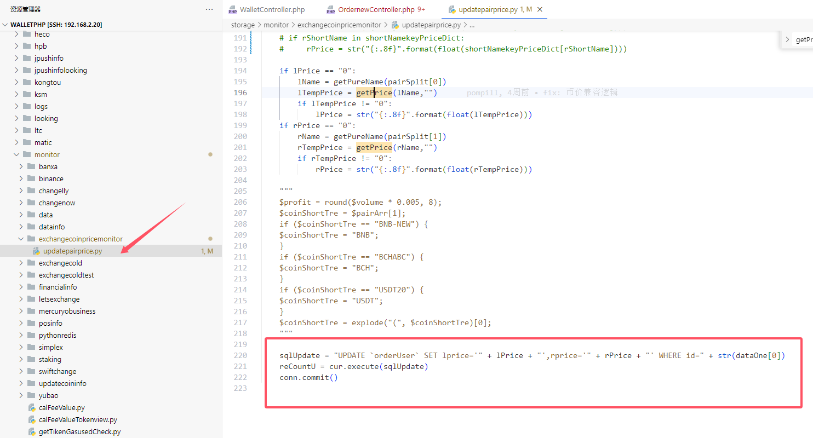

# getOrderListaccount账号的兑换记录明细

```php
    /**
     * 获取兑换记录 一个账号的兑换记录明细
     */
    public function getOrderListaccount(Request $request) {
        // 数据从orderuser表中查询
```


# updatepairprice更新币价

```python

    sqlUpdate = "UPDATE `orderUser` SET lprice='" + lPrice + "',rprice='" + rPrice + "' WHERE id=" + str(dataOne[0])
    reCountU = cur.execute(sqlUpdate)
    conn.commit()

```


# 


# 更新状态

```
changellyTransactions.py
```

