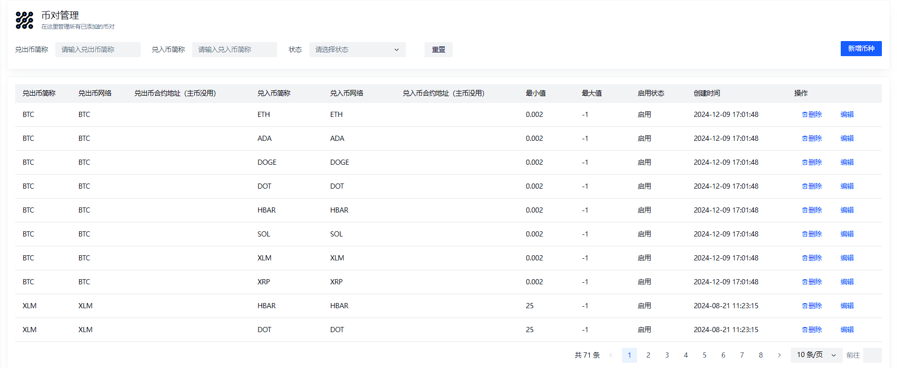

# Vue 组件

# 页面结构

```vue
<template>
    <div class="container">
        <a-card :bordered="false" class="cardStyle" style="margin-bottom: 16px;" >
             <a-list-item-meta>
                <template #title>
                  <div class="akaInfoTitle">币对管理</div>
                </template>
                <template #description>
                  <div class="akaInfoDesc">在这里管理所有已添加的币对</div>
                </template>
                <template #avatar>
                  <div style="border-radius: 20px 0 20px 20px; background-color: #eff4f9; padding: 3px;">
                    <Iconify icon="eos-icons:role-binding-outlined" style="color: black;" width="40" height="40" />
                  </div>
                </template>
            </a-list-item-meta>

            <a-card-meta>
                <template #avatar>
                    <a-form :model="queryForm" ref="queryFormRef" layout="inline">
                        <a-form-item field="lName" label="兑出币简称">
                            <a-input v-model="queryForm.lName" placeholder="请输入兑出币简称" @input="handleQuery" @clear="handleQuery" allow-clear/>
                        </a-form-item>
                        <a-form-item field="rName" label="兑入币简称">
                            <a-input v-model="queryForm.rName" placeholder="请输入兑入币简称" @input="handleQuery" @clear="handleQuery" allow-clear/>
                        </a-form-item>
                        <a-form-item field="enable" label="状态">
                            <a-select v-model="queryForm.enabled" placeholder="请选择状态" @change="handleQuery">
                                <a-option
                                v-for="item in sList"
                                :key="item.value"
                                :value="item.value"
                                :label="item.key"
                                />
                            </a-select>
                        </a-form-item>
                        <a-form-item>
                            <a-space>
                                <!-- <a-button type="primary" @click="handleQuery">搜索</a-button> -->
                                <a-button @click="handleReset">重置</a-button>
                            </a-space>
                        </a-form-item>
                    </a-form>
                </template>
            </a-card-meta>
            <template #actions>
                <a-space class="action">
                <a-button type="primary" @click="handleAdd">新增币种</a-button>
                </a-space>
            </template>
        </a-card>

        <a-card :bordered="false" class="cardStyle">
            <a-row>
                  <a-table
                    :columns="columns"
                    :data="tableData"
                    :bordered="false"
                    row-key="coinId"
                    :pagination="{ 'show-total': true, 'show-jumper': true, 'show-page-size': true, total: pager.count, current: currentPage }"
                    @page-change="handlePageChange"
                    @page-size-change="handlePageSizeChange"
                    style="display: flex; flex-direction: column; align-items: stretch; width:100%;"
                  >
                  <template #createTime="{record}">
                    {{transferUtcToNormalDate(record.createTime)}}
                  </template>
                  <template #enabled="{record}">
                    {{transferStatus(record.enabled)}}
                  </template>
                  <template #action="{ record }">
                        <a-space>
                            <a-button type="text" @click="() => { deleteVisible = true; deleteData = [record.id];  }"><icon-delete /> 删除</a-button>
                            <a-button type="text" @click="handleEdit(record)">编辑</a-button>
                        </a-space>
                    </template>
                  </a-table>
            </a-row>
        </a-card>

        <a-modal v-model:visible="queryModalVisible" :title="queryModalTitle" title-align="start" :width="600" modal-class="menu-modal" @before-ok="handle" @close="() => {$refs.queryModelFormRef.resetFields(); queryModelForm.menuId = null;}">
            <a-form :model="queryModelForm" :rules="rules" ref="queryModelFormRef" auto-label-width label-align="left">
                <a-row >
                    <a-col >
                        <a-form-item field="lName" label="兑出币简称">
                          <a-input v-model="queryModelForm.lName"/>
                        </a-form-item>
                        <a-form-item field="lNetwork" label="兑出币网络">
                          <a-input v-model="queryModelForm.lNetwork"/>
                        </a-form-item>
                        <a-form-item field="lContractAddress" label="兑出币合约地址（主币没用）">
                          <a-input v-model="queryModelForm.lContractAddress"/>
                        </a-form-item>
                        <a-form-item field="rName" label="兑入币简称">
                          <a-input v-model="queryModelForm.rName"/>
                        </a-form-item>
                        <a-form-item field="rNetwork" label="兑入币网络">
                          <a-input v-model="queryModelForm.rNetwork"/>
                        </a-form-item>
                        <a-form-item field="rContractAddress" label="兑入币合约地址（主币没用）">
                          <a-input v-model="queryModelForm.rContractAddress"/>
                        </a-form-item>
                        <a-form-item field="minAmount" label="最小值">
                          <a-input-number v-model="queryModelForm.minAmount" class="input-demo" :precision="8"/>
                        </a-form-item>
                        <a-form-item field="maxAmount" label="最大值">
                          <a-input-number v-model="queryModelForm.maxAmount" class="input-demo" :precision="8"/>
                        </a-form-item>
                        <a-form-item field="enabled" label="是否启用">
                          <a-switch v-model="queryModelForm.enabled" checked-value="1" unchecked-value="0" />
                        </a-form-item>
                    </a-col>
                </a-row>
            </a-form>
        </a-modal>
        <DeleteModal 
            :data="deleteData" 
            :visible="deleteVisible" 
            :apiDelete="delInternalPairConfig" 
            @deleteVisibleChange="() => deleteVisible = false "
        />
    </div>
</template>
```




这段代码定义了一个 Vue 组件，用于管理币对。页面分为几个部分：

- **顶部标题和描述**：显示“币对管理”和“在这里管理所有已添加的币对”。
- **搜索表单**：包含输入框和下拉选择框，用于搜索币对。
- **操作按钮**：包含“新增币种”按钮。
- **表格**：显示币对列表，包括币对名称、网络、合约地址、最小值、最大值、启用状态和创建时间。
- **模态框**：用于新增或编辑币对的表单。

## 代码详解

#### 2.1 顶部标题和描述

```js
<a-card :bordered="false" class="cardStyle" style="margin-bottom: 16px;">
    <a-list-item-meta>
        <template #title>
            <div class="akaInfoTitle">币对管理</div>
        </template>
        <template #description>
            <div class="akaInfoDesc">在这里管理所有已添加的币对</div>
        </template>
        <template #avatar>
            <div style="border-radius: 20px 0 20px 20px; background-color: #eff4f9; padding: 3px;">
                <Iconify icon="eos-icons:role-binding-outlined" style="color: black;" width="40" height="40" />
            </div>
        </template>
    </a-list-item-meta>
</a-card>
```

- **`<a-card>`**：这是一个卡片组件，用于显示标题和描述。
- **`<a-list-item-meta>`**：用于显示列表项的元数据，包括标题、描述和头像。
- **`<Iconify>`**：这是一个图标组件，用于显示一个图标。

#### 2.2 搜索表单

```js
<a-card :bordered="false" class="cardStyle">
    <a-card-meta>
        <template #avatar>
            <a-form :model="queryForm" ref="queryFormRef" layout="inline">
                <a-form-item field="lName" label="兑出币简称">
                    <a-input v-model="queryForm.lName" placeholder="请输入兑出币简称" @input="handleQuery" @clear="handleQuery" allow-clear/>
                </a-form-item>
                <a-form-item field="rName" label="兑入币简称">
                    <a-input v-model="queryForm.rName" placeholder="请输入兑入币简称" @input="handleQuery" @clear="handleQuery" allow-clear/>
                </a-form-item>
                <a-form-item field="enable" label="状态">
                    <a-select v-model="queryForm.enabled" placeholder="请选择状态" @change="handleQuery">
                        <a-option
                        v-for="item in sList"
                        :key="item.value"
                        :value="item.value"
                        :label="item.key"
                        />
                    </a-select>
                </a-form-item>
                <a-form-item>
                    <a-space>
                        <a-button @click="handleReset">重置</a-button>
                    </a-space>
                </a-form-item>
            </a-form>
        </template>
    </a-card-meta>
    <template #actions>
        <a-space class="action">
            <a-button type="primary" @click="handleAdd">新增币种</a-button>
        </a-space>
    </template>
</a-card>
```

- **`<a-form>`**：这是一个表单组件，用于收集用户输入。
- **`<a-form-item>`**：表单项组件，包含标签和输入框。
- **`<a-input>`**：输入框组件，用于输入文本。
- **`<a-select>`**：下拉选择框组件，用于选择选项。
- **`<a-button>`**：按钮组件，用于触发事件。

#### 2.3 表格

```js
<a-card :bordered="false" class="cardStyle">
    <a-row>
        <a-table
            :columns="columns"
            :data="tableData"
            :bordered="false"
            row-key="coinId"
            :pagination="{ 'show-total': true, 'show-jumper': true, 'show-page-size': true, total: pager.count, current: currentPage }"
            @page-change="handlePageChange"
            @page-size-change="handlePageSizeChange"
            style="display: flex; flex-direction: column; align-items: stretch; width:100%;"
        >
            <template #createTime="{record}">
                {{transferUtcToNormalDate(record.createTime)}}
            </template>
            <template #enabled="{record}">
                {{transferStatus(record.enabled)}}
            </template>
            <template #action="{ record }">
                <a-space>
                    <a-button type="text" @click="() => { deleteVisible = true; deleteData = [record.id];  }"><icon-delete /> 删除</a-button>
                    <a-button type="text" @click="handleEdit(record)">编辑</a-button>
                </a-space>
            </template>
        </a-table>
    </a-row>
</a-card>
```

- **`<a-table>`**：表格组件，用于显示数据。
- **`columns`**：表格列的配置。
- **`data`**：表格数据。
- **`row-key`**：行键，用于唯一标识每一行。
- **`pagination`**：分页配置。
- **`<template>`**：模板插槽，用于自定义表格单元格的内容。

#### 2.4 模态框

```js
<a-modal v-model:visible="queryModalVisible" :title="queryModalTitle" title-align="start" :width="600" modal-class="menu-modal" @before-ok="handle" @close="() => {$refs.queryModelFormRef.resetFields(); queryModelForm.menuId = null;}">
    <a-form :model="queryModelForm" :rules="rules" ref="queryModelFormRef" auto-label-width label-align="left">
        <a-row >
            <a-col >
                <a-form-item field="lName" label="兑出币简称">
                  <a-input v-model="queryModelForm.lName"/>
                </a-form-item>
                <a-form-item field="lNetwork" label="兑出币网络">
                  <a-input v-model="queryModelForm.lNetwork"/>
                </a-form-item>
                <a-form-item field="lContractAddress" label="兑出币合约地址（主币没用）">
                  <a-input v-model="queryModelForm.lContractAddress"/>
                </a-form-item>
                <a-form-item field="rName" label="兑入币简称">
                  <a-input v-model="queryModelForm.rName"/>
                </a-form-item>
                <a-form-item field="rNetwork" label="兑入币网络">
                  <a-input v-model="queryModelForm.rNetwork"/>
                </a-form-item>
                <a-form-item field="rContractAddress" label="兑入币合约地址（主币没用）">
                  <a-input v-model="queryModelForm.rContractAddress"/>
                </a-form-item>
                <a-form-item field="minAmount" label="最小值">
                  <a-input-number v-model="queryModelForm.minAmount" class="input-demo" :precision="8"/>
                </a-form-item>
                <a-form-item field="maxAmount" label="最大值">
                  <a-input-number v-model="queryModelForm.maxAmount" class="input-demo" :precision="8"/>
                </a-form-item>
                <a-form-item field="enabled" label="是否启用">
                  <a-switch v-model="queryModelForm.enabled" checked-value="1" unchecked-value="0" />
                </a-form-item>
            </a-col>
        </a-row>
    </a-form>
</a-modal>
```

- **`<a-modal>`**：模态框组件，用于显示新增或编辑币对的表单。
- **`<a-form>`**：表单组件，用于收集用户输入。
- **`<a-form-item>`**：表单项组件，包含标签和输入框。
- **`<a-input>`**：输入框组件，用于输入文本。
- **`<a-input-number>`**：数字输入框组件，用于输入数字。
- **`<a-switch>`**：开关组件，用于切换布尔值。


# 脚本逻辑

```js

<script setup>
    import { onMounted, reactive, ref, getCurrentInstance, nextTick, watch } from 'vue';
    import {addInternalPairConfig, delInternalPairConfig, getInternalPairConfig, listInternalPairConfig, updateInternalPairConfig} from '@/api/backend/pairConfig'
    import { message } from 'ant-design-vue';
    import clipboardy from 'clipboardy';

    const { proxy } = getCurrentInstance();
    const tableData = ref([]);
    const queryForm = reactive({});
    // 表格分页
    const pager = reactive({
      count: 0,
      pageIndex: 1,
      pageSize: 10
    });
    // 默认页码
    const currentPage = ref(1);

    const queryModelForm = reactive({
      menuType: 'M',
      sort: 0,
      isFrame: '1',
      visible: '0',
      name: ""
    });
    const queryModalVisible = ref(false);
    const queryModalTitle = ref('确认表单');
    const rangeValue = ref();

    const deleteVisible = ref(false);
    const deleteData = ref([]);

    const columns = [
        { title: '币对ID', dataIndex: 'id', slotName: 'id',width: "100",ellipsis: true,tooltip: true},
        { title: '兑出币简称', dataIndex: 'lName', slotName: 'lName',width: "100",ellipsis: true,tooltip: true},
        { title: '兑出币网络', dataIndex: 'lNetwork', slotName: 'lNetwork',width: "100",ellipsis: true,tooltip: true},
        { title: '兑出币合约地址（主币没用）', dataIndex: 'lContractAddress', slotName: 'lContractAddress',width: "220",ellipsis: true,tooltip: true},
        { title: '兑入币简称', dataIndex: 'rName', slotName: 'rName',width: "130",ellipsis: true,tooltip: true},
        { title: '兑入币网络', dataIndex: 'rNetwork', slotName: 'rNetwork',width: "130",ellipsis: true,tooltip: true},
        { title: '兑入币合约地址（主币没用）', dataIndex: 'rContractAddress', slotName: 'rContractAddress',width: "220",ellipsis: true,tooltip: true},
        { title: '最小值', dataIndex: 'minAmount', slotName: 'minAmount',width: "100",ellipsis: true,tooltip: true},
        { title: '最大值', dataIndex: 'maxAmount', slotName: 'maxAmount',width: "100",ellipsis: true,tooltip: true},
        { title: '启用状态', dataIndex: 'enabled', slotName: 'enabled',width: "100",ellipsis: true,tooltip: true},
        { title: '创建时间', dataIndex: 'createTime', slotName: 'createTime',width: "180",ellipsis: true,tooltip: true},
        { title: '操作', slotName: 'action' ,width: "170", fixed: "right" },
    ]

    const sList = [
        {"key":"启用","value":"1"},
        {"key":"禁用","value":"0"}
    ]

    const rules = {
        lName: [{ required: true, message: '请输入兑出币简称' }],
        lNetwork: [{ required: true, message: '请输入兑出币网络' }],
        rName: [{ required: true, message: '请输入兑入币简称' }],
        rNetwork: [{ required: true, message: '请输入兑出币网络' }],
    };

    const transferStatus = (status) => {
        if (status === 1){
            return "启用"
        }
        return "禁用"
    }

    const transferUtcToNormalDate = (timestamp) => {
        // 创建一个新的 Date 对象
        const date = new Date(timestamp);

        // 获取各个部分的值
        const year = date.getFullYear();
        const month = ('0' + (date.getMonth() + 1)).slice(-2); // 月份是从 0 开始的，需要加 1
        const day = ('0' + date.getDate()).slice(-2);
        const hours = ('0' + date.getHours()).slice(-2);
        const minutes = ('0' + date.getMinutes()).slice(-2);
        const seconds = ('0' + date.getSeconds()).slice(-2);

        // 构建格式化后的日期时间字符串
        const formattedDateTime = `${year}-${month}-${day} ${hours}:${minutes}:${seconds}`;
        return formattedDateTime
    }

    const handle = (done) => {
      if (queryModalTitle.value === "添加自有兑换交易对配置"){
        handleModelSummit(done)
      }else{
        handleUpdate(done)
      }
    }

    /**
     * 处理更新操作的函数。
     * 该函数通常在用户提交表单后被调用，以验证表单数据，并根据验证结果进行相应的更新或新增操作。
     *
     * @param {Function} done - 完成回调函数，用于通知调用者当前操作是否完成。
     */
    const handleUpdate = (done) => {
      // 打印日志，标识进入 handleUpdate 函数，并输出 done 参数。
      console.log('[11] handleUpdate', done);

      // 调用表单引用对象的 validate 方法，对表单进行验证。
      // 如果验证成功（valid 为 true），则继续执行异步操作；否则，触发错误提示。
      proxy.$refs.queryModelFormRef.validate(async (valid) => {
        if (!valid) {
          // 如果表单验证失败，则打印错误信息，并通过 done(false) 告知调用者操作未成功。
          proxy.$message.error('表单校验失败');
          done(false);
        } else {
          // 如果表单验证成功，检查 queryModelForm.menuId 是否存在。
          // 注意：这里的逻辑可能有误，因为当 !valid 时应该不会进入到这个 else 分支。
          // 此处可能是意在表达如果 menuId 不存在，则进行新增操作。
          if (!queryModelForm.menuId) {
            // 尝试调用 updateInternalPairConfig 函数来更新内部配对配置。
            try {
              const response = await updateInternalPairConfig(queryModelForm);
              console.log("res:", response);

              // 如果响应的状态码为 200，表示操作成功。
              if (response.code === 200) {
                proxy.$message.success('新增成功');

                // 关闭查询模态框。
                queryModalVisible.value = false;

                // 调用 done() 告知调用者操作已完成。
                done();
              } else {
                // 如果响应状态码不是 200，则显示错误消息，并告知调用者操作未成功。
                proxy.$message.error(response.msg || '操作失败');
                done(false);
              }
            } catch (error) {
              // 捕获任何可能发生的异常，并显示通用错误消息。
              proxy.$message.error('发生未知错误');
              done(false);
            }
          } else {
            // 如果 queryModelForm.menuId 存在，则意味着这是一个更新操作。
            // 注释掉的代码表明原本计划在此处执行更新菜单的操作。
            // 可能需要恢复或调整这部分代码以实现预期功能。
            // const { success } = await updateMenu(modalForm, modalForm.menuId);
            // if (success) proxy.$message.success('修改成功');
          }

          // 不论是新增还是更新，完成后都尝试刷新列表。
          getList(queryForm);
        }
      });
    };

    const handleModelSummit = (done) => {
      handleSubmit(done)
    }

    // handleSubmit 新增与修改按钮方法 20220713
    const handleSubmit = (done) => {
      console.log('[11] handleSubmit', done)
      proxy.$refs.queryModelFormRef.validate(async (valid) => {
        if (!valid) {
          if (!queryModelForm.menuId) {
            console.log("dasdasd",queryModelForm)
            const response = await addInternalPairConfig(queryModelForm);
            console.log("res:",response)
            if (response.code == 200){
              proxy.$message.success('新增成功');
              done();
              queryModalVisible.value = false;
            }else{
              proxy.$message.error(response.msg);
              done(false);
            }
          } else {
            // const { success } = await updateMenu(modalForm, modalForm.menuId);
            // if (success) proxy.$message.success('修改成功');
          }
          getList();

        } else {
          proxy.$message.error('表单校验失败');
          done(false);
        }
      });
    };

    const handleQuery = () => {
        console.log("queryForm:",queryForm)
        getList(queryForm);
    };
    const handleReset = () => {
         // 重置表单数据
        Object.keys(queryForm).forEach(key => {
          queryForm[key] = ''; // 将其他字段重置为空字符串
        });
        console.log("queryForm",queryForm)
        getList(queryForm)
    };

    /** 查询参数列表 */
    const getList = async (params = {}) => {
        const { code, data, msg } = await listInternalPairConfig({...params, pageSize: pager.pageSize, pageIndex: pager.pageIndex});
        console.log("code, data, msg",code, data, msg)
        if ( code === 200 ) {
        tableData.value = data.list;
        pager.count = data.count;
        console.log("tabledata:",tableData.value)
        } else {
        proxy.$notification.error(msg)
        }
    };

    const handlePageChange = (page) => {
        console.log("page index change ",page)
        pager.pageIndex = page;
        currentPage.value = page;
        getList(queryForm);
    };

    // 每页数据量
    const handlePageSizeChange = (pageSize) => {
      console.log("page size change",pageSize)
      pager.pageSize = pageSize;
      getList(queryForm);
    };

    /** 编辑按钮操作 */
    const handleEdit = (record) => {
        queryModalVisible.value = true;
        queryModalTitle.value = '更新自有兑换交易对配置'
        for (let key in record){
          if (key === "enabled"){
            queryModelForm[key] = String(record[key])
            continue
          }
            queryModelForm[key] = record[key]
        }
    }

    /** 新增按钮操作 */
    const handleAdd = (parentId = null) => {
        queryModalVisible.value = true;
        queryModalTitle.value = '添加自有兑换交易对配置'
    }

    watch(() => deleteVisible.value ,(value) => {
        if ( value == false ) {
            getList();
        }
    });

    onMounted(() => {
        getList()
    });
</script>

```

这段 `<script setup>` 部分的代码是 Vue 3 的组合式 API (Composition API) 的实现，它包含了页面逻辑、数据获取和交互功能。下面我会逐步解析这些代码，并解释每个部分的功能。

### 1. 导入依赖

```js
import { onMounted, reactive, ref, getCurrentInstance, nextTick, watch } from 'vue';
import {addInternalPairConfig, delInternalPairConfig, getInternalPairConfig, listInternalPairConfig, updateInternalPairConfig} from '@/api/backend/pairConfig'
import { message } from 'ant-design-vue';
import clipboardy from 'clipboardy';
```

- **Vue 模块**：从 Vue 中导入了生命周期钩子（如 `onMounted`）、响应式对象创建工具（如 `reactive`, `ref`）等。
- **API 请求**：从本地路径 `'@/api/backend/pairConfig'` 导入了一系列与币对配置相关的 API 方法。
- **Ant Design 组件**：从 `ant-design-vue` 导入了消息提示组件 `message`。
- **Clipboardy**：一个用于复制文本到剪贴板的库，不过在当前代码中并未使用。

### 2. 初始化状态和引用

```js
const { proxy } = getCurrentInstance();
const tableData = ref([]);
const queryForm = reactive({});
// 表格分页
const pager = reactive({
  count: 0,
  pageIndex: 1,
  pageSize: 10
});
// 默认页码
const currentPage = ref(1);

const queryModelForm = reactive({
  menuType: 'M',
  sort: 0,
  isFrame: '1',
  visible: '0',
  name: ""
});
const queryModalVisible = ref(false);
const queryModalTitle = ref('确认表单');
const rangeValue = ref();

const deleteVisible = ref(false);
const deleteData = ref([]);

const columns = [
    { title: '兑出币简称', dataIndex: 'lName', slotName: 'lName',width: "100",ellipsis: true,tooltip: true},
    { title: '兑出币网络', dataIndex: 'lNetwork', slotName: 'lNetwork',width: "100",ellipsis: true,tooltip: true},
    { title: '兑出币合约地址（主币没用）', dataIndex: 'lContractAddress', slotName: 'lContractAddress',width: "220",ellipsis: true,tooltip: true},
    { title: '兑入币简称', dataIndex: 'rName', slotName: 'rName',width: "130",ellipsis: true,tooltip: true},
    { title: '兑入币网络', dataIndex: 'rNetwork', slotName: 'rNetwork',width: "130",ellipsis: true,tooltip: true},
    { title: '兑入币合约地址（主币没用）', dataIndex: 'rContractAddress', slotName: 'rContractAddress',width: "220",ellipsis: true,tooltip: true},
    { title: '最小值', dataIndex: 'minAmount', slotName: 'minAmount',width: "100",ellipsis: true,tooltip: true},
    { title: '最大值', dataIndex: 'maxAmount', slotName: 'maxAmount',width: "100",ellipsis: true,tooltip: true},
    { title: '启用状态', dataIndex: 'enabled', slotName: 'enabled',width: "100",ellipsis: true,tooltip: true},
    { title: '创建时间', dataIndex: 'createTime', slotName: 'createTime',width: "180",ellipsis: true,tooltip: true},
    { title: '操作', slotName: 'action' ,width: "170", fixed: "right" },
]

const sList = [
    {"key":"启用","value":"1"},
    {"key":"禁用","value":"0"}
]

const rules = {
    lName: [{ required: true, message: '请输入兑出币简称' }],
    lNetwork: [{ required: true, message: '请输入兑出币网络' }],
    rName: [{ required: true, message: '请输入兑入币简称' }],
    rNetwork: [{ required: true, message: '请输入兑出币网络' }],
};
```

- **proxy**：获取当前实例的上下文，通常用来访问全局方法或属性。
- **tableData**：用于存储表格的数据，是一个响应式的空数组。
- **queryForm**：搜索表单的状态，初始为空对象。
- **pager** 和 **currentPage**：分页相关设置。
- **queryModelForm**：模态框内的表单数据，初始化了一些默认值。
- **queryModalVisible** 和 **queryModalTitle**：控制模态框的显示状态和标题。
- **deleteVisible** 和 **deleteData**：控制删除确认对话框的显示状态及其关联的数据。
- **columns**：表格列的定义，包含每一列的标题、宽度和其他属性。
- **sList**：状态选择项的列表，用作下拉菜单的数据源。
- **rules**：表单验证规则，确保用户输入符合预期格式。


### 3. 方法定义

#### 数据处理方法

```js
const transferStatus = (status) => {...}
const transferUtcToNormalDate = (timestamp) => {...}
```

- **transferStatus**：将数字形式的状态转换为中文描述。
- **transferUtcToNormalDate**：将 UTC 时间戳转换为本地时间字符串。

#### 模态框操作方法

```js
const handle = (done) => {...}
const handleUpdate = (done) => {...}
const handleModelSummit = (done) => {...}
const handleSubmit = (done) => {...}
```

- **handle**：根据模态框的标题判断是添加还是更新操作。
- **handleUpdate** 和 **handleSubmit**：处理表单提交，分别对应更新和新增操作。
- **handleModelSummit**：似乎是重复了 `handleSubmit` 的功能，可以考虑合并。

#### 查询和重置方法

```js
const handleQuery = () => {...}
const handleReset = () => {...}
```

- **handleQuery**：基于查询表单的条件重新加载数据。
- **handleReset**：重置查询表单并将查询参数设为空，然后重新加载数据。

#### 分页处理方法

```js
const handlePageChange = (page) => {...}
const handlePageSizeChange = (pageSize) => {...}
```

- **handlePageChange** 和 **handlePageSizeChange**：当用户改变页码或每页条数时触发，更新分页信息并重新加载数据。

#### 编辑和新增按钮方法

```js
const handleEdit = (record) => {...}
const handleAdd = (parentId = null) => {...}
```

- **handleEdit**：填充模态框表单以编辑选定的记录。
- **handleAdd**：清空模态框表单以准备添加新记录。

#### 监听和挂载事件

```js
watch(() => deleteVisible.value ,(value) => {
    if ( value == false ) {
        getList();
    }
});

onMounted(() => {
    getList()
});
```

- **watch**：监听 `deleteVisible` 的变化，如果删除对话框关闭，则重新加载数据。
- **onMounted**：组件挂载完成后立即调用 `getList` 加载数据。

### 4. 获取数据的方法

```js
const getList = async (params = {}) => {...}
```

- **getList**：这是一个异步函数，用于从服务器获取币对配置列表，并更新 `tableData` 和 `pager`。