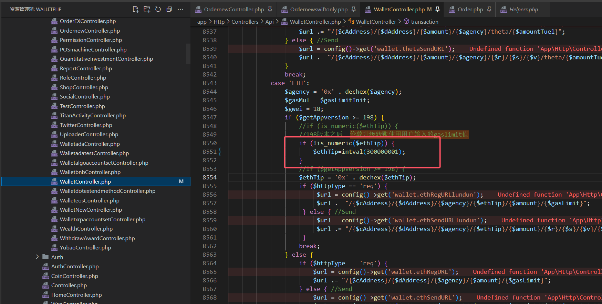

```
maxFeePerGas cannot be less than maxPriorityFeePerGas (The total must be the larger of the two) (tx type=2 hash=0x70ea810905db3a467936a5036731d9f9f1ebe15da6b7f813c4d00c4f311d82d5 nonce=0 value=1500000000000000 signed=true hf=london maxFeePerGas=831500000 maxPriorityFeePerGas=1000000001)
```



```php
                if ($getAppversion >= 198) {
                    //if (is_numeric($ethTip)) {
                    //198版本之后  伦敦升级转账使用用户输入的gaslimit值
                    if (!is_numeric($ethTip)) {
                        $ethTip=intval(300000001);
                    }
```

