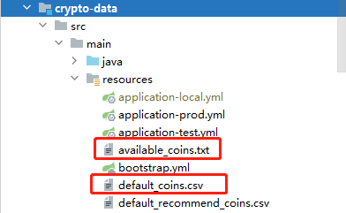
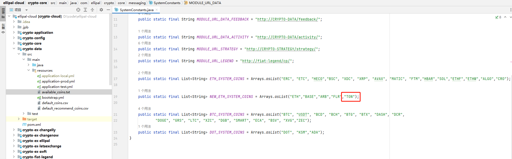

# 页面


# 文件配置




## default_coins.csv

excel表格添加币种, 这里是详细信息:


## available_coins.txt

文本是代币可以使用的币种, 最终是从csv中获取所有数据, 然后txt配置的才会允许使用。


# 代币名称

```java
        if ("TON".equalsIgnoreCase(name) && "TON".equalsIgnoreCase(network)) {
            return "TON";
        }

        // 有代币的主币都要加，我真是疯了
        if (network.equalsIgnoreCase("BSC") ||
                network.equalsIgnoreCase("HECO") ||
                network.equalsIgnoreCase("AVAX") ||
                network.equalsIgnoreCase("FTM") ||
                network.equalsIgnoreCase("FLR") ||
                network.equalsIgnoreCase("XVG") ||
                network.equalsIgnoreCase("SOL") ||
                network.equalsIgnoreCase("ARB") ||
                network.equalsIgnoreCase("BASE") ||
                network.equalsIgnoreCase("ETC") ||
                network.equalsIgnoreCase("TON")) {
            return StringUtil.buildString(name, "(", network, ")");
        }
```


****


# 前端显示

```java
        if (network.equalsIgnoreCase("FLR") && !name.equalsIgnoreCase("FLR")) {
            return name + "(FLR)";
        }
        if (network.equalsIgnoreCase("TON") && !name.equalsIgnoreCase("TON")) {
            return name + "(TON)";
        }
```


# gas配置

这里配置表示使用最新的go语言写的后台接口调用。

```java
    public static final List<String> NEW_ETH_SYSTEM_COINS = Arrays.asList("ETH","BASE","ARB","FLR","TON");
```

