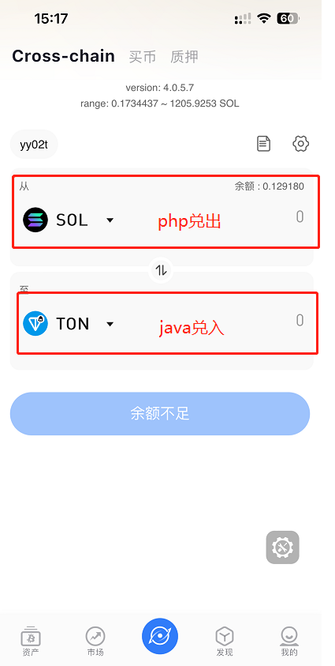
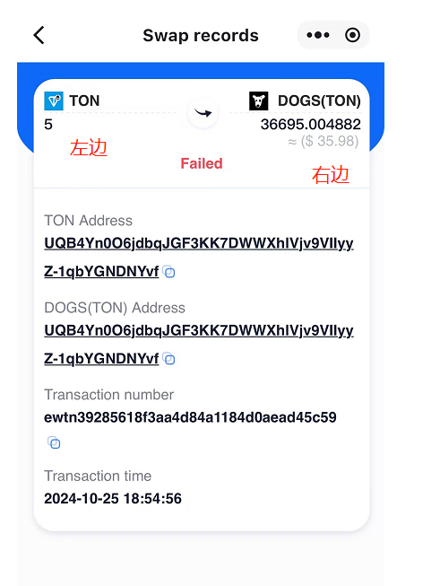
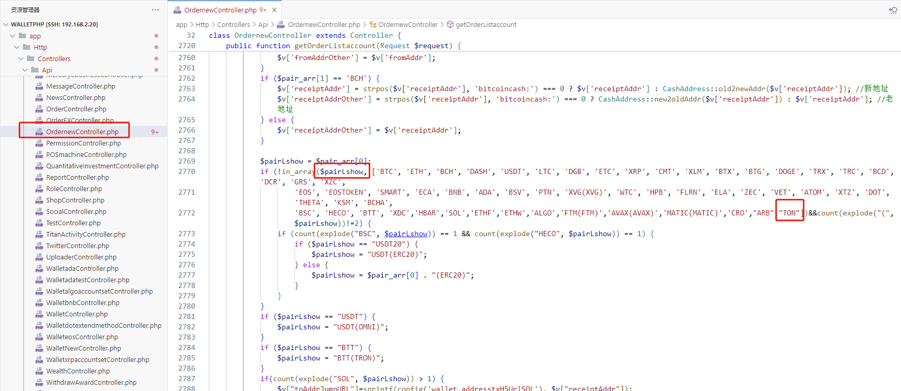
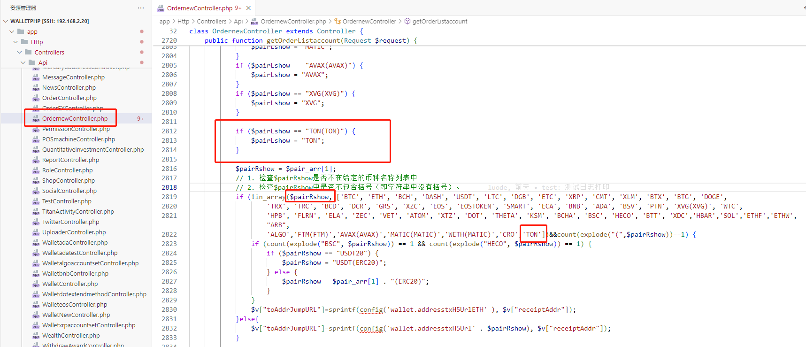
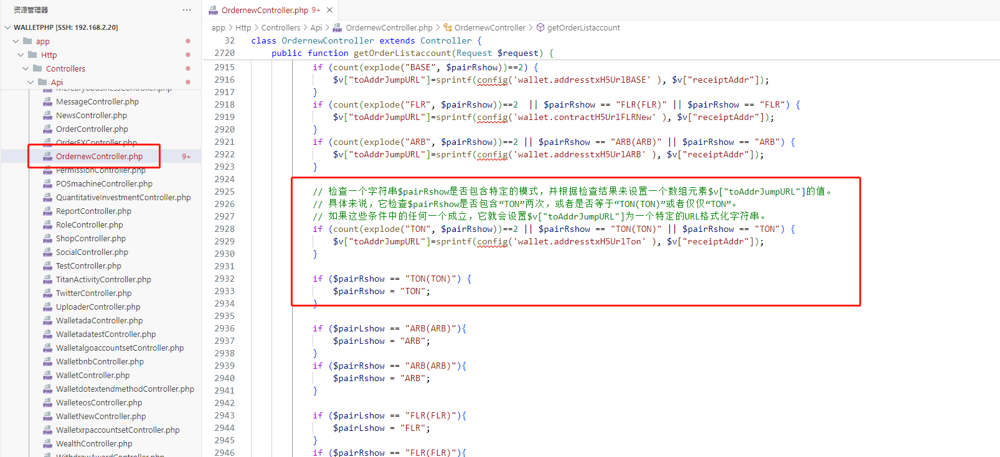
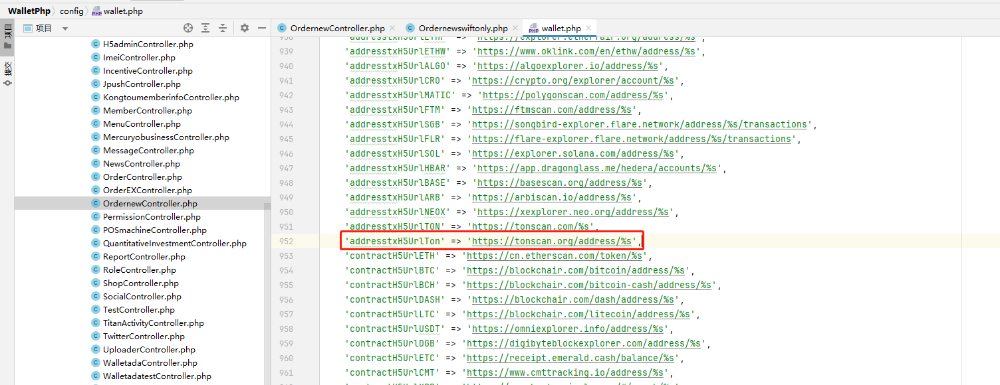
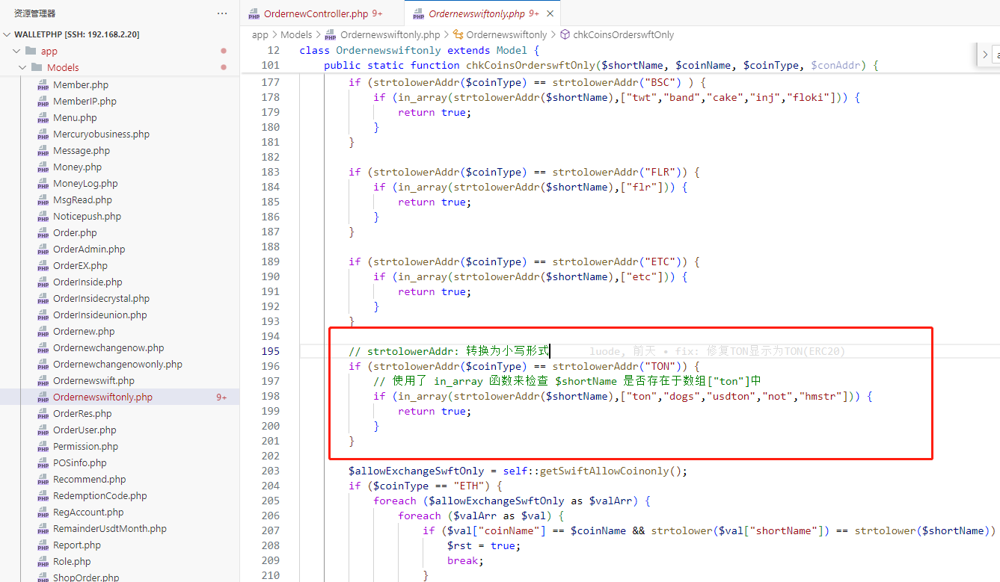
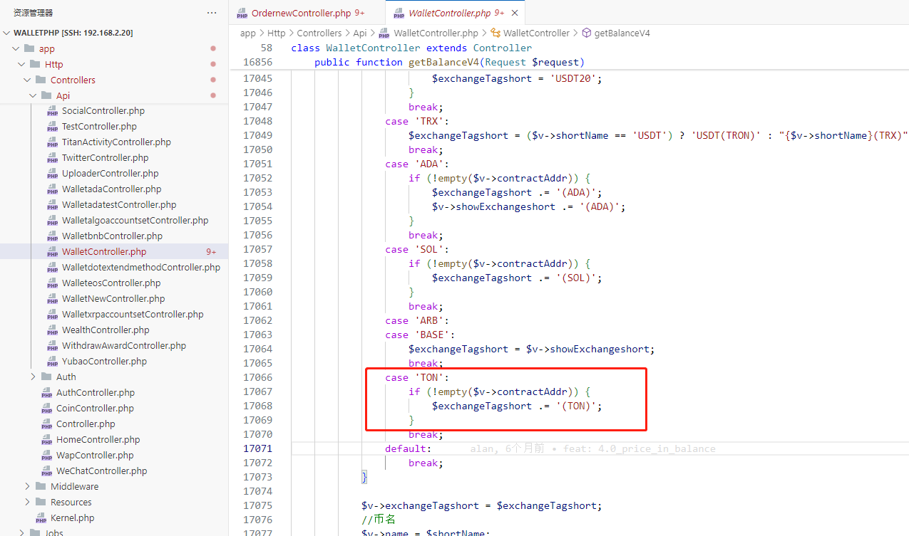
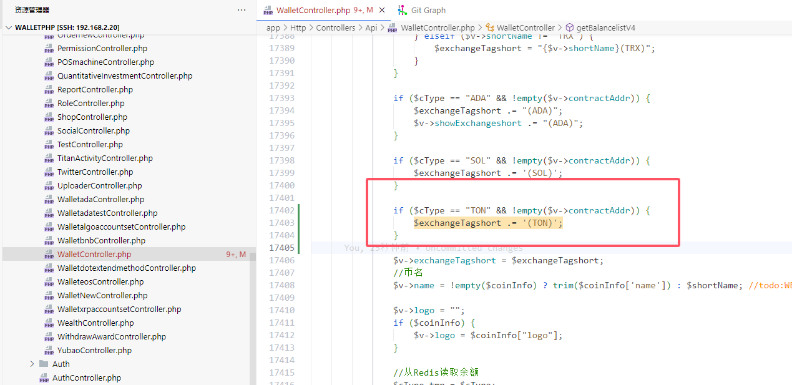

# 代码添加

- 兑换记录左/右边名称: 币(网络) -> 如果是主链币不需要加网络

  

  - 左边的每次名称不走默认的(ERC20)

  ```php
  if (!in_array($pairLshow, ['BTC', 'ETH', 'BCH', 'DASH', 'USDT', 'LTC', 'DGB', 'ETC', 'XRP', 'CMT', 'XLM', 'BTX', 'BTG', 'DOGE', 'TRX', 'TRC', 'BCD', 'DCR', 'GRS', 'XZC',
                             'EOS', 'EOSTOKEN', 'SMART', 'ECA', 'BNB', 'ADA', 'BSV', 'PTN', 'XVG(XVG)', 'WTC', 'HPB', 'FLRN', 'ELA', 'ZEC', 'VET', 'ATOM', 'XTZ', 'DOT', 'THETA', 'KSM', 'BCHA',
                             'BSC', 'HECO', 'BTT', 'XDC','HBAR','SOL','ETHF','ETHW','ALGO','FTM(FTM)','AVAX(AVAX)','MATIC(MATIC)','CRO',"ARB","TON"])&&count(explode("(",$pairLshow))!=2) {
      if (count(explode("BSC", $pairLshow)) == 1 && count(explode("HECO", $pairLshow)) == 1) {
          if ($pairLshow == "USDT20") {
              $pairLshow = "USDT(ERC20)";
          } else {
              $pairLshow = $pair_arr[0] . "(ERC20)";
          }
      }          
  }
  ```




- 如果是左边主币, 默认不展示(TON)


- 右边的每次名称不走默认的(ERC20)

```php
if ($pairLshow == "TON(TON)") {
    $pairLshow = "TON";
}

$pairRshow = $pair_arr[1];
// 1. 检查$pairRshow是否不在给定的币种名称列表中
// 2. 检查$pairRshow中是否不包含括号（即字符串中没有括号）。
if (!in_array($pairRshow, ['BTC', 'ETH', 'BCH', 'DASH', 'USDT', 'LTC', 'DGB', 'ETC', 'XRP', 'CMT', 'XLM', 'BTX', 'BTG', 'DOGE',
                           'TRX', 'TRC', 'BCD', 'DCR', 'GRS', 'XZC', 'EOS', 'EOSTOKEN', 'SMART', 'ECA', 'BNB', 'ADA', 'BSV', 'PTN', 'XVG(XVG)', 'WTC',
                           'HPB', 'FLRN', 'ELA', 'ZEC', 'VET', 'ATOM', 'XTZ', 'DOT', 'THETA', 'KSM', 'BCHA', 'BSC', 'HECO', 'BTT', 'XDC','HBAR','SOL','ETHF','ETHW',"ARB",
                           'ALGO','FTM(FTM)','AVAX(AVAX)','MATIC(MATIC)','WETH(MATIC)','CRO','TON'])&&count(explode("(",$pairRshow))==1) {
    if (count(explode("BSC", $pairRshow)) == 1 && count(explode("HECO", $pairRshow)) == 1) {
        if ($pairRshow == "USDT20") {
            $pairRshow = "USDT(ERC20)";
        } else {
            $pairRshow = $pair_arr[1] . "(ERC20)";
        }
    }
    $v["toAddrJumpURL"]=sprintf(config('wallet.addresstxH5UrlETH' ), $v["receiptAddr"]);
}
```




- 如果是右边主币, 默认不展示(TON)
- 配置地址的浏览器查询 addresstxH5UrlTon -> 这是一个配置映射, 一般都是链的浏览器查询

```php

// 检查一个字符串$pairRshow是否包含特定的模式，并根据检查结果来设置一个数组元素$v["toAddrJumpURL"]的值。
// 具体来说，它检查$pairRshow是否包含“TON”两次，或者是否等于“TON(TON)”或者仅仅“TON”。
// 如果这些条件中的任何一个成立，它就会设置$v["toAddrJumpURL"]为一个特定的URL格式化字符串。
if (count(explode("TON", $pairRshow))==2 || $pairRshow == "TON(TON)" || $pairRshow == "TON") {
    $v["toAddrJumpURL"]=sprintf(config('wallet.addresstxH5UrlTon' ), $v["receiptAddr"]);
}

if ($pairRshow == "TON(TON)") {
    $pairRshow = "TON";
}


'addresstxH5UrlTon' => 'https://tonscan.org/address/%s',
```







- 配置TON 支持兑换的币种

```php
        // strtolowerAddr: 转换为小写形式
        if (strtolowerAddr($coinType) == strtolowerAddr("TON")) {
            // 使用了 in_array 函数来检查 $shortName 是否存在于数组["ton"]中
            if (in_array(strtolowerAddr($shortName),["ton","dogs","usdton","not","hmstr"])) {
                return true;
            }
        }
```





- 汇率查询时要使用 代币(主链) 的参数, 需要配置字段

```php
    /*
     * 获取单个钱包信息接口【V4版本】
     * Alan 2024年5月10日
     */

    public function getBalanceV4(Request $request){
				case 'TON':
                    if (!empty($v->contractAddr)) {
                        $exchangeTagshort .= '(TON)';
                    }
                    break;
    }

```





```php
    /*
     * 获取多个钱包的地址信息接口【V4】
     * 2024年5月10日
     */

    public function getBalancelistV4(Request $request){
                if ($cType == "TON" && !empty($v->contractAddr)) {
                    $exchangeTagshort .= '(TON)';
                }
    }
```

