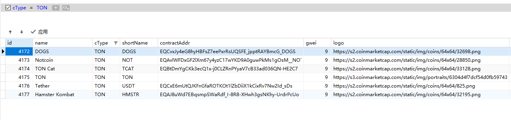

# 币名、token表

配置这个数据展示到资产代币列表

```sql
CREATE TABLE `coins` (
  `id` int(11) NOT NULL AUTO_INCREMENT,
  `name` varchar(200) DEFAULT NULL COMMENT '币名',
  `cType` varchar(100) DEFAULT '''''' COMMENT '类型BTC/ETH/ERC',
  `shortName` varchar(200) DEFAULT '''''' COMMENT '币名简称',
  `contractAddr` varchar(200) DEFAULT '''''' COMMENT '合约地址（Token）',
  `gwei` int(10) DEFAULT NULL COMMENT 'G位',
  `logo` varchar(200) DEFAULT NULL COMMENT 'Logo',
  `gasLimit` int(10) DEFAULT '0' COMMENT 'ETH gasLimit',
  `ctime` int(10) DEFAULT '0' COMMENT '添加时间',
  `status` tinyint(3) DEFAULT '1' COMMENT '状态-1=禁用 1=正常',
  `storage` tinyint(1) NOT NULL DEFAULT '0',
  `buy` tinyint(1) NOT NULL DEFAULT '0',
  `swap` tinyint(1) NOT NULL DEFAULT '0',
  `staking` tinyint(1) NOT NULL DEFAULT '0',
  `note` varchar(10) NOT NULL DEFAULT 'null',
  `blockchain` tinyint(1) NOT NULL DEFAULT '0',
  `link` varchar(200) DEFAULT NULL COMMENT '币种介绍链接',
  `cmcId` int(11) DEFAULT NULL COMMENT 'coinmarketID',
  PRIMARY KEY (`id`)
) ENGINE=InnoDB AUTO_INCREMENT=4178 DEFAULT CHARSET=utf8 COMMENT='币名、token表';
```




- 用币名结尾的有特殊处理, 在这里修改

```sql
CREATE TABLE `coinsAda` (
  `id` int(11) NOT NULL AUTO_INCREMENT,
  `name` varchar(200) DEFAULT NULL COMMENT '币名',
  `cType` varchar(100) DEFAULT '''''' COMMENT '类型BTC/ETH/ERC',
  `shortName` varchar(200) DEFAULT '''''' COMMENT '币名简称',
  `contractAddr` varchar(200) DEFAULT '''''' COMMENT '合约地址（Token）',
  `gwei` int(10) DEFAULT NULL COMMENT 'G位',
  `logo` varchar(200) DEFAULT NULL COMMENT 'Logo',
  `gasLimit` int(10) DEFAULT '0' COMMENT 'ETH gasLimit',
  `ctime` int(10) DEFAULT '0' COMMENT '添加时间',
  `status` tinyint(3) DEFAULT '1' COMMENT '状态-1=禁用 1=正常',
  `storage` tinyint(1) NOT NULL DEFAULT '1',
  `buy` tinyint(1) NOT NULL DEFAULT '0',
  `swap` tinyint(1) NOT NULL DEFAULT '0',
  `staking` tinyint(1) NOT NULL DEFAULT '0',
  `note` varchar(15) NOT NULL DEFAULT 'ERC20',
  `blockchain` tinyint(1) NOT NULL DEFAULT '0',
  `link` varchar(200) DEFAULT NULL,
  `asset_name_hex` varchar(200) DEFAULT NULL,
  `cmcId` int(11) DEFAULT NULL COMMENT 'coinmarketID',
  PRIMARY KEY (`id`),
  KEY `asset_name_hex` (`asset_name_hex`) USING BTREE
) ENGINE=InnoDB AUTO_INCREMENT=4117 DEFAULT CHARSET=utf8 COMMENT='币名、token表';
```

