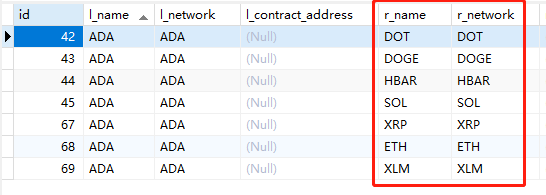
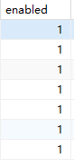
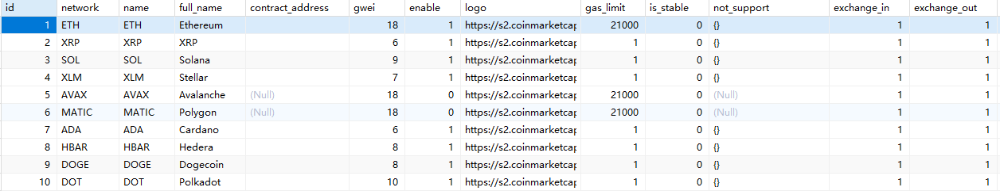

# 添加币种数据internal_network_config

```sql
CREATE TABLE `internal_network_config` (
  `id` int(11) NOT NULL AUTO_INCREMENT COMMENT '主键id',
  `name` varchar(128) NOT NULL COMMENT '简称',
  `network` varchar(32) CHARACTER SET latin1 NOT NULL COMMENT '链网络',
  `contract_address` varchar(256) DEFAULT NULL COMMENT '合约地址（主币无）',
  `wallet_address` varchar(256) CHARACTER SET latin1 NOT NULL COMMENT '平台钱包地址',
  `pub_key` varchar(256) DEFAULT NULL COMMENT '公钥',
  `init_volume` decimal(18,8) NOT NULL COMMENT '币池初始数量',
  `warning_level` decimal(3,2) NOT NULL COMMENT '告警线比例',
  `binance_address` varchar(256) NOT NULL COMMENT '币安地址',
  `binance_withdraw_min` decimal(18,8) NOT NULL COMMENT '最小提币数量',
  `transfer_network` varchar(128) NOT NULL COMMENT '转账网络',
  `amount_step` int(4) NOT NULL COMMENT '步长',
  `future_amount_step` int(4) NOT NULL COMMENT '期货步长',
  `tag` int(11) DEFAULT NULL COMMENT '某些币种向交易所转账时指定，如XRP(自用)',
  `memo_id` int(11) DEFAULT NULL COMMENT '某些币向交易所转账需要，如XLM',
  `memo_text` varchar(256) DEFAULT NULL COMMENT '某些币需要',
  `type` tinyint(3) NOT NULL DEFAULT '0' COMMENT '0常规 1大额',
  `expire_time` int(4) NOT NULL COMMENT '超时时间(小时)：（创建交易到收到转账的有效时间范围）',
  `create_time` datetime NOT NULL DEFAULT CURRENT_TIMESTAMP COMMENT '创建时间',
  `update_time` datetime DEFAULT NULL COMMENT '更新时间',
  PRIMARY KEY (`id`)
) ENGINE=InnoDB AUTO_INCREMENT=17 DEFAULT CHARSET=utf8mb4 COMMENT='地址网络配置表';
```


**需获取币安的现货(amount_step)和合约(future_amount_step)最小变化精度**


**需获取现货提现时是否有memoid及最小提现量(有些币比较特殊)**


**需配置自有平台钱包地址(wallet_address)及公钥(pub_key)**


# internal_pair_config添加币对

```sql
CREATE TABLE `internal_pair_config` (
  `id` int(11) NOT NULL AUTO_INCREMENT COMMENT '主键',
  `l_name` varchar(64) NOT NULL COMMENT '对出币简称',
  `l_network` varchar(64) NOT NULL COMMENT '对出币网络',
  `l_contract_address` varchar(256) DEFAULT NULL COMMENT '对出币合约地址（主币没用）',
  `r_name` varchar(64) NOT NULL COMMENT '兑入币简称',
  `r_network` varchar(64) NOT NULL COMMENT '兑入币网络',
  `r_contract_address` varchar(256) DEFAULT NULL COMMENT '兑入币合约地址（主币没用）',
  `min_amount` decimal(16,8) NOT NULL COMMENT '最小值',
  `max_amount` decimal(16,8) NOT NULL COMMENT '最大值',
  `enabled` tinyint(1) NOT NULL DEFAULT '1' COMMENT '是否启用',
  `type` tinyint(3) NOT NULL DEFAULT '0' COMMENT '0常规自有 1大额自有',
  `create_time` datetime NOT NULL DEFAULT CURRENT_TIMESTAMP COMMENT '创建时间',
  `update_time` datetime DEFAULT NULL COMMENT '更新时间',
  PRIMARY KEY (`id`)
) ENGINE=InnoDB AUTO_INCREMENT=76 DEFAULT CHARSET=utf8 COMMENT='自有兑换-交易对配置';
```


**需结合实际情况及币安最小下单数量综合考虑，配置兑出币种最大(min_amount)最小(max_amount)下单数量**


**对于需要兑入的币种，一一配置即可, 双向配置**



**开关需打开才会允许兑换(enabled=1)**




# internal_exchange_currency_config币种详情数据

展示用的

```sql
CREATE TABLE `internal_exchange_currency_config` (
  `id` int(11) NOT NULL AUTO_INCREMENT COMMENT '主键ID',
  `network` varchar(32) NOT NULL COMMENT '链网络',
  `name` varchar(64) NOT NULL COMMENT '币种简称',
  `full_name` varchar(256) NOT NULL COMMENT '币全称',
  `contract_address` varchar(256) DEFAULT NULL COMMENT '合约地址',
  `gwei` int(4) NOT NULL COMMENT '单位',
  `enable` tinyint(1) NOT NULL DEFAULT '1' COMMENT '是否启用',
  `logo` varchar(256) NOT NULL COMMENT '图标地址',
  `gas_limit` int(11) NOT NULL DEFAULT '0',
  `is_stable` tinyint(1) NOT NULL DEFAULT '1' COMMENT '是否为稳定币',
  `not_support` json DEFAULT NULL COMMENT '不支持兑入',
  `exchange_in` tinyint(1) NOT NULL DEFAULT '1' COMMENT '是否允许兑入',
  `exchange_out` tinyint(1) NOT NULL DEFAULT '1' COMMENT '是否允许对出',
  `c_group` varchar(64) DEFAULT NULL COMMENT '体系',
  `type` tinyint(3) NOT NULL DEFAULT '0' COMMENT '0：常规自有、1：大额自有',
  `create_time` datetime NOT NULL DEFAULT CURRENT_TIMESTAMP COMMENT '创建时间',
  `update_time` datetime DEFAULT NULL COMMENT '更新时间',
  PRIMARY KEY (`id`)
) ENGINE=InnoDB AUTO_INCREMENT=11 DEFAULT CHARSET=utf8 COMMENT='自有兑换品种配置表';
```



# system_dict交易所配置

```sql
CREATE TABLE `system_dict` (
  `id` int(11) NOT NULL AUTO_INCREMENT COMMENT '主键id',
  `dict_type` varchar(128) DEFAULT NULL COMMENT '类型',
  `dict_key` varchar(128) DEFAULT NULL COMMENT 'key',
  `dict_value` varchar(128) DEFAULT NULL COMMENT '值',
  `status` tinyint(1) DEFAULT '1' COMMENT '状态',
  `sort` int(8) DEFAULT NULL COMMENT '排序',
  `description` varchar(256) DEFAULT NULL COMMENT '描述',
  `create_time` datetime DEFAULT CURRENT_TIMESTAMP COMMENT '创建时间',
  `update_time` datetime DEFAULT NULL COMMENT '更新时间',
  `extension` varchar(1024) DEFAULT NULL COMMENT '扩展字段',
  PRIMARY KEY (`id`)
) ENGINE=InnoDB AUTO_INCREMENT=9 DEFAULT CHARSET=utf8mb4 COMMENT='系统字典表';
```

