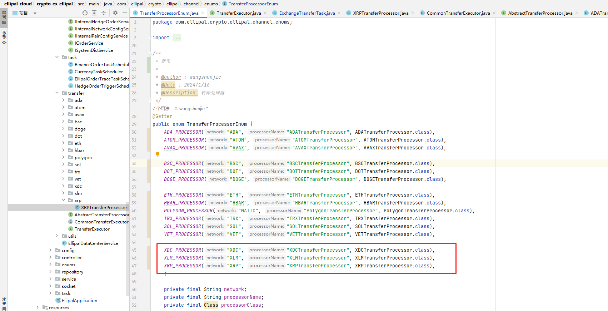
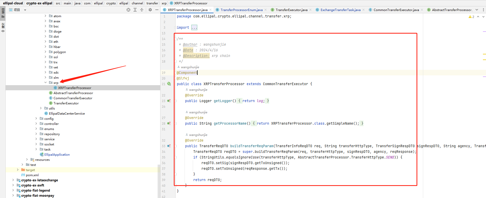
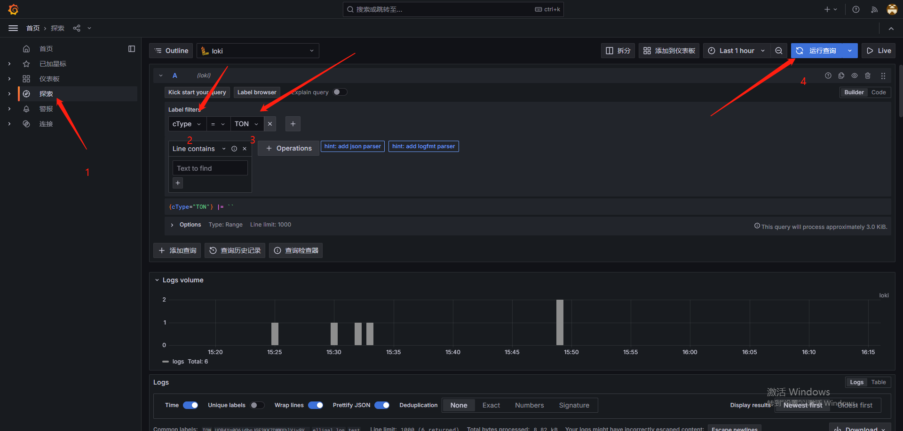
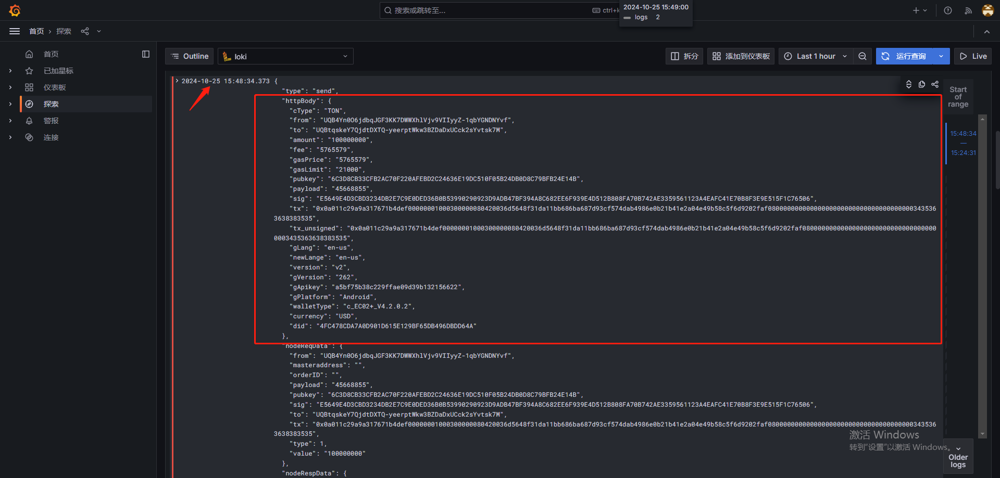

# 说明

需实现相应processor，具体原因是每个币种发起req时，所需字段不同，所以需要通过多态去每个币种上

同时，对于不同体系的币种如utxo等，对应gasfee也不尽相同，所以还需考虑预签名时传入gasfee的计算问题


# 新币处理枚举配置

配置币种、处理实现类名称、处理实现类




# 处理类




主要是对构建请求参数的补充:

```java
@Override
public TransferReqDTO buildTransferReqParam(TransferInfoReqDTO req, String transferHttpType, TransferSignRespDTO signRespDTO, String agency, TransferRespDTO reqResponse) {
    TransferReqDTO reqDTO = super.buildTransferReqParam(req, transferHttpType, signRespDTO, agency, reqResponse);
    if (StringUtils.equalsIgnoreCase(transferHttpType, AbstractTransferProcessor.TransferHttpType.SEND)) {
        reqDTO.setSig(signRespDTO.getTxUnsigned());
        reqDTO.setTxUnsigned(reqResponse.getTx());
    }
    return reqDTO;
}
```

他会先调用`super.buildTransferReqParam`构建部分数据, 但是可能不全, 所以需要继承重构补充参数


## 补充的参数来源

**日志管理系统**

```
http://wallettest.ellipal.com:3000/explore?schemaVersion=1&panes=%7B%22b1o%22%3A%7B%22datasource%22%3A%22fdmy12szw83k0c%22%2C%22queries%22%3A%5B%7B%22refId%22%3A%22A%22%2C%22expr%22%3A%22%7BcType%3D%5C%22BTC%5C%22%7D+%7C%3D+%60%60%22%2C%22queryType%22%3A%22range%22%2C%22datasource%22%3A%7B%22type%22%3A%22loki%22%2C%22uid%22%3A%22fdmy12szw83k0c%22%7D%2C%22editorMode%22%3A%22builder%22%7D%5D%2C%22range%22%3A%7B%22from%22%3A%22now-1h%22%2C%22to%22%3A%22now%22%7D%7D%7D&orgId=1
```





**查询到最近的来自用户的请求信息, 这里的body就是需要对照后补充到实现处理类中的参数, 不够的就补**
