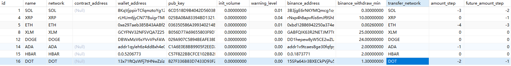
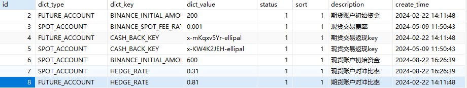

# internal_network_config添加币种数据

```sql
CREATE TABLE `internal_network_config` (
  `id` int(11) NOT NULL AUTO_INCREMENT COMMENT '主键id',
  `name` varchar(128) NOT NULL COMMENT '简称',
  `network` varchar(32) CHARACTER SET latin1 NOT NULL COMMENT '链网络',
  `contract_address` varchar(256) DEFAULT NULL COMMENT '合约地址（主币无）',
  `wallet_address` varchar(256) CHARACTER SET latin1 NOT NULL COMMENT '平台钱包地址',
  `pub_key` varchar(256) DEFAULT NULL COMMENT '公钥',
  `init_volume` decimal(18,8) NOT NULL COMMENT '币池初始数量',
  `warning_level` decimal(3,2) NOT NULL COMMENT '告警线比例',
  `binance_address` varchar(256) NOT NULL COMMENT '币安地址',
  `binance_withdraw_min` decimal(18,8) NOT NULL COMMENT '最小提币数量',
  `transfer_network` varchar(128) NOT NULL COMMENT '转账网络',
  `amount_step` int(4) NOT NULL COMMENT '步长',
  `future_amount_step` int(4) NOT NULL COMMENT '期货步长',
  `tag` int(11) DEFAULT NULL COMMENT '某些币种向交易所转账时指定，如XRP(自用)',
  `memo_id` int(11) DEFAULT NULL COMMENT '某些币向交易所转账需要，如XLM',
  `memo_text` varchar(256) DEFAULT NULL COMMENT '某些币需要',
  `type` tinyint(3) NOT NULL DEFAULT '0' COMMENT '0常规 1大额',
  `expire_time` int(4) NOT NULL COMMENT '超时时间(小时)：（创建交易到收到转账的有效时间范围）',
  `create_time` datetime NOT NULL DEFAULT CURRENT_TIMESTAMP COMMENT '创建时间',
  `update_time` datetime DEFAULT NULL COMMENT '更新时间',
  PRIMARY KEY (`id`)
) ENGINE=InnoDB AUTO_INCREMENT=17 DEFAULT CHARSET=utf8mb4 COMMENT='地址网络配置表';
```



# internal_pair_config交易币对配置

```sql
CREATE TABLE `internal_pair_config` (
  `id` int(11) NOT NULL AUTO_INCREMENT COMMENT '主键',
  `l_name` varchar(64) NOT NULL COMMENT '对出币简称',
  `l_network` varchar(64) NOT NULL COMMENT '对出币网络',
  `l_contract_address` varchar(256) DEFAULT NULL COMMENT '对出币合约地址（主币没用）',
  `r_name` varchar(64) NOT NULL COMMENT '兑入币简称',
  `r_network` varchar(64) NOT NULL COMMENT '兑入币网络',
  `r_contract_address` varchar(256) DEFAULT NULL COMMENT '兑入币合约地址（主币没用）',
  `min_amount` decimal(16,8) NOT NULL COMMENT '最小值',
  `max_amount` decimal(16,8) NOT NULL COMMENT '最大值',
  `enabled` tinyint(1) NOT NULL DEFAULT '1' COMMENT '是否启用',
  `type` tinyint(3) NOT NULL DEFAULT '0' COMMENT '0常规自有 1大额自有',
  `create_time` datetime NOT NULL DEFAULT CURRENT_TIMESTAMP COMMENT '创建时间',
  `update_time` datetime DEFAULT NULL COMMENT '更新时间',
  PRIMARY KEY (`id`)
) ENGINE=InnoDB AUTO_INCREMENT=76 DEFAULT CHARSET=utf8 COMMENT='自有兑换-交易对配置';
```


# system_dict交易所配置

```sql
CREATE TABLE `system_dict` (
  `id` int(11) NOT NULL AUTO_INCREMENT COMMENT '主键id',
  `dict_type` varchar(128) DEFAULT NULL COMMENT '类型',
  `dict_key` varchar(128) DEFAULT NULL COMMENT 'key',
  `dict_value` varchar(128) DEFAULT NULL COMMENT '值',
  `status` tinyint(1) DEFAULT '1' COMMENT '状态',
  `sort` int(8) DEFAULT NULL COMMENT '排序',
  `description` varchar(256) DEFAULT NULL COMMENT '描述',
  `create_time` datetime DEFAULT CURRENT_TIMESTAMP COMMENT '创建时间',
  `update_time` datetime DEFAULT NULL COMMENT '更新时间',
  `extension` varchar(1024) DEFAULT NULL COMMENT '扩展字段',
  PRIMARY KEY (`id`)
) ENGINE=InnoDB AUTO_INCREMENT=9 DEFAULT CHARSET=utf8mb4 COMMENT='系统字典表';
```




# exchange_strategy_config兑换收费策略配置

```sql
CREATE TABLE `exchange_strategy_config` (
  `id` int(11) NOT NULL AUTO_INCREMENT COMMENT '主键',
  `channel` varchar(64) NOT NULL COMMENT '兑换渠道',
  `type` int(4) NOT NULL COMMENT '策略类型',
  `value` decimal(6,4) NOT NULL DEFAULT '0.0000' COMMENT '策略值（收费比例）',
  `exchange_fee` decimal(6,5) NOT NULL DEFAULT '0.00000' COMMENT '交易所手续费',
  `tolerate` decimal(3,2) DEFAULT '0.20' COMMENT '容忍范围',
  `enabled` tinyint(1) NOT NULL DEFAULT '1' COMMENT '是否启用',
  `description` varchar(256) DEFAULT NULL COMMENT '策略描述',
  `create_time` datetime NOT NULL DEFAULT CURRENT_TIMESTAMP COMMENT '创建时间',
  `update_time` datetime DEFAULT NULL COMMENT '更新时间',
  PRIMARY KEY (`id`),
  UNIQUE KEY `exchange_strategy_config_un` (`type`,`channel`)
) ENGINE=InnoDB AUTO_INCREMENT=2 DEFAULT CHARSET=utf8 COMMENT='兑换收费策略配置';
```


# ellipal_transfer_record转账记录表

```sql
CREATE TABLE `ellipal_transfer_record` (
  `id` int(11) NOT NULL AUTO_INCREMENT COMMENT '主键',
  `seq_no` varchar(128) NOT NULL COMMENT '流水号',
  `order_id` varchar(128) DEFAULT NULL COMMENT '订单ID',
  `name` varchar(128) NOT NULL COMMENT '简称',
  `network` varchar(128) NOT NULL COMMENT '链网络',
  `contract_address` varchar(256) DEFAULT NULL COMMENT '合约地址（主币没用）',
  `from_address` varchar(256) NOT NULL COMMENT 'from地址',
  `to_address` varchar(256) NOT NULL COMMENT 'to地址',
  `volume` decimal(18,8) NOT NULL COMMENT '数量',
  `tx_hash` varchar(256) DEFAULT NULL COMMENT '交易hash',
  `target_type` varchar(128) NOT NULL COMMENT '转账目标类型(USER,BINANCE...)',
  `trigger_type` varchar(128) NOT NULL COMMENT '触发类型',
  `status` varchar(128) DEFAULT NULL COMMENT '转账状态',
  `fail_count` int(4) DEFAULT '0' COMMENT '失败次数',
  `reason` text COMMENT '最后一次失败原因',
  `create_time` datetime NOT NULL COMMENT '创建时间',
  `update_time` datetime DEFAULT NULL COMMENT '更新时间',
  PRIMARY KEY (`id`)
) ENGINE=InnoDB AUTO_INCREMENT=171 DEFAULT CHARSET=utf8mb4 COMMENT='转账记录表';
```


# internal_exchange_currency_config自有兑换品种配置表

```sql
CREATE TABLE `internal_exchange_currency_config` (
  `id` int(11) NOT NULL AUTO_INCREMENT COMMENT '主键ID',
  `network` varchar(32) NOT NULL COMMENT '链网络',
  `name` varchar(64) NOT NULL COMMENT '币种简称',
  `full_name` varchar(256) NOT NULL COMMENT '币全称',
  `contract_address` varchar(256) DEFAULT NULL COMMENT '合约地址',
  `gwei` int(4) NOT NULL COMMENT '单位',
  `enable` tinyint(1) NOT NULL DEFAULT '1' COMMENT '是否启用',
  `logo` varchar(256) NOT NULL COMMENT '图标地址',
  `gas_limit` int(11) NOT NULL DEFAULT '0',
  `is_stable` tinyint(1) NOT NULL DEFAULT '1' COMMENT '是否为稳定币',
  `not_support` json DEFAULT NULL COMMENT '不支持兑入',
  `exchange_in` tinyint(1) NOT NULL DEFAULT '1' COMMENT '是否允许兑入',
  `exchange_out` tinyint(1) NOT NULL DEFAULT '1' COMMENT '是否允许对出',
  `c_group` varchar(64) DEFAULT NULL COMMENT '体系',
  `type` tinyint(3) NOT NULL DEFAULT '0' COMMENT '0：常规自有、1：大额自有',
  `create_time` datetime NOT NULL DEFAULT CURRENT_TIMESTAMP COMMENT '创建时间',
  `update_time` datetime DEFAULT NULL COMMENT '更新时间',
  PRIMARY KEY (`id`)
) ENGINE=InnoDB AUTO_INCREMENT=11 DEFAULT CHARSET=utf8 COMMENT='自有兑换品种配置表';
```


# internal_exchange_order自有兑换订单表

```sql
CREATE TABLE `internal_exchange_order` (
  `id` int(11) NOT NULL AUTO_INCREMENT COMMENT '主键',
  `order_id` varchar(128) NOT NULL COMMENT '兑换订单号',
  `l_name` varchar(64) NOT NULL COMMENT '对出币名称',
  `l_network` varchar(64) DEFAULT NULL COMMENT '对出币链',
  `l_contract_address` varchar(256) DEFAULT NULL COMMENT '对出合约地址',
  `r_name` varchar(128) DEFAULT NULL COMMENT '兑入币名称',
  `r_network` varchar(64) NOT NULL COMMENT '兑入币链',
  `r_contract_address` varchar(256) DEFAULT NULL COMMENT '兑入合约地址',
  `from_user_address` varchar(256) NOT NULL COMMENT '对出钱包地址',
  `platform_receive_address` varchar(256) NOT NULL COMMENT '平台接收地址',
  `to_user_address` varchar(256) NOT NULL COMMENT '兑入钱包地址',
  `platform_out_address` varchar(256) NOT NULL COMMENT '平台转账地址',
  `refund_address` varchar(256) DEFAULT NULL COMMENT '退款地址',
  `status` varchar(128) NOT NULL COMMENT '订单状态',
  `from_amount` decimal(18,8) NOT NULL COMMENT '对出数量',
  `receive_amount` decimal(18,8) DEFAULT NULL COMMENT '平台到账数量',
  `to_amount` decimal(18,8) DEFAULT NULL COMMENT '兑出币转出数量',
  `actual_to_amount` decimal(18,8) DEFAULT NULL COMMENT '实际转出',
  `usual_l_price` decimal(16,8) DEFAULT NULL COMMENT '正常对入价格（USDT）',
  `actual_l_price` decimal(16,8) DEFAULT NULL COMMENT '实际兑换兑入价格（USDT）',
  `usual_r_price` decimal(16,8) DEFAULT NULL COMMENT '正常兑出价格（USDT）',
  `actual_r_price` decimal(16,8) DEFAULT NULL COMMENT '实际兑换对出价格（USDT）',
  `profit_amount` decimal(16,8) DEFAULT NULL COMMENT '分成收益数量',
  `profit_tag` int(4) NOT NULL COMMENT '分成标识',
  `profit_rate` decimal(6,4) DEFAULT NULL COMMENT '分成比例',
  `tx_hash_in` varchar(256) DEFAULT NULL COMMENT '兑入时交易hash',
  `tx_hash_out` varchar(256) DEFAULT NULL COMMENT '平台转账时交易hash',
  `ext_order_id` varchar(128) NOT NULL COMMENT '额外的订单id，调用方标识',
  `extension` varchar(2048) DEFAULT NULL COMMENT '备用信息',
  `type` tinyint(3) NOT NULL DEFAULT '0' COMMENT '0：常规自有、1：大额自有',
  `expire_time` datetime DEFAULT NULL COMMENT '过期时间：规定时间内未收到转账',
  `create_time` datetime NOT NULL DEFAULT CURRENT_TIMESTAMP COMMENT '创建时间',
  `update_time` datetime DEFAULT NULL COMMENT '更新时间',
  PRIMARY KEY (`id`),
  UNIQUE KEY `internal_exchange_order_un` (`order_id`),
  UNIQUE KEY `internal_exchange_order_order_id_IDX` (`order_id`,`ext_order_id`) USING BTREE
) ENGINE=InnoDB AUTO_INCREMENT=401 DEFAULT CHARSET=utf8 COMMENT='自有兑换订单表';
```


# internal_hedge_order对冲订单表

```sql
CREATE TABLE `internal_hedge_order` (
  `id` int(11) NOT NULL AUTO_INCREMENT COMMENT '主键ID',
  `order_id` varchar(128) NOT NULL COMMENT '订单ID',
  `trade_side` varchar(64) NOT NULL COMMENT '方向（BUY,SELL）',
  `order_type` varchar(64) NOT NULL COMMENT '订单类型（FUTURE，SPOT）',
  `symbol` varchar(64) NOT NULL COMMENT '币种',
  `network` varchar(64) NOT NULL COMMENT '链网络',
  `contract_address` varchar(128) DEFAULT NULL COMMENT '合约地址',
  `price` decimal(16,8) DEFAULT NULL COMMENT '价格',
  `volume` decimal(18,8) DEFAULT NULL COMMENT '数量',
  `actual_trade_volume` decimal(18,8) NOT NULL COMMENT '实际交易量（手续费）',
  `type` tinyint(3) NOT NULL COMMENT '0常规 1大额',
  `status` varchar(64) DEFAULT NULL COMMENT '订单状态',
  `reason` text COMMENT '原因',
  `create_time` datetime DEFAULT NULL COMMENT '创建时间',
  `update_time` datetime DEFAULT NULL COMMENT '更新时间',
  PRIMARY KEY (`id`),
  UNIQUE KEY `internal_hedge_order_order_id_IDX` (`order_id`,`order_type`) USING BTREE
) ENGINE=InnoDB AUTO_INCREMENT=143 DEFAULT CHARSET=utf8mb4 COMMENT='自有兑换-对冲订单表';
```

