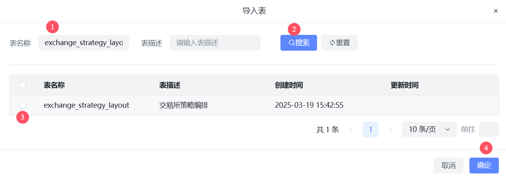

# 管理后台自动生成代码

- 本地启动项目(必须是本地启动)
- 本地启动项目(必须是本地启动)
- 本地启动项目(必须是本地启动)

# 1. 开发工具自动生成

# 2. 导入数据库

# 3. 编辑信息

- 基本信息编辑作者名称

- 应用名称编辑后台代码生成的目录

# 4. 生成代码

- 会生成后端和前端代码
  - 注意拉取项目的代码不要改名称: 后端项目名称 `go-admin`
  - 注意拉取项目的代码不要改名称: 前端项目名称`go-admin-vue3`

## 4.1 后台代码

## 4.2 前端代码

# 5. 配置接口

翻到最后一页, 找到刚刚自动新增的表的增删改查接口, 点击编辑

**输入名称 +  类型选择BUS业务类型**, 把增删改查接口都配置好

# 6. 生成菜单配置(本地)

## 6.1 手动配置新增菜单

- API权限选择前面配置的增删改查接口

## 7. 菜单管理编辑(本地)

- 当你为一个功能新增一个新的接口权限的时候, 之前的角色不会联动赋予这个新权限, 需要在角色更新重新取消再添加权限

# 8. 正式环境配置步骤

1. 在正式环境点击开发工具代码生成, 导入数据库表
2. 点击生成配置(注意不要生成代码)
3. 点击菜单管理, 将生成的默认的菜单删除

4. 接口管理配置接口

5. 手动在想要的菜单位置添加菜单

