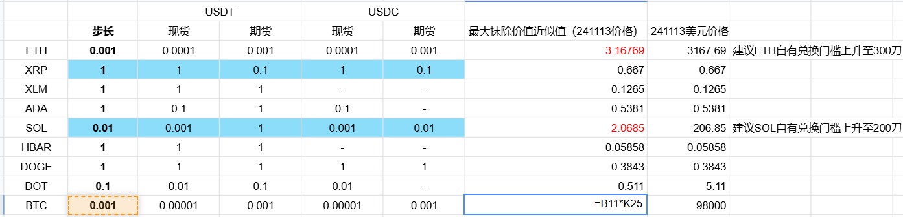
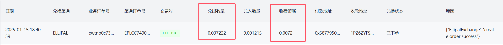
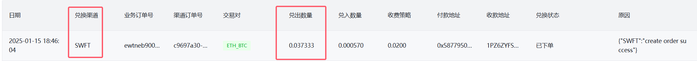

# 自有兑换取消步长




币对兑换步长限制放开: 

- 超过步长的部分，先截取尾数，计算这部分占整单的比例，如果已超过设置的费率，则不接此单，交给其他交易所；
- 如果未超过设置的费率，则计算剩余应收的收益，正常接单

```
- 理论上最大收费的数量 = 兑出数量 * 0.045(公司收费策略)
- 如果 理论上最大收费的数量 大于 被截断的兑出数量小数部分 -> 说明被截断的部分可以全部抹除, 包含在收费比例中
- 如果 理论上最大收费的数量 小于 被截断的兑出数量小数部分 -> 说明被截断的部分价值占比太高了, 截断用户亏损太多, 此时不接单
	
(截断后的兑出数量 + 被截断的兑出数量小数部分) * y收费策略 = (截断后的兑出数量 * x剩余收费策略) + 被截断的兑出数量小数部分
求: (A + B) * y = A * x + B
解: x = y - (B / A) * (1 - y)
	- x剩余收费策略 = y收费策略 - (被截断的兑出数量小数部分 /  截断后的兑出数量) * (1 - y收费策略)
```

- 实际的兑出数量 = x剩余收费策略 * 截断后的兑出数量


# 最大可抹除的小数

**最大可抹除的小数 = 兑出数量 * 0.072(收费策略)**

​	(**收费策略 ->** 测试环境: 0.005, 正式环境: 0.045)


> 例1(成功): ETH_BTC



- ETH(兑出数量) = 0.037222
- ETH 步长 = 0.001
- ETH 抹除小数部分 = 0.000222

最大可抹除的小数 = 0.037222 * 0.0072(收费策略) = 0.00026800

- 0.00026800 > 0.000222(ETH 抹除小数部分)
- 最大可抹除小数 **大于** 当前兑出小数
- 可抹除, 接单


> 例2(失败): ETH_BTC



- ETH(兑出数量) = 0.037333
- ETH 步长 = 0.001
- ETH 抹除小数部分 = 0.000333

最大可抹除的小数 = 0.037333 * 0.0072(收费策略) = 0.00026879760

- 0.00026879760 < 0.000333(ETH 抹除小数部分)
- 最大可抹除小数 **小于** 当前兑出小数
- 不可抹除, 不接单


# 代码

src/main/java/com/ellipal/crypto/ellipal/channel/task/CurrencyTaskScheduler.java

```java

    /**
     * 计算兑换数量。
     * <p>
     * 此方法用于计算从一种货币兑换到另一种货币的数量，考虑到费用扣除。支持模拟计算模式。
     *
     * @param reqDTO       请求数据传输对象，包含兑换所需的各项信息。
     * @param lPrice       兑出货币的价格（相对于 USDT）。
     * @param rPrice       兑入货币的价格（相对于 USDT）。
     * @param isSimulation 是否进行模拟计算(是否是现货交易, 现货)
     * @return 兑入货币数量(扣除收费 + gas费)
     */
    public BigDecimal getExchangePairAmount(PairInfoReqDTO reqDTO, BigDecimal lPrice, BigDecimal rPrice, boolean isSimulation) {
            // 3.抹除步长
            // 获取兑出币步长信息
            InternalNetworkConfig networkConfigOut = networkConfigService.getNetworkConfig(
                    reqDTO.getLName(),
                    reqDTO.getLNetwork(),
                    reqDTO.getLContractAddress());

            // 抹除根据兑出币合约步长的尾数
            StepUtil separateDecimal = StepUtil.truncateAndSeparateDecimal(amount, networkConfigOut.getFutureAmountStep());
            if (separateDecimal == null) {
                log.error("**********计算兑入数量错误:{}({})_{}({}) 兑出数量抹除步长后为0: 兑出数量: {}, 步长: {}",
                        reqDTO.getLName(), reqDTO.getLNetwork(), reqDTO.getRName(), reqDTO.getRNetwork(), amount, networkConfigOut.getFutureAmountStep());
                return null;
            }
            // 截断后的兑出数量
            BigDecimal truncatedAmount = separateDecimal.getTruncatedAmount();
            // 被截断的兑出数量小数部分
            BigDecimal truncatedDecimalPart = separateDecimal.getTruncatedDecimalPart();

            // 理论上最大收费的数量 = 兑出数量 * 0.045(收费策略)
            // 如果 理论上最大收费的数量 > 被截断的兑出数量小数部分 -> 说明被截断的部分可以全部抹除, 可以包含在收费比例中
            // 如果 理论上最大收费的数量 < 被截断的兑出数量小数部分 -> 说明被截断的部分价值占比太高了, 截断用户亏损太多, 此时不接单
            BigDecimal bigAmount = amount.multiply(exchangeFeeRate);
            if (bigAmount.compareTo(truncatedDecimalPart) < 0) {
                log.error("**********计算兑入数量错误:{}({})_{}({}) 兑出数量: {}, 步长: {}, 收费比例: {}%, 最大收费的数量 小于 被截断的兑出数量小数部分: 最大收费的兑出数量: {}, 被截断的兑出数量小数部分: {}",
                        reqDTO.getLName(), reqDTO.getLNetwork(), reqDTO.getRName(), reqDTO.getRNetwork(),
                        amount, networkConfigOut.getFutureAmountStep(), originalProportion, bigAmount.toPlainString(), truncatedDecimalPart.toPlainString());
                return null;
            }
            // (截断后的兑出数量 + 被截断的兑出数量小数部分) * y收费策略(交易所+公司) = (截断后的兑出数量 * x剩余收费策略) + 被截断的兑出数量小数部分
            // 求: (A + B) * y = A * x + B
            // 解: x = y - (B / A) * (1 - y)
            //	- x剩余收费策略 = y收费策略 - (被截断的兑出数量小数部分 /  截断后的兑出数量) * (1 - y收费策略)
            BigDecimal remainingStrategy = exchangeFeeRate.subtract((truncatedDecimalPart.divide(truncatedAmount, 8, RoundingMode.HALF_DOWN)).multiply((BigDecimal.ONE.subtract(exchangeFeeRate))));
            String remainingProportion = remainingStrategy.multiply(new BigDecimal(100)).setScale(2, RoundingMode.HALF_UP).toPlainString();

```

