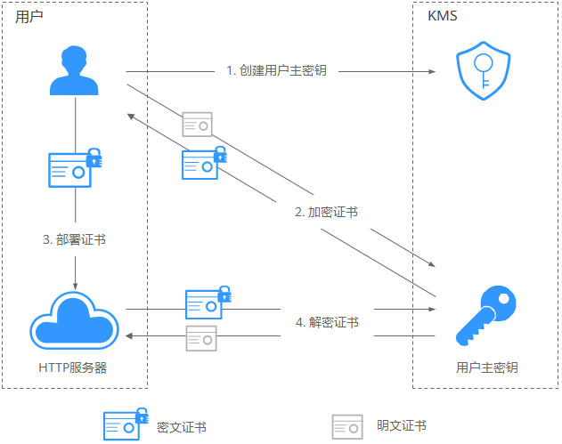

# [华为云服务如何使用KMS加密数据？](https://support.huaweicloud.com/dew_faq/dew_01_0053.html)

# [加解密小量数据](https://support.huaweicloud.com/bestpractice-dew/dew_06_0001.html)

加密证书示例:

**官网流程说明如下：**

1. 用户需要在KMS中创建一个用户主密钥。
2. 用户调用KMS的[加密数据密钥](https://support.huaweicloud.com/api-dew/EncryptDatakey.html)接口，使用指定的用户主密钥将明文证书加密为密文证书。
3. 用户在服务器上部署密文证书。
4. 当服务器需要使用证书时，调用KMS的[解密数据密钥](https://support.huaweicloud.com/api-dew/DecryptDatakey.html)接口，将密文证书解密为明文证书。

> 由于控制台输入的加密原文会经过一次Base64转码后才传至后端
>
> 所以当调用API接口解密密文的时候，返回的明文就是加密原文经过Base64转码得到的字符串

**说明：**

1. 用户在华为云控制台的[KMS](https://console.huaweicloud.com/console/?locale=zh-cn&region=ap-southeast-1#/dew/kms/keyList/customKey)中创建一个主密钥
2. 点击创建的密钥, 进入信息页面, 使用在线工具加密我们的api密钥
3. 将加密后的密钥结果配置在程序中
4. 程序使用密钥时, 调用华为云接口解密api密钥, 拿到api密钥BASE64格式
5. 将BASE64格式密钥转换为原始密钥

# 步骤

    1. 申请华为云 ak/sk
       https://support.huaweicloud.com/devg-apisign/api-sign-provide-aksk.html
  - 进入控制台右上角的用户名处，在下拉列表中单击“统一身份验证”
  - 单击“用户组”, 单击“创建用户组”，
  - 完成后点击用户组授权, 右侧搜索"数据加密", 选择"KMS"
  - 授权成功, 单击“用户”, 单击“创建用户”，勾选"编程访问", "访问密钥", 加入创建的用户组
  - 创建成功后，在“创建成功”弹窗中，单击“立即下载”下载密钥

2. 右上角创建kms主密钥(AES_256)
https://console.huaweicloud.com/dew

3. 点击主密钥, 进入信息页面, 使用在线工具加密我们的api密钥, 拿到加密结果
https://console.huaweicloud.com/dew

4. 通过调用api解密

   https://console.huaweicloud.com/apiexplorer/#/openapi/KMS/sdk?api=DecryptData