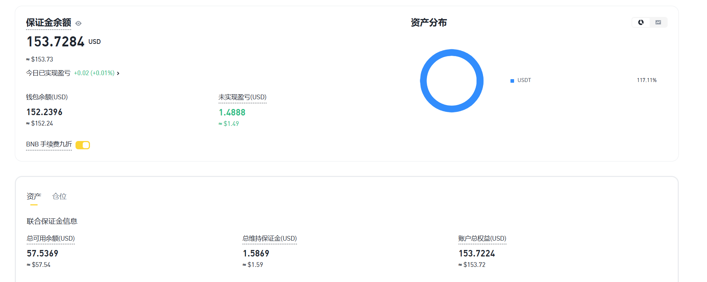
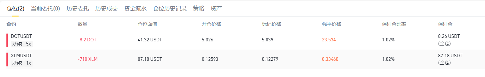
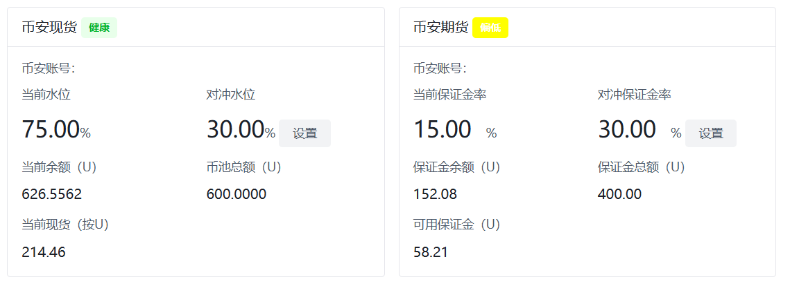

# 账户



**保证金余额: 153.7184** = 钱包余额(152.2396) + 未实现盈亏(+1.4888)

**总可用余额: 57.5369** = 钱包余额(152.2396) - 所有合约单本金(89.4103+8.24264) + 未实现盈亏(+1.4888)

- **XLM本金:**  89.4103 = ( 710(数量) * 0.12593(开仓价格)  ) / 1(杠杆倍数)
- **DOT本金:**  8.24264 = ( 8.2(数量) * 5.026(开仓价格) ) / 5(杠杆倍数) 




# 保证金问题

- 全仓的合约账户是否会爆仓、是否没有足够保证金下单, 主要看**总可用余额**
- 如果**总可用余额**没了, 就不可以继续下合约单了
- 如果**总可用余额**没了, 强平价格就会停止浮动变化, 不会自动加仓保证金, 到达强平价格之后就会爆仓
- 所以必须保证**总可用余额**足够


# 计算对冲



`com/ellipal/crypto/ellipal/channel/task/HedgeOrderTriggerScheduler.java`

```java
    /**
     * 对冲第一步: 对冲平衡定时三分钟检查
     * 合约的功能: 兑出币种开空单, 所以必须保证可用保证金足够
     * 当前保证金水位: 15% = 58.21(可用保证金) / 400(保证金总额)
     * 如果当前保证金水位 **低于** 对冲保证金水位 -> 触发对冲
     * <p>
     * 现货的功能: 买入兑入币种现货, 所以必须保证现货usdt足够
     * 当前水位: 104% = 626.5562(现货usdt余额) / 600(币池总额)
     * 如果当前水位 低于 对冲水位 -> 触发对冲
     */
    @Scheduled(cron = "0 */3 * * * ?")
    public void binanceHedgeTask() {
```


## 币安现货

> 现货的功能: 买入兑入币种现货, 所以必须保证现货usdt足够

当前水位: 104% = 626.5562(现货usdt余额) / 600(币池总额) 

- 如果当前水位 低于 对冲水位 -> 触发对冲


## 币安合约

> 合约的功能: 兑出币种开空单, 所以必须保证可用保证金足够

**当前保证金水位: 15%** = 58.21(可用保证金) / 400(保证金总额) 

- 如果当前保证金水位 **低于** 对冲保证金水位 -> 触发对冲


## 划转

`com/ellipal/crypto/ellipal/channel/runnable/HedgingWithdrawTask.java`

```java
    /**
     * 划转
     * U本位可用余额 小于 初始金额的10%, 触发紧急划转, 避免无可用保证金爆仓
     * U本位usdt余额 小于 初始金额, 现货账户 -> U本位账户划转
     * U本位usdt余额 大于 初始金额, U本位账户 -> 现货账户划转
     */
    private void convert() {
```

- U本位保证金余额 小于 初始金额, **现货账户 -> U本位账户划转**
  - 需要划转的金额 = 初始金额 - U本位保证金余额
  - 需要划转的金额 > 现货usdt余额 : **不允许划转**

- U本位保证金余额 大于 初始金额, **U本位账户 -> 现货账户划转**
  - 需要划转的金额 = U本位保证金余额 - 初始金额
  - 需要划转的金额 > U本位可用保证金 : **不允许划转**


# 查询账户

```sh
# 生产环境
curl --location --request POST 'http://cloud.ellipal.com:5075/api/v1/getBinanceWalletBalanceInfo' \
--header 'User-Agent: Apifox/1.0.0 (https://apifox.com)' \
--header 'Content-Type: application/json' \
--header 'Accept: */*' \
--header 'Host: cloud.ellipal.com:5075' \
--header 'Connection: keep-alive' \
--data-raw '{
    "walletType": "",
    "symbolList": []
}'

# 测试环境
curl --location --request POST 'http://cloudtest.ellipal.com:5075/api/v1/getBinanceWalletBalanceInfo' \
--header 'User-Agent: Apifox/1.0.0 (https://apifox.com)' \
--header 'Content-Type: application/json' \
--header 'Accept: */*' \
--header 'Host: cloudtest.ellipal.com:5075' \
--header 'Connection: keep-alive' \
--data-raw '{
    "walletType": "",
    "symbolList": []
}'
```

