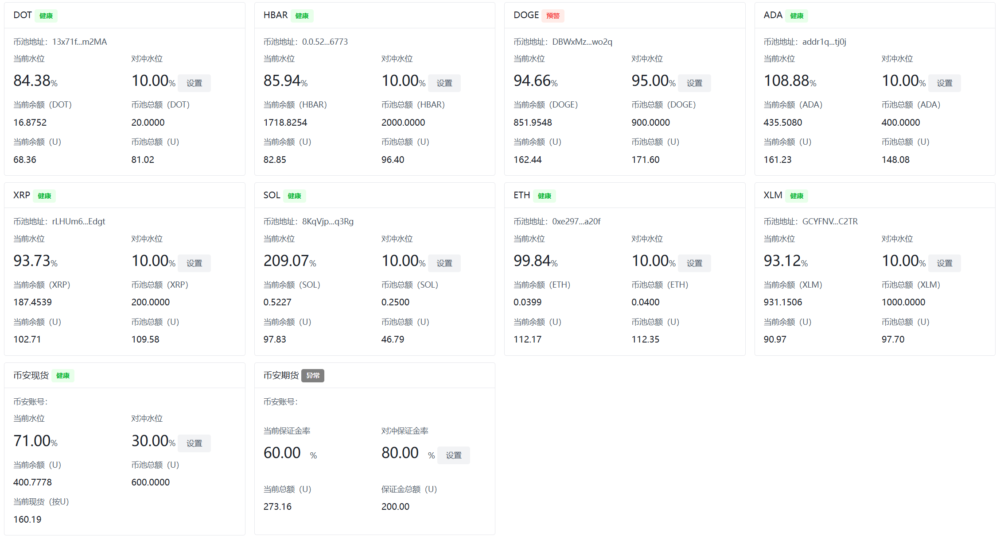

# 查看币池

https://admintest.ellipal.com/#/backend/walletPanel




# 触发对冲的条件

- 币池余额不够了(低于预警值) -> 调大预警值, 触发对冲测试

  - 当前余额851.9548, 初始余额900, 预警值0.95(95%)
  - 当前水位(当前余额851.9548 / 初始余额900) = 0.94% -> 小于95%会触发对冲

  ```java
  // 6. 检查公司资产池是否不足，并在不足时触发对冲(对冲会将交易所的现货提币到币池)
  // 此方法用于检查公司资产池的余额是否低于 初始数量与预警线（比例）的乘积。
  if (assetVolume.compareTo(networkConfig.getInitVolume().multiply(networkConfig.getWarningLevel())) < 0)
  ```

  

- 大额兑换, 币池兑入的钱不够(需要转账给用户的币种钱不够) -> 选择一个币池兑入的钱不够的币种. 触发对冲测试

  - SOL 当前币池余额100, 有一个订单 ADA -> SOL(110), 那么币池只有100个SOL, 无法转给用户, 需要对冲交易所提币到币池  

  ```java
  // 检查待处理订单加上本次转移金额是否超过公司当前币种资产池余额(超大单)
  // 如果超过, 需要对冲, 将交易所的现货提币到公司币池
  if (pendingVolume.add(transferAmount).compareTo(assetVolume) >= 0) {
  ```

  

- 币安合约保证金不足, 触发对冲

- 手动对冲


