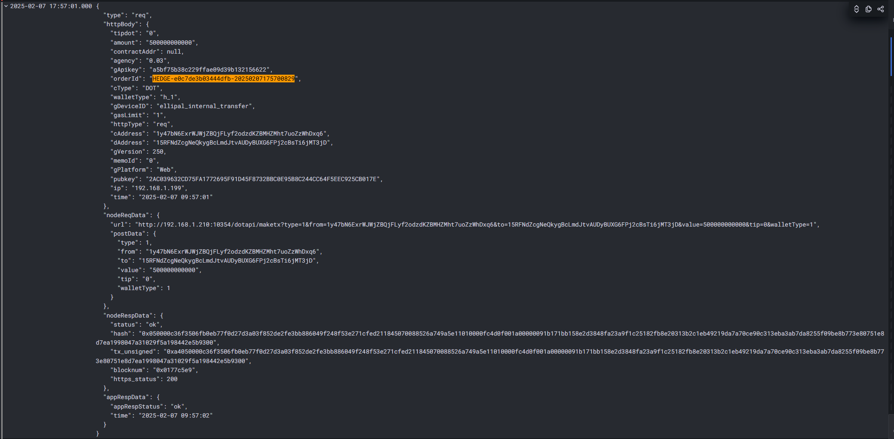
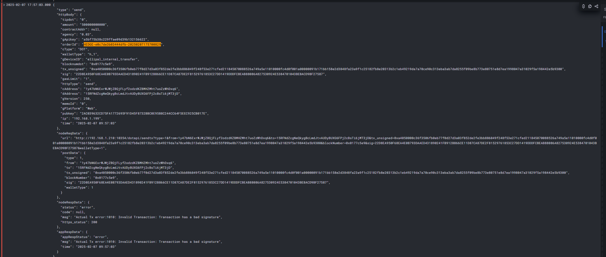

# 备份记录(私密)

# 节点

```sh
# 查询ip 
curl cip.cc
IP      : 159.138.88.172 test
IP      : 94.74.83.47 java-test
IP      : 111.119.193.211	
IP      : 119.8.175.40
IP      : 119.13.105.9
IP      : 114.119.191.234 管理系统
IP      : 111.119.204.50 兑换重构
```

```sh
# 北极星测试
polaris:
  address: grpc://159.138.88.172:8091
 
# 北极星正式
polaris:
  address: grpc://192.168.1.65:8091

# 测试重启
ps  -ef | grep "polaris"
root      4269     1  7 Apr10 ?        09:49:20 ./polaris-server start
kill -9 4269
```


```sh
nginx图片文件目录: /data/wwwroot/wallet/public/images
更新币价: /data/wwwroot/wallet/storage/monitor/exchangecoinpricemonitor/updatepairprice.py
```


# TG

```sh
id=jwx3c1eio3rwxztl

Hello, Please help me check the order.If the exchange cannot continue, can you refund the user?
user address: 0x25130B1368303E4B404687E0fc03721eb542e627

https://tonscan.org/tx/c3565ee079b1e59616da98cedfe373bb635ed80fcb52b04e2aa50996600f31a7
```

```sh
id=e0855934-8c52-426b-826d-cc3dfcf7533c

你好，请帮我查一下订单, 如果不能兑换请原地址退款。
用户原地址: rEf9LwLcizdGRfHftdnCciUJu2Mv1og1To


https://xrpscan.com/tx/343C81989E1AF972617604FD0A9384FF3D0A6A0F1D4D8E52A6A9504DDB0BF8F3
```


# 日志

# php

```sh
# php部署目录: 
cd /root/wallet

# php日志目录: 
tail -f -n 11 /data/wwwroot/wallet/storage/logs/laravel-$(date '+%Y-%m-%d').log
# php转账
tail -f -n 1111 /data/wwwroot/wallet/storage/logs/laravel-$(date '+%Y-%m-%d').log  | grep -E "转账统一|addressDIDinfo--|Check amount|Check httpType|Check cType|dddddd|params|this tokenRecord|rb amount gwei| 未获取到txid|提币|存币"
# 余额
grep -rinI bc1qhljwtjwv48z0a5hfulwl6x5k8nkak6v4u8gvft laravel-2025-04-1*

# 发布目录
cd /data/wwwroot/wallet
vim .git/config
# 追加 ip ssh
ssh-keyscan -p 8011 192.168.5.162 >> ~/.ssh/known_hosts
```

# node

```sh
# req/send
grep -rinI ewtnae02c4f0b041425f944cfa35683226b4 /home/deployer/log/golangNodeServer/logs/transfer/transfer.log 
```


# go兑换

```sh
# 通用
tail -f -n 111 /home/deployer/log/finance-go/logs/app.log
grep ewtnae02c4f0b041425f944cfa35683226b4 /home/deployer/log/finance-go/logs/app.log
# 请求参数日志
tail -f -n 111 /home/deployer/log/finance-go/logs/RequestDetail/RequestDetail.log
# 转账日志
tail -f -n 111 /home/deployer/log/finance-go/logs/Transaction/Transaction.log
grep ewtnae02c4f0b041425f944cfa35683226b4 /home/deployer/log/finance-go/logs/Transaction/Transaction.log

# 获取范围汇率 没有币种价格
tail -f -n 111 /home/deployer/log/finance-go/logs/app.log | grep "获取范围"
tail -f -n 111 /home/deployer/log/finance-go/logs/app.log | grep "获取汇率"
tail -f -n 111 /home/deployer/log/finance-go/logs/app.log | grep -E "获取范围|获取汇率|CreateOrder"

# 创建订单
tail -f -n 111 /home/deployer/log/finance-go/logs/app.log | grep "CreateOrder"

# 订单追踪更改状态
tail -f -n 111 /home/deployer/log/finance-go/logs/app.log | grep "追踪订单状态" 
tail -f -n 111 /home/deployer/log/finance-go/logs/app.log | grep "追踪订单状态: 已完成"
tail -f -n 111 /home/deployer/log/finance-go/logs/app.log | grep "获取交易对价格"
tail -f -n 111 /home/deployer/log/finance-go/logs/app.log | grep "获取交易对价格异常"
tail -f -n 111 /home/deployer/log/finance-go/logs/app.log | grep "当前币价priceMap总数量"
tail -f -n 111 /home/deployer/log/finance-go/logs/app.log | grep "追踪超时订单状态" 
tail -f -n 111 /home/deployer/log/finance-go/logs/app.log | grep "追踪超时订单状态异常" 
```

# 重启注册服务

```sh
root@java-test-new:/home/work/java-project/cryptocloud# ./start_crypto.sh monitor

# 查看进程目录
 pwdx 2292104
```

# java部署

```
启动配置: --spring.profiles.active=test/prod

启动目录: /home/deployer/service/java/模块名/*.jar

运维系统拷贝目录: /home/deployer/spug/repos/java

日志目录: 
cd /home/deployer/spug/repos/java/logs

tail -f -n 11 /home/deployer/spug/repos/java/logs/crypto-data-5001.log
tail -f -n 11 /home/deployer/spug/repos/java/logs/crypto-strategy-5005.log
tail -f -n 11 /home/deployer/spug/repos/java/logs/crypto-portal-5010.log	(https)
tail -f -n 11 /home/deployer/spug/repos/java/logs/crypto-portal-5011.log	(http)
tail -f -n 11 /home/deployer/spug/repos/java/logs/exchange-swft-5073.log
tail -f -n 11 /home/deployer/spug/repos/java/logs/exchange-changelly-5071.log
tail -f -n 11 /home/deployer/spug/repos/java/logs/exchange-changenow-5072.log
tail -f -n 11 /home/deployer/spug/repos/java/logs/exchange-ellipal-5076.log	(http)
tail -f -n 11 /home/deployer/spug/repos/java/logs/exchange-ellipal-5076.log	(https)
tail -f -n 11 /home/deployer/spug/repos/java/logs/fiat-simplex-5050.log
tail -f -n 11 /home/deployer/spug/repos/java/logs/fiat-moonpay-5052.log

日志备份目录
cd /home/deployer/spug/repos/java/logs/archive
```

# eureka

```sh
curl -H "Accept: application/json" http://127.0.0.1:5100/eureka/apps | jq 
```


# portal模块

```sh
# 通用
tail -f -n 111 //home/deployer/spug/repos/java/logs/crypto-portal-5010.log

# 获取汇率和范围 
tail -f -n 111 //home/deployer/spug/repos/java/logs/crypto-portal-5010.log | grep "获取汇率和范围"
tail -f -n 111 //home/deployer/spug/repos/java/logs/crypto-portal-5010.log | grep "获取汇率和范围结果"
tail -f -n 111 //home/deployer/spug/repos/java/logs/crypto-portal-5010.log | grep "获取法币交易范围"

# 创建订单部分  
tail -f -n 111 //home/deployer/spug/repos/java/logs/crypto-portal-5010.log | grep "创建兑换订单"
tail -f -n 111 //home/deployer/spug/repos/java/logs/crypto-portal-5010.log | grep "创建兑换订单结果"
tail -f -n 111 //home/deployer/spug/repos/java/logs/crypto-portal-5010.log | grep "保存创建订单记录到MongoDB"
tail -f -n 111 //home/deployer/spug/repos/java/logs/crypto-portal-5010.log | grep "上报错误信息"
tail -f -n 111 //home/deployer/spug/repos/java/logs/crypto-portal-5010.log | grep "创建买币卖币订单"
```

# strategy策略	

```sh
# 通用
tail -f -n 111 /home/deployer/spug/repos/java/logs/crypto-strategy-5005.log

# 创建订单部分
tail -f -n 111 /home/deployer/spug/repos/java/logs/crypto-strategy-5005.log | grep "\-\-\-\-\-\-" 
tail -f -n 111 /home/deployer/spug/repos/java/logs/crypto-strategy-5005.log | grep "创建兑换订单"
tail -f -n 111 /home/deployer/spug/repos/java/logs/crypto-strategy-5005.log | grep "创建兑换订单" | grep "检查货币兑换是否受支持"
tail -f -n 111 /home/deployer/spug/repos/java/logs/crypto-strategy-5005.log | grep "交易所查询汇率结果: 交易所"
tail -f -n 111 /home/deployer/spug/repos/java/logs/crypto-strategy-5005.log | grep "创建买币卖币订单"
tail -f -n 111 /home/deployer/spug/repos/java/logs/crypto-strategy-5005.log | grep "保存orderUser订单到MySQL"
```

# data模块

```sh
# 通用
tail -f -n 11 /home/deployer/spug/repos/java/logs/crypto-data-5001.log 
tail -f -n 11 /home/deployer/spug/repos/java/logs/crypto-data-5001.log | grep "上报错误信息"

# Gas费用
tail -f -n 11 /home/deployer/spug/repos/java/logs/crypto-data-5001.log | grep "获取Gas费"
# 获取币种usd价格
tail -f -n 11 /home/deployer/spug/repos/java/logs/crypto-data-5001.log | grep "获取币种usd价格"
tail -f -n 11 /home/deployer/spug/repos/java/logs/crypto-data-5001.log | grep "获取法币usd价格"

# 获取汇率和范围
tail -f -n 11 /home/deployer/spug/repos/java/logs/crypto-data-5001.log | grep -E "获取范围|获取汇率"
tail -f -n 11 /home/deployer/spug/repos/java/logs/crypto-data-5001.log | grep "获取范围"
tail -f -n 11 /home/deployer/spug/repos/java/logs/crypto-data-5001.log | grep "获取范围:" | grep "交易所" | grep "是否支持"
tail -f -n 11 /home/deployer/spug/repos/java/logs/crypto-data-5001.log | grep "获取范围: 可用交易所信息"
tail -f -n 11 /home/deployer/spug/repos/java/logs/crypto-data-5001.log | grep "获取范围: 最终范围"
tail -f -n 11 /home/deployer/spug/repos/java/logs/crypto-data-5001.log | grep "获取汇率"
tail -f -n 11 /home/deployer/spug/repos/java/logs/crypto-data-5001.log | grep -E "获取汇率: 加入缓存 | 获取汇率和范围: 最终汇率"
tail -f -n 11 /home/deployer/spug/repos/java/logs/crypto-data-5001.log | grep "获取汇率和范围:"
tail -f -n 11 /home/deployer/spug/repos/java/logs/crypto-data-5001.log | grep "获取汇率和范围: 最終汇率"
tail -f -n 11 /home/deployer/spug/repos/java/logs/crypto-data-5001.log | grep "获取汇率和范围: 最终结果" 
tail -f -n 11 /home/deployer/spug/repos/java/logs/crypto-data-5001.log | grep "获取法币交易范围"
tail -f -n 11 /home/deployer/spug/repos/java/logs/crypto-data-5001.log | grep "获取法币汇率信息"
tail -f -n 11 /home/deployer/spug/repos/java/logs/crypto-data-5001.log | grep "获取买币卖币记录"

# 获取指定网络的Gas费用 
tail -f -n 11 /home/deployer/spug/repos/java/logs/crypto-data-5001.log | grep "获取指定网络的Gas费用"
tail -f -n 11 /home/deployer/spug/repos/java/logs/crypto-data-5001.log | grep "远程调用获取Gas费用"

# 创建订单
tail -f -n 11 /home/deployer/spug/repos/java/logs/crypto-data-5001.log | grep "检查货币兑换是否受支持"
tail -f -n 11 /home/deployer/spug/repos/java/logs/crypto-data-5001.log | grep "交易所获取汇率"
tail -f -n 11 /home/deployer/spug/repos/java/logs/crypto-data-5001.log | grep "上报错误信息"
```

# swft交易所

```sh
tail -f -n 111 /home/deployer/spug/repos/java/logs/exchange-swft-5073.log

# 获取汇率
tail -f -n 111 /home/deployer/spug/repos/java/logs/exchange-swft-5073.log | grep "交易所调用: url: v1/getBaseInfo"
```

# changelly交易所

```sh
tail -f -n 111 /home/deployer/spug/repos/java/logs/exchange-changelly-5071.log

# 查询范围
tail -f -n 111 /home/deployer/spug/repos/java/logs/exchange-changelly-5071.log | grep "range"
```

# changenow交易所

```sh
tail -f -n 111 /home/deployer/spug/repos/java/logs/exchange-changenow-5072.log
```

# 自有兑换

```sh
# 日志目录
cd /home/deployer/spug/repos/java/logs


# 解压日志
gunzip /home/deployer/spug/repos/java/logs/archive/exchange-ellipal-5076.log.2025-03-24.0.gz
tail -f -n 111 /home/deployer/spug/repos/java/logs/archive/exchange-ellipal-5076.log.2025-04-17.1 | grep "\-\-\-\-\-\-"

# 通用  获取收费策略 获取钱包余额
tail -f -n 11 /home/deployer/spug/repos/java/logs/exchange-ellipal-5076.log
tail -f -n 111 /home/deployer/spug/repos/java/logs/archive/exchange-ellipal-5076.log.2025-04-17.1
tail -f -n 111 /home/deployer/spug/repos/java/logs/exchange-ellipal-5076.log | grep "\-\-\-\-\-\-"
tail -f -n 111 /home/deployer/spug/repos/java/logs/exchange-ellipal-5076.log | grep -E "\-\-\-\-\-\-|\*\*\*\*\*\*" 
tail -f -n 111 /home/deployer/spug/repos/java/logs/exchange-ellipal-5076.log | grep "\*\*\*\*\*\*"
tail -f -n 111 /home/deployer/spug/repos/java/logs/exchange-ellipal-5076.log | grep "兑入数量" 
tail -f -n 111 /home/deployer/spug/repos/java/logs/exchange-ellipal-5076.log | grep "获取币种的美元价格"
tail -f -n 111 /home/deployer/spug/repos/java/logs/exchange-ellipal-5076.log | grep "获取收费策略"

# 创建订单成功
tail -f -n 111 /home/deployer/spug/repos/java/logs/exchange-ellipal-5076.log | grep "状态: WAITING_PAYMENT"

# ws连接: 接收到的文本消息 转账ws接收交易签名失败 
tail -f -n 111 /home/deployer/spug/repos/java/logs/exchange-ellipal-5076.log | grep "ws"
tail -f -n 111 /home/deployer/spug/repos/java/logs/exchange-ellipal-5076.log | grep "ws连接: 接收到的文本消息"
tail -f -n 111 /home/deployer/spug/repos/java/logs/exchange-ellipal-5076.log | grep "转账ws接收交易签名"
tail -f -n 111 /home/deployer/spug/repos/java/logs/exchange-ellipal-5076.log | grep "处理签名事件"

# 轮询转账状态
tail -f -n 111111 /home/deployer/spug/repos/java/logs/exchange-ellipal-5076.log | grep "轮询转账状态开始"
tail -f -n 111111 /home/deployer/spug/repos/java/logs/exchange-ellipal-5076.log | grep "获取钱包余额"

# 兑换对冲买现货开空单
tail -f -n 111111 /home/deployer/spug/repos/java/logs/exchange-ellipal-5076.log | grep "对冲兑"

# 链上确认
tail -f -n 111111 /home/deployer/spug/repos/java/logs/exchange-ellipal-5076.log | grep "链上确认"
# 链上确认成功
tail -f -n 111111 /home/deployer/spug/repos/java/logs/exchange-ellipal-5076.log | grep "链上确认成功"
# 链上确认失败
tail -f -n 111111 /home/deployer/spug/repos/java/logs/exchange-ellipal-5076.log | grep "链上确认失败"

# 兑换: 
tail -f -n 111111 /home/deployer/spug/repos/java/logs/exchange-ellipal-5076.log | grep --color=always "兑换结束:.*false\|兑换结束:"
# 兑换完成
tail -f -n 111111 /home/deployer/spug/repos/java/logs/exchange-ellipal-5076.log | grep "兑换结束: 状态: true"
# 兑换错误
tail -f -n 111111 /home/deployer/spug/repos/java/logs/exchange-ellipal-5076.log | grep "兑换结束: 状态: false"


# 对冲入口 
tail -f -n 111111 /home/deployer/spug/repos/java/logs/exchange-ellipal-5076.log | grep -E "对冲第一步|对冲初始化"
tail -f -n 111111 /home/deployer/spug/repos/java/logs/archive/exchange-ellipal-5076.log.2025-03-24.0 | grep -E "对冲第一步|对冲初始化"

# 对冲充币
tail -f -n 111111 /home/deployer/spug/repos/java/logs/exchange-ellipal-5076.log | grep --color=always -E "对冲初始化: 充币到交易所|充币到交易所, 状态:.*false|充币到交易所, 状态:|充币开始"
tail -f -n 111111 /home/deployer/spug/repos/java/logs/archive/exchange-ellipal-5076.log.2025-03-24.0 | grep --color=always -E "对冲初始化: 充币到交易所|充币到交易所, 状态:.*false|充币到交易所, 状态:|充币开始"

# 对冲提币
tail -f -n 111111 /home/deployer/spug/repos/java/logs/exchange-ellipal-5076.log | grep -E "对冲初始化: 提币到币池|提币到币池完成"
tail -f -n 111111 /home/deployer/spug/repos/java/logs/archive/exchange-ellipal-5076.log.2025-03-24.0 | grep -E "对冲初始化: 提币到币池|提币到币池完成"

# 对冲交易所到账, 卖现货平合约
tail -f -n 111111 /home/deployer/spug/repos/java/logs/exchange-ellipal-5076.log | grep -E "对冲初始化: 充币到交易所|交易所确认到账成功|对冲结束"
tail -f -n 111111 /home/deployer/spug/repos/java/logs/archive/exchange-ellipal-5076.log.2025-03-24.0 | grep -E "对冲初始化: 充币到交易所|交易所确认到账成功|对冲结束"

# 划转
tail -f -n 111111 /home/deployer/spug/repos/java/logs/archive/exchange-ellipal-5076.log.2025-03-24.0 | grep "划转"

# 对冲结束
tail -f -n 111111 /home/deployer/spug/repos/java/logs/exchange-ellipal-5076.log | grep "对冲结束"

# 链上确认开始
tail -f -n 111111 /home/deployer/spug/repos/java/logs/exchange-ellipal-5076.log | grep "链上确认开始"
```

# 自有兑换退款

```sh
UPDATE `internal_exchange_order` SET `status` = 'WAIT_REFUND' WHERE `order_id` = 'EPL2CD09C9AFA1247FBA8C52B78D81468BA'

curl --location --request POST 'http://cloudtest.ellipal.com:5075/admin/refund' \
--header 'User-Agent: Apifox/1.0.0 (https://apifox.com)' \
--header 'Content-Type: application/json' \
--header 'Accept: */*' \
--header 'Host: cloudtest.ellipal.com:5075' \
--header 'Connection: keep-alive' \
--data-raw '{
    "orderId": "EPL2CD09C9AFA1247FBA8C52B78D81468BA",
    "refundAddress": "",
    "refundReason": "bug"
}'
```

# 自有兑换发布配置

文件过滤规则

```sh
crypto-$_SPUG_EX_ELLIPAL_TARGET/target/*.jar
crypto-$_SPUG_EX_ELLIPAL_TARGET/src/main/resources/*.yml
```

代码检出后执行

```sh
set -e
curr_dir=`pwd`

cd $curr_dir/crypto-core
mvn package install -DskipTests

cd $curr_dir/crypto-model
mvn package install -DskipTests


cd $curr_dir/crypto-$_SPUG_EX_ELLIPAL_TARGET
mvn package install -DskipTests
cd $curr_dir
```

部署路径

```sh
/home/deployer/service/java/ellipal
```

存储路径

```sh
/home/deployer/spug/repos/java
```

应用发布前执行

```sh
cp crypto-$_SPUG_EX_ELLIPAL_TARGET/target/*.jar ./
cp crypto-$_SPUG_EX_ELLIPAL_TARGET/src/main/resources/*.yml ./
cp ./application-prod.yml ./application.yml
```

应用发布后执行

```sh
set -e
MODULE=$_SPUG_EX_ELLIPAL_TARGET
WORK_DIR=`pwd`
ModulePid=`jps | grep $MODULE | awk '{print $1}'`
if [ $ModulePid > 0 ];then
  echo $MODULE 原有进程 pid $ModulePid, killing...
  kill -9 $ModulePid
fi
echo "nohup java -DInstance=$MODULE -Djava.library.path=/usr/local/lib -server -XX:+UseG1GC -XX:+PrintGCDetails -XX:MaxGCPauseMillis=50 -XX:ParallelGCThreads=8 -XX:ConcGCThreads=4 -XX:InitiatingHeapOccupancyPercent=45 -XX:+UseBiasedLocking $USER_DEBUG  -jar $WORK_DIR/crypto-$MODULE-1.0-SNAPSHOT.jar --spring.config.location="$WORK_DIR/" --spring.profiles.active=prod > /dev/null 2>&1 &"
nohup java -DInstance=$MODULE -Djava.library.path=/usr/local/lib -server -XX:+UseG1GC -XX:+PrintGCDetails -XX:MaxGCPauseMillis=50 -XX:ParallelGCThreads=8 -XX:ConcGCThreads=4 -XX:InitiatingHeapOccupancyPercent=45  -Xms1024m -Xmx1024m -XX:+UseBiasedLocking $USER_DEBUG  -jar $WORK_DIR/crypto-$MODULE-1.0-SNAPSHOT.jar --spring.config.location="$WORK_DIR/" --spring.profiles.active=prod > /dev/null 2>&1 &
ModulePidNew=""
wait=0

for i in {1..60}
do
  if [ "$ModulePidNew" == "" ];then
    jps | grep $MODULE | awk '{print $1}'
    ModulePidNew=`jps | grep $MODULE | awk '{print $1}'`
    echo 检测到 $MODULE pid $ModulePidNew 
    if [ "$ModulePidNew" != "" ] && [ $ModulePidNew != $ModulePid ];then
      echo $MODULE started, pid $ModulePidNew
    fi
  fi

  if [ $wait -eq 0 ];then
    started=`netstat -lpntu | grep "$ModulePidNew" | wc -l`
    if [ $started -gt 0 ];then
      echo $MODULE 已启动!
      wait=$i
    fi
  fi
  
  if [ $wait -eq 0 ];then
    echo 已等待 $i 秒 
    sleep 1
  fi
done
if [ $wait -eq 0 ];then
  echo $MODULE 没起来！
fi
```


# 买币卖币

```sh
# moonpay
tail -f -n 11 /home/deployer/spug/repos/java/logs/fiat-moonpay-5052.log
tail -f -n 1111 /home/deployer/spug/repos/java/logs/fiat-moonpay-5052.log | grep "获取汇率"
tail -f -n 1111 /home/deployer/spug/repos/java/logs/fiat-moonpay-5052.log | grep -E "获取范围|获取汇率"
tail -f -n 1111 /home/deployer/spug/repos/java/logs/fiat-moonpay-5052.log | grep -E "构建请求的URL|请求响应|请求失败"
tail -f -n 1111 /home/deployer/spug/repos/java/logs/fiat-moonpay-5052.log | grep "创建交易订单"
tail -f -n 1111 /home/deployer/spug/repos/java/logs/fiat-moonpay-5052.log | grep "获取卖币订单状态"
tail -f -n 1111 /home/deployer/spug/repos/java/logs/fiat-moonpay-5052.log | grep "获取买币订单状态"

# simplex 
tail -f -n 11 /home/deployer/spug/repos/java/logs/fiat-simplex-5050.log
tail -f -n 1111 /home/deployer/spug/repos/java/logs/fiat-simplex-5050.log | grep -E "获取范围|获取汇率"
tail -f -n 1111 /home/deployer/spug/repos/java/logs/fiat-simplex-5050.log | grep -E "构建请求的URL|请求响应|请求失败"
tail -f -n 1111 /home/deployer/spug/repos/java/logs/fiat-simplex-5050.log | grep "创建交易订单"

# kafka消息监听器: 处理法币交易订单
tail -f -n 11111 /home/deployer/spug/repos/java/logs/crypto-strategy-5005.log | grep "kafka消息监听器"
tail -f -n 11111 /home/deployer/spug/repos/java/logs/crypto-strategy-5005.log | grep "kafka消息监听器: 处理法币交易订单"
tail -f -n 11111 /home/deployer/spug/repos/java/logs/crypto-strategy-5005.log | grep "kafka消息监听器: 处理法币交易订单, 更新到mysql数据库"
tail -f -n 11111 /home/deployer/spug/repos/java/logs/crypto-strategy-5005.log | grep "kafka消息监听器: 处理法币交易订单, orderId: bstn36f32439256c4795a927f1971b624fd3"

tail -f -n 11111 /home/deployer/spug/repos/java/logs/crypto-strategy-5005.log | grep "创建买币卖币订单"
```

# Kafka

```sh
ngrep \"coin\":{\"network\":\"SOL\",\"contractAddress\":\"Es9vMFrzaCERmJfrF4H2FYD4KCoNkY11McCe8BenwNYB\",\"name\":\"USDT\" -W byline -d any src port 9092 -q

# 查询 {"exchange":"Changelly","coin":{"network":"BSC","contractAddress":"0XA260E12D2B924CB899AE80BB58123AC3FEE1E2F0","name":"HOOK","fullName":"Hooked Protocol","enabled":true,"image":"https://cdn.changelly.com/icons/hook.png"},"pairs":
ngrep \"exchange\":\"EllipalExchange\",\"coin\":{\"network\":\"SOL\" -W byline -d any src port 9092 -q
ngrep \"exchange\":\"ChangeNow\",\"coin\":{\"network\":\"S\" -W byline -d any src port 9092 -q
ngrep \"exchange\":\"Changelly\",\"coin\":{\"network\":\"S\" -W byline -d any src port 9092 -q
ngrep \"exchange\":\"SWFT\",\"coin\":{\"network\":\"S\" -W byline -d any src port 9092 -q

# ChangeNow
{
  "exchange": "ChangeNow",
  "coin": {
    "network": "eth",
    "contractAddress": "0x42bBFa2e77757C645eeaAd1655E0911a7553Efbc",
    "name": "BOBA",
    "fullName": "Boba Network",
    "enabled": true,
    "image": "https://content-api.changenow.io/uploads/boba_59f841cfb6.svg"
  },
  "pairs": [
    {
      "network": "xmr",
      "name": "XMR",
      "fullName": "Monero",
      "enabled": true,
      "image": "https://content-api.changenow.io/uploads/xmr_f7131e8067.svg"
    }
  ]
}

# Changelly
{
  "exchange": "Changelly",
  "coin": {
    "network": "SOL",
    "contractAddress": "",
    "name": "BENDOG",
    "fullName": "Ben the Dog",
    "enabled": true,
    "image": "https://cdn.changelly.com/icons/bendog.png"
  },
  "pairs": [
    {
      "network": "ETH",
      "contractAddress": "0X9E46A38F5DAABE8683E10793B06749EEF7D733D1",
      "name": "NCT",
      "fullName": "PolySwarm",
      "enabled": true,
      "image": "https://cdn.changelly.com/icons/nct.png"
    }
  ]
}
# SWFT
{
  "exchange": "SWFT",
  "coin": {
    "network": "SOL",
    "contractAddress": "HX5EpJxT61cbJg177Pi9ZKe15HWAn4aJCmPVuz6pyp36",
    "name": "TRUMPJR",
    "fullName": "TRUMPJR(SOL)",
    "enabled": true
  },
  "pairs": [
    {
      "network": "SOL",
      "contractAddress": "FUAfBo2jgks6gB4Z4LfZkqSZgzNucisEHqnNebaRxM1P",
      "name": "MELANIA",
      "fullName": "MELANIA(SOL)",
      "enabled": true
    }
  ]
}

# EllipalExchange
{
  "exchange": "EllipalExchange",
  "coin": {
    "network": "HBAR",
    "contractAddress": "",
    "name": "HBAR",
    "fullName": "Hedera",
    "enabled": true,
    "image": "https://s2.coinmarketcap.com/static/img/coins/64x64/4642.png",
    "exchangeIn": true
  },
  "pairs": [
    {
      "network": "XRP",
      "contractAddress": "",
      "name": "XRP",
      "enabled": false
    }
  ]
}
```

# mongo

```sh
开始连接到 root(root)@192.168.1.17  0.1
Last failed login: Tue Apr 22 02:58:58 CST 2025 from 192.168.1.66 on ssh:notty
There were 3 failed login attempts since the last successful login.
Last login: Mon Apr 21 18:46:12 2025 from 192.168.1.96

        Welcome to Huawei Cloud Service

[root@ecs-wallet-test ~]# ./mongo.sh
test> 

# 查询所有数据库
test> show dbs
# 切换到数据库
test> use statistic
# 查看该数据库中的所有集合
test> show collections

# 查询时间 >= 2025-05-06 00:00:00的所有req数据
db.transaction_log.find({
  type: 'req',
  time: { $gte: ISODate('2025-05-06T00:00:00.000Z') }
}).sort({ time: 1 })
# 查询时间 >= 2025-05-06 00:00:00的所有req数据, 并保存到指定json文件
fs.writeFileSync('/tmp/luode/req2025-05-01.json', JSON.stringify(db.transaction_log.find({ type: 'req', time: { $gte: ISODate('2025-05-01T00:00:00.000Z') } }).sort({ time: 1 }).toArray(), null, 2))

# 查询一个钱包地址的所有转账数据
test> db.transaction_log.find({
  type: 'send',
  time: { $gte: ISODate('2025-03-20T00:00:00.000Z') },
  'respData.status': 'ok',
  'httpBody.from': '0x2568270df878081aC785b2746bB4547d12100eBB',
  'httpBody.did': { 
    $ne: null,          // 不等于 null
    $exists: true,      // 字段存在
    $not: { $eq: "" }   // 不等于空字符串
  }
}).sort({ time: 1 })  // -1 表示降序，1 表示升序

# 查询一个钱包did的所有转账数据 
test> db.transaction_log.find({
  type: 'send',
  time: { $gte: ISODate('2025-03-20T00:00:00.000Z') },
  'respData.status': 'ok',
  'httpBody.did': "DA5EFD1C553A2F3A256616230D9817624230ECE5"
}).sort({ time: 1 }) 


test> db.transaction_log.find({
  type: 'send',
  time: { $gte: ISODate('2025-03-20T00:00:00.000Z') },
  'respData.status': 'ok',
  'httpBody.did': "540014004c00481400c5da04046a1d51"
}).sort({ time: 1 }) 

# 查询一个钱包did的所有转账数据 
print(
  JSON.stringify(
    db.transaction_log.aggregate([
      {
        $match: {
          type: 'send',
          time: { $gte: ISODate('2025-03-20T00:00:00.000Z') },
          'respData.status': 'ok',
          'httpBody.did':  { 
            $in: [
              "540014004c00481400c5da04046a1d51",
              "DA5EFD1C553A2F3A256616230D9817624230ECE5"
            ]
          }
        }
      },
      {
        $addFields: {
          "gasFee": {
            $multiply: [
              { 
                $convert: { 
                  input: { $ifNull: ["$httpBody.agency", "0"] },
                  to: "double",
                  onError: 0,
                  onNull: 0
                }
              },
              { 
                $convert: { 
                  input: { $ifNull: ["$httpBody.gasLimit", "1"] },
                  to: "double",
                  onError: 1,
                  onNull: 1
                }
              }
            ]
          },
          "tempAddress": {
            $ifNull: [
              "$httpBody.dAddress",
              { 
                $ifNull: [
                  "$httpBody.toAddress",
                  "$httpBody.to"
                ]
              }
            ]
          }
        }
      },
      {
        $project: {
          "时间": { 
            $dateToString: {
              format: "%Y-%m-%d %H:%M:%S",
              date: "$time"
            }
          },  
          "币种类型": "$httpBody.cType",
          "转出地址": "$httpBody.from",
          "转入地址": "$tempAddress",
          "转账金额": "$httpBody.amount",
          _id: 0
        }
      },
      {
        $sort: { "时间": 1 }
      }
    ]).toArray(),
    null,  // 替换函数（不需要）
    2     // 缩进空格数
  )
)
```


# 管理系统

```sh
tail -f -n 111 "/home/deployer/log/admin-go/logs/$(date '+%Y-%m-%d').log"

ps -ef | grep goadmin
```

# 签名设备

```sh
# 查询
lsof -i :12300
# 根据pid查询目录
lsof -p 15554 | grep cwd

# 断开
kill pid

# 后台启动 
cd luode/hedgeswapSignManager/
nohup go run main.go -f ./config.yml &
tail -f nohup.out

# 二进制启动
cd luode/hedgeswapSignManager/
nohup ./main -f ./config.yml &
tail -f nohup.out

# 检查abd服务
adb devices
# 启动abd
adb start-server

# 抓包端口
tcpdump -i any port 5075 -A -n

# 抓包ip
tcpdump -i any "host 192.168.2.22" -A -n | grep "orderId"
```

签名日志


# 数据库表

```sh
# 查询地址是否在我们钱包使用过, 创建时间
SELECT * FROM assett
where address = 'bc1qhljwtjwv48z0a5hfulwl6x5k8nkak6v4u8gvft'

# 查询地址在哪个设备
SELECT * FROM jpush
where id = 'bc1qhljwtjwv48z0a5hfulwl6x5k8nkak6v4u8gvft'
```


# 统计兑换

```sh
# 统计币对总usd交易额
SET @month = '2025-01';
SELECT 
    SUBSTRING_INDEX(pair, '_', -1) AS coin_name,
    FLOOR(SUM(rprice * volumeLast)) AS total_usd,  -- 使用 FLOOR 去除小数
    DATE_FORMAT(STR_TO_DATE(@month, '%Y-%m'), '%Y-%m') AS time
FROM `ellpal`.`orderUser`
WHERE `pair` LIKE '%_%'  -- 确保有一个 `_` 分隔符
  AND `status` = '4'
  AND ctime >= UNIX_TIMESTAMP(DATE_FORMAT(STR_TO_DATE(@month, '%Y-%m'), '%Y-%m-01'))  -- 动态开始时间
  AND ctime < UNIX_TIMESTAMP(DATE_FORMAT(STR_TO_DATE(@month, '%Y-%m'), '%Y-%m-01') + INTERVAL 1 MONTH)  -- 动态结束时间
GROUP BY coin_name
ORDER BY total_usd DESC;

# 统计月总usd交易额
SET @month = '2025-01';
select SUM(total_usd) from (
SELECT 
    SUBSTRING_INDEX(pair, '_', -1) AS coin_name,
    FLOOR(SUM(rprice * volumeLast)) AS total_usd,  -- 使用 FLOOR 去除小数
    DATE_FORMAT(STR_TO_DATE(@month, '%Y-%m'), '%Y-%m') AS time
FROM `ellpal`.`orderUser`
WHERE `pair` LIKE '%_%'  -- 确保有一个 `_` 分隔符
  AND `status` = '4'
  AND ctime >= UNIX_TIMESTAMP(DATE_FORMAT(STR_TO_DATE(@month, '%Y-%m'), '%Y-%m-01'))  -- 动态开始时间
  AND ctime < UNIX_TIMESTAMP(DATE_FORMAT(STR_TO_DATE(@month, '%Y-%m'), '%Y-%m-01') + INTERVAL 1 MONTH)  -- 动态结束时间
GROUP BY coin_name
ORDER BY total_usd DESC
) t

# 不带usdt币对总usd交易额
SET @month = '2025-01';
SELECT 
    SUBSTRING_INDEX(pair, '_', -1) AS coin_name,
    FLOOR(SUM(rprice * volumeLast)) AS total_usd,  -- 使用 FLOOR 去除小数
    DATE_FORMAT(STR_TO_DATE(@month, '%Y-%m'), '%Y-%m') AS time
FROM `ellpal`.`orderUser`
WHERE `pair` LIKE '%_%'  -- 确保有一个 `_` 分隔符
  AND `status` = '4'
  AND ctime >= UNIX_TIMESTAMP(DATE_FORMAT(STR_TO_DATE(@month, '%Y-%m'), '%Y-%m-01'))  -- 动态开始时间
  AND ctime < UNIX_TIMESTAMP(DATE_FORMAT(STR_TO_DATE(@month, '%Y-%m'), '%Y-%m-01') + INTERVAL 1 MONTH)  -- 动态结束时间
  AND SUBSTRING_INDEX(pair, '_', -1) NOT LIKE '%USDT%'  -- 排除 coin_name 包含 'USDT'
GROUP BY coin_name
ORDER BY total_usd DESC;


# 不带usdt月总usd交易额
SET @month = '2025-01';
select SUM(total_usd) from (
SELECT 
    SUBSTRING_INDEX(pair, '_', -1) AS coin_name,
    FLOOR(SUM(rprice * volumeLast)) AS total_usd,  -- 使用 FLOOR 去除小数
    DATE_FORMAT(STR_TO_DATE(@month, '%Y-%m'), '%Y-%m') AS time
FROM `ellpal`.`orderUser`
WHERE `pair` LIKE '%_%'  -- 确保有一个 `_` 分隔符
  AND `status` = '4'
  AND ctime >= UNIX_TIMESTAMP(DATE_FORMAT(STR_TO_DATE(@month, '%Y-%m'), '%Y-%m-01'))  -- 动态开始时间
  AND ctime < UNIX_TIMESTAMP(DATE_FORMAT(STR_TO_DATE(@month, '%Y-%m'), '%Y-%m-01') + INTERVAL 1 MONTH)  -- 动态结束时间
  AND SUBSTRING_INDEX(pair, '_', -1) NOT LIKE '%USDT%'  -- 排除 coin_name 包含 'USDT'
GROUP BY coin_name
ORDER BY total_usd DESC
) t

# 计算某一天的数据
SET @date = '2024-12-15';  -- 指定日期
SELECT 
    SUBSTRING_INDEX(pair, '_', -1) AS coin_name,
    FLOOR(SUM(rprice * volumeLast)) AS total_usd,  -- 使用 FLOOR 去除小数
    DATE_FORMAT(STR_TO_DATE(@date, '%Y-%m-%d'), '%Y-%m-%d') AS time
FROM `ellpal`.`orderUser`
WHERE `pair` LIKE '%_%'  -- 确保有一个 `_` 分隔符
  AND `status` = '4'
  AND ctime >= UNIX_TIMESTAMP(STR_TO_DATE(@date, '%Y-%m-%d'))  -- 指定日期的开始时间
  AND ctime < UNIX_TIMESTAMP(STR_TO_DATE(@date, '%Y-%m-%d') + INTERVAL 1 DAY)  -- 指定日期的结束时间
  AND SUBSTRING_INDEX(pair, '_', -1) NOT LIKE '%USDT%'  -- 排除 coin_name 包含 'USDT'
GROUP BY coin_name
ORDER BY total_usd DESC;
```

# 导出钱包币种

```sql
SELECT 
id as 'id',
addresstype as '钱包类型（1 冷钱包 2 热钱包 3 观察钱包 4 其他）',
cType as '币种类型',
shortName as '币名',
currency_num as '币数量',
contractAddr as '币合约地址',
address_num as '地址数',
record_currency_usdt as '统计时币种USDT单价',
money as '币数*单价',
yesterday_money as '昨天USD',
diff_money as '差额1亿美金就是异常',
status as '-1异常，0正常，1修复好',
record_time as '统计时间'
FROM `ellpal`.`admin_currency_status_details` 
where record_time >= '2025-01-01 00:00:00' and record_time < '2025-01-02 00:00:00'
```

# 导出买币买币

```sql
SELECT 
  `id` AS 'ID ',
  `orderid` AS '内部订单号: 交易所的前缀 + "ewtn" + UUID',
  `extendorderid` AS '扩展订单号，默认为 "Moonpay"',
  `fiat` AS '买币=法币USD, 卖币=加密货币',
  `currency` AS '买币=加密货币, 卖币=法币USD',
  `amout` AS '支付金额',
  `address` AS '接收地址',
  `provideraddr` AS '币商加密货币地址',
  `volumelast` AS '最后成交额',
  `volume` AS '预估金额',
  `status` AS '状态: 1 申请订单  2 已经支付 3 回款中 4 成功 5 失败',
  `type` AS '交易类型: BUY: 买, SELL: 卖',
  `typebuy` AS '币商类型: 2: Simplex 4: Legend 5: MoonPay',
  `clientip` AS '客户端标识',
  `usertoken` AS '客户token, 注册用户',
  FROM_UNIXTIME(`ctime`) AS '创建时间戳'
FROM 
  `ellpal`.`mercuryobusiness`
WHERE 
  `ctime` >= '1732896000'
ORDER BY 
  `ctime`;
```

# vscode

```sh
# 兑换系统
{
    // 使用 IntelliSense 了解相关属性。 
    // 悬停以查看现有属性的描述。
    // 欲了解更多信息，请访问: https://go.microsoft.com/fwlink/?linkid=830387
    "version": "0.2.0", // 配置文件版本，VS Code 使用 "0.2.0" 表示调试配置文件版本。
    "configurations": [ // 配置数组，包含不同的调试配置。
        {
            "name": "local开发环境启动", // 调试配置名称，在调试配置菜单中显示。
            "type": "go", // 指定调试器类型，这里为 Go 语言。
            "request": "launch", // 表示调试请求类型，"launch" 表示启动程序。
            "mode": "auto", // 调试模式，可以是 "auto"、"debug" 或 "test"。`auto` 会自动选择合适的模式。
            "args": "-env=local", // 启动程序时的命令行参数。
            "program": "${workspaceFolder}" // 要调试的程序路径，`${workspaceFolder}` 表示当前工作区的根目录。
        },
        {
            "name": "test环境启动", // 调试配置名称，在调试配置菜单中显示。
            "type": "go", // 指定调试器类型，这里为 Go 语言。
            "request": "launch", // 表示调试请求类型，"launch" 表示启动程序。
            "mode": "auto", // 调试模式，可以是 "auto"、"debug" 或 "test"。`auto` 会自动选择合适的模式。
            "args": "-env=local", // 启动程序时的命令行参数。
            "program": "${workspaceFolder}/test" // 要调试的程序路径，`${workspaceFolder}` 表示当前工作区的根目录。
        },
        {
            "name": "test环境编译",
            "type": "go",
            "request": "launch",
            "mode": "auto",
            "args": [
                "-env=test"
            ], // 命令行参数改为数组形式，更符合 JSON 规范
            "program": "${workspaceFolder}",
            "env": {
                "GOOS": "linux", // 指定目标操作系统为 Linux
                "GOARCH": "amd64" // 指定目标架构为 64 位（根据需要可改为 "arm" 等）
            },
            "preLaunchTask": "build-for-linux" // 在调试前执行一个任务来编译 Linux 二进制文件
        }
    ]
}

# 管理系统
{
    // 使用 IntelliSense 了解相关属性。 
    // 悬停以查看现有属性的描述。
    // 欲了解更多信息，请访问: https://go.microsoft.com/fwlink/?linkid=830387
    "version": "0.2.0", // 配置文件版本，VS Code 使用 "0.2.0" 表示调试配置文件版本。
    "configurations": [ // 配置数组，包含不同的调试配置。
        {
            "name": "dev开发环境启动", // 调试配置名称，在调试配置菜单中显示。
            "type": "go", // 指定调试器类型，这里为 Go 语言。
            "request": "launch", // 表示调试请求类型，"launch" 表示启动程序。
            "mode": "auto", // 调试模式，可以是 "auto"、"debug" 或 "test"。`auto` 会自动选择合适的模式。
            "args": "server -c ${workspaceFolder}/config/settings.local.yml -a true", // 启动程序时的命令行参数。
            "program": "${workspaceFolder}" // 要调试的程序路径，`${workspaceFolder}` 表示当前工作区的根目录。
        }
    ]
}
```

tasks.json

```sh
{
    "version": "2.0.0",
    "tasks": [
        {
            "label": "build-for-linux",
            "type": "shell",
            "command": "go build -o ${workspaceFolder}/bin/go-finance", // 编译为 Linux 二进制文件
            "group": {
                "kind": "build",
                "isDefault": true
            },
            "problemMatcher": [
                "$go"
            ] // 捕获 Go 编译错误
        }
    ]
}
```


```bash
export 
export GOARCH=amd64
GOOS=linux GOARCH=amd64 go build -o myapp main.go
```

# redis获取币对数据

```sh
redis-cli -p 6379 GET "EllipalNodeSync:ContractList" > ContractList.txt
```

# python定时任务

`D:\code\WalletPhp\storage\monitor\changenow`

```sh
vim /var/spool/cron/www 

ExchangeProfit
updatepairprice
changellyTransactions12
changellyTransactions16
changellyTransactions17
changellyTransactions18
changellyTransactions19
changellyTransactions20
changellyTransactions5

updateSimplexstatus

swiftCoinallow
```

# SQL

```sql
-- 查询当日所在周一的日期 -> 2024-12-30
SELECT DATE_SUB('2025-01-05', INTERVAL WEEKDAY('2025-01-05') DAY) AS MondayDate;
-- 查询当日所在月 -> 2025-02
SELECT DATE_FORMAT('2025-02-05', '%Y-%m') AS FirstDayOfYear;
-- 查询当日所在年 -> 2024
SELECT DATE_FORMAT('2024-02-05', '%Y') AS FirstDayOfYear;

SET @timestamp = 1736006400; -- 替换为你的时间戳
SELECT 
  FROM_UNIXTIME(@timestamp,'%Y-%m-%d') AS Date,
  DATE_SUB(FROM_UNIXTIME(@timestamp,'%Y-%m-%d'), INTERVAL WEEKDAY(FROM_UNIXTIME(@timestamp,'%Y-%m-%d')) DAY) AS DateWeek,
  DATE_FORMAT(FROM_UNIXTIME(@timestamp,'%Y-%m-%d'), '%Y-%m') AS DateMonth,
  DATE_FORMAT(FROM_UNIXTIME(@timestamp,'%Y-%m-%d'), '%Y') AS DateYear

INSERT INTO admin_exchangeprofit_copy1 (
    date_time,
    date,
    order_creat_num,
    order_succeed_num,
    profit_usd,
    date_week,
    date_month,
    date_year,
    atime
)
VALUES
(
    FROM_UNIXTIME(@timestamp),
    FROM_UNIXTIME(@timestamp, '%Y-%m-%d'),
    @order_creat_num,
    @order_succeed_num,
    @profit_usd,
    DATE_SUB(FROM_UNIXTIME(@timestamp,'%Y-%m-%d'), INTERVAL WEEKDAY(FROM_UNIXTIME(@timestamp,'%Y-%m-%d')) DAY),
    DATE_FORMAT(FROM_UNIXTIME(@timestamp,'%Y-%m-%d'), '%Y-%m'),
    DATE_FORMAT(FROM_UNIXTIME(@timestamp,'%Y-%m-%d'), '%Y'),
    FROM_UNIXTIME(@timestamp)
);


-- 查询收益
SELECT SUM(fb) FROM (

	SELECT 
			FROM_UNIXTIME(ctime, '%Y-%m-%d %H:%i:%s') AS ctime_formatted,
			orderID,shiftOrderID,
			pair,amount,volumeLast,
			lprice,
			rprice,
			fb
	FROM 
			`ellpal`.`orderUser`
	WHERE 
			`ctime` >= '1735660800'  and ctime <= '1738339199'
			AND `status` = '4' 
			AND `channel` LIKE '%SWFT%'
	ORDER BY 
			`ctime`
		
) tb_demo
    
-- 卖币记录
		SELECT id,orderid as '内部订单号',extendorderid as '币商订单',fiat as 'from',currency 'to',amout,address as 'fromaddr',provideraddr as 'toaddr',volumelast as '最新更新的金额',volume as '预估金额',status as '1 申请订单  2 等待 3 支付中 4 成功 5 失败',type as 'BUY: 买, SELL: 卖',typebuy as '币商类型: 2: Simplex 4: Legend 5: MoonPay',FROM_UNIXTIME(ctime, '%Y-%m-%d %H:%i:%s') AS ctime_formatted,FROM_UNIXTIME(utime, '%Y-%m-%d %H:%i:%s') AS utime_formatted 
		FROM `ellpal`.`mercuryobusiness` WHERE `type` LIKE '%SELL%' 
		ORDER BY ctime
```

# 批量查询错误的渠道id

```sql
SELECT CONCAT(
    '[',
    GROUP_CONCAT(
        CONCAT('"', shiftOrderID, '"')
        ORDER BY shiftOrderID
        SEPARATOR ','
    ),
    ']'
) AS result
FROM `ellpal`.`orderUser`
WHERE `channel` = 'CHANGELLY'
  AND `ctime` >= '1740931200'
  AND `status` NOT IN (1, 4)
LIMIT 0, 1000;
```


# 更新收益

```sql
# 兑换记录
SELECT orderID,pair,status,orderType,amount,volume,volumeLast,lprice,rprice,exchangeProfit,profit,fb 
FROM `orderUser` 
WHERE status = 4 and ctime >= 1639497600 and ctime < 1639584000
ORDER BY ctime DESC

# 兑换收益 -> 42.10182255
SELECT SUM(CAST(fb AS DECIMAL(20,8))) AS profit_usd FROM `orderUser` 
WHERE status = 4 and ctime >= 1639497600 and ctime < 1639584000

# 兑换金额 -> 4449.3753130081871588
SELECT SUM(CAST(amount AS DECIMAL(20,8)) * CAST(lprice AS DECIMAL(20,8))) AS order_usd FROM `orderUser` 
WHERE status = 4 and ctime >= 1639497600 and ctime < 1639584000

# 统计日数据
SELECT 
    date,date_week,date_month,date_year,
    SUM(order_creat_num) AS total_order_creat_num,
    SUM(order_succeed_num) AS total_order_succeed_num,
    SUM(CAST(order_usd AS DECIMAL(16,8))) AS total_order_usd,
    SUM(CAST(profit_usd AS DECIMAL(16,8))) AS total_profit_usd
FROM 
    admin_exchangeprofit
GROUP BY 
    date
ORDER BY 
    date DESC
LIMIT 10;

# 统计周数据
SELECT 
    date,date_week,date_month,date_year,
    SUM(order_creat_num) AS total_order_creat_num,
    SUM(order_succeed_num) AS total_order_succeed_num,
    SUM(CAST(order_usd AS DECIMAL(16,8))) AS total_order_usd,
    SUM(CAST(profit_usd AS DECIMAL(16,8))) AS total_profit_usd
FROM 
    admin_exchangeprofit
GROUP BY 
    date_week
ORDER BY 
    date_week DESC
LIMIT 10;


# 统计月数据
SELECT 
    date,date_week,date_month,date_year,
    SUM(order_creat_num) AS total_order_creat_num,
    SUM(order_succeed_num) AS total_order_succeed_num,
    SUM(CAST(order_usd AS DECIMAL(16,8))) AS total_order_usd,
    SUM(CAST(profit_usd AS DECIMAL(16,8))) AS total_profit_usd
FROM 
    admin_exchangeprofit
GROUP BY 
    date_month
ORDER BY 
    date_month DESC
LIMIT 10;

# 统计年数据
SELECT 
    date_year,
    SUM(CAST(order_usd AS DECIMAL(16,8))) AS total_order_usd,
    SUM(CAST(profit_usd AS DECIMAL(16,8))) AS total_profit_usd
FROM 
    admin_exchangeprofit
GROUP BY 
    date_year
ORDER BY 
    date_year
LIMIT 10;

SELECT orderID,pair,status,orderType,amount,volume,volumeLast,lprice,rprice,exchangeProfit,profit,fb 
FROM `orderUser` 
WHERE 
    CAST(rprice AS DECIMAL(20, 8)) != 0
    AND status = 4 
    AND orderType = 1
ORDER BY `ctime` DESC 
limit 1000

SELECT count(1) FROM `orderUser` 
WHERE 
    CAST(rprice AS DECIMAL(20, 8)) != 0
    AND status = 4 
    AND orderType = 19;

# 查询币价更新错误
SELECT *
FROM `orderUser` 
WHERE `status` = '4' AND `lprice` = '0' OR `rprice` = '0' AND ctime >= 1735660800
ORDER BY `ctime` DESC 
LIMIT 0,1000
#############################################################################################
# 自有兑换1 0.045
UPDATE orderUser
SET 
    exchangeProfit = ROUND(CAST(amount AS DECIMAL(20, 8)) * CAST(lprice AS DECIMAL(20, 8)), 5),
    profit = ROUND(CAST(amount AS DECIMAL(20, 8)) * 0.045, 5),
    Fb = ROUND(ROUND(CAST(amount AS DECIMAL(20, 8)) * 0.045, 5) * CAST(lprice AS DECIMAL(20, 8)), 5)
WHERE status = 4 
    AND orderType = 1;
    
# 自有兑换3 0.035
UPDATE orderUser
SET 
    exchangeProfit = ROUND(CAST(amount AS DECIMAL(20, 8)) * CAST(lprice AS DECIMAL(20, 8)), 5),
    profit = ROUND(CAST(amount AS DECIMAL(20, 8)) * 0.035, 5),
    Fb = ROUND(ROUND(CAST(amount AS DECIMAL(20, 8)) * 0.035, 5) * CAST(lprice AS DECIMAL(20, 8)), 5)
WHERE status = 4 
    AND orderType = 3;
    
# swft12 0.01
UPDATE orderUser
SET 
    exchangeProfit = ROUND(CAST(amount AS DECIMAL(20, 8)) * CAST(lprice AS DECIMAL(20, 8)), 5),
    profit = ROUND(CAST(amount AS DECIMAL(20, 8)) * 0.01, 5),
    Fb = ROUND(ROUND(CAST(amount AS DECIMAL(20, 8)) * 0.01, 5) * CAST(lprice AS DECIMAL(20, 8)), 5)
WHERE status = 4 
    AND orderType = 12;
    

# swft18 0.02
UPDATE orderUser
SET 
    exchangeProfit = ROUND(CAST(amount AS DECIMAL(20, 8)) * CAST(lprice AS DECIMAL(20, 8)), 5),
    profit = ROUND(CAST(amount AS DECIMAL(20, 8)) * 0.02, 5),
    Fb = ROUND(ROUND(CAST(amount AS DECIMAL(20, 8)) * 0.02, 5) * CAST(lprice AS DECIMAL(20, 8)), 5)
WHERE status = 4 
    AND orderType = 18;
    

# changelly16 0.015
UPDATE orderUser
SET 
    exchangeProfit = ROUND(CAST(amount AS DECIMAL(20, 8)) * CAST(lprice AS DECIMAL(20, 8)), 5),
    profit = ROUND(CAST(volumeLast AS DECIMAL(20, 8)) * 0.015, 5),
    Fb = ROUND(ROUND(CAST(volumeLast AS DECIMAL(20, 8)) * 0.015, 5) * CAST(rprice AS DECIMAL(20, 8)), 5)
WHERE status = 4 
    AND orderType = 16;
    

# changelly17 0.02
UPDATE orderUser
SET 
    exchangeProfit = ROUND(CAST(amount AS DECIMAL(20, 8)) * CAST(lprice AS DECIMAL(20, 8)), 5),
    profit = ROUND(CAST(volumeLast AS DECIMAL(20, 8)) * 0.02, 5),
    Fb = ROUND(ROUND(CAST(volumeLast AS DECIMAL(20, 8)) * 0.02, 5) * CAST(rprice AS DECIMAL(20, 8)), 5)
WHERE status = 4 
    AND orderType = 17;


# changenow19 0.015
UPDATE orderUser
SET 
    exchangeProfit = ROUND(CAST(amount AS DECIMAL(20, 8)) * CAST(lprice AS DECIMAL(20, 8)), 5),
    profit = ROUND(CAST(volume AS DECIMAL(20, 8)) * 0.015, 5),
    Fb = ROUND(ROUND(CAST(volume AS DECIMAL(20, 8)) * 0.015, 5) * CAST(rprice AS DECIMAL(20, 8)), 5)
WHERE status = 4 
    AND orderType = 19;
    
# 5
UPDATE orderUser
SET 
    exchangeProfit = ROUND(CAST(amount AS DECIMAL(20, 8)) * CAST(lprice AS DECIMAL(20, 8)), 5),
    profit = ROUND(CAST(volume AS DECIMAL(20, 8)) * 0.005, 5),
    Fb = ROUND(ROUND(CAST(volume AS DECIMAL(20, 8)) * 0.005, 5) * CAST(rprice AS DECIMAL(20, 8)), 5)
WHERE status = 4 
    AND orderType = 5;
# 2
UPDATE orderUser
SET 
    exchangeProfit = ROUND(CAST(amount AS DECIMAL(20, 8)) * CAST(lprice AS DECIMAL(20, 8)), 5),
    profit = ROUND(CAST(volume AS DECIMAL(20, 8)) * 0.005, 5),
    Fb = ROUND(ROUND(CAST(volume AS DECIMAL(20, 8)) * 0.005, 5) * CAST(rprice AS DECIMAL(20, 8)), 5)
WHERE status = 4 
    AND orderType = 2;
# 4
UPDATE orderUser
SET 
    exchangeProfit = ROUND(CAST(amount AS DECIMAL(20, 8)) * CAST(lprice AS DECIMAL(20, 8)), 5),
    profit = ROUND(CAST(volume AS DECIMAL(20, 8)) * 0.005, 5),
    Fb = ROUND(ROUND(CAST(volume AS DECIMAL(20, 8)) * 0.005, 5) * CAST(rprice AS DECIMAL(20, 8)), 5)
WHERE status = 4 
    AND orderType = 4;
# 6
UPDATE orderUser
SET 
    exchangeProfit = ROUND(CAST(amount AS DECIMAL(20, 8)) * CAST(lprice AS DECIMAL(20, 8)), 5),
    profit = ROUND(CAST(volume AS DECIMAL(20, 8)) * 0.05, 5),
    Fb = ROUND(ROUND(CAST(volume AS DECIMAL(20, 8)) * 0.05, 5) * CAST(rprice AS DECIMAL(20, 8)), 5)
WHERE status = 4 
    AND orderType = 6;
# 9
UPDATE orderUser
SET 
    exchangeProfit = ROUND(CAST(amount AS DECIMAL(20, 8)) * CAST(lprice AS DECIMAL(20, 8)), 5),
    profit = ROUND(CAST(volume AS DECIMAL(20, 8)) * 0.005, 5),
    Fb = ROUND(ROUND(CAST(volume AS DECIMAL(20, 8)) * 0.005, 5) * CAST(rprice AS DECIMAL(20, 8)), 5)
WHERE status = 4 
    AND orderType = 9;
# 20
UPDATE orderUser
SET 
    exchangeProfit = ROUND(CAST(amount AS DECIMAL(20, 8)) * CAST(lprice AS DECIMAL(20, 8)), 5),
    profit = ROUND(CAST(volume AS DECIMAL(20, 8)) * 0.003, 5),
    Fb = ROUND(ROUND(CAST(volume AS DECIMAL(20, 8)) * 0.003, 5) * CAST(rprice AS DECIMAL(20, 8)), 5)
WHERE status = 4 
    AND orderType = 20;
# 31
UPDATE orderUser
SET 
    exchangeProfit = ROUND(CAST(amount AS DECIMAL(20, 8)) * CAST(lprice AS DECIMAL(20, 8)), 5),
    profit = ROUND(CAST(volume AS DECIMAL(20, 8)) * 0.005, 5),
    Fb = ROUND(ROUND(CAST(volume AS DECIMAL(20, 8)) * 0.005, 5) * CAST(rprice AS DECIMAL(20, 8)), 5)
WHERE status = 4 
    AND orderType = 31;
    
##################################
SELECT * 
FROM `ellpal_dev`.`admin_exchangeprofit` 
WHERE `date` >= '2022-01' 
  AND `date` < '2023-01' 
  AND CONVERT(`profit_usd`, DECIMAL(10, 5)) > 2000  -- 使用 CONVERT 将 profit_usd 转为数字
ORDER BY `profit_usd` DESC 
LIMIT 0, 1000;
    
10867	1554048000	2019-04-01	376	376	81210	812.01	2019-04-01	2019-04	2019	1554048000
10868	1556640000	2019-05-01	415	415	66252	662.52	2019-05-01	2019-05	2019	1556640000
10869	1559318400	2019-06-01	472	472	66865	668.65	2019-06-01	2019-06	2019	1559318400
10870	1561910400	2019-07-01	546	546	695733	6957.33	2019-07-01	2019-07	2019	1561910400
10871	1564588800	2019-08-01	383	383	138477	1384.77	2019-08-01	2019-08	2019	1564588800
10872	1567267200	2019-09-01	312	312	284137	2841.37	2019-09-01	2019-09	2019	1567267200
10873	1569859200	2019-10-01	479	479	521496	5214.96	2019-10-01	2019-10	2019	1569859200
10874	1572537600	2019-11-01	504	504	248075	2480.75	2019-11-01	2019-11	2019	1572537600
10875	1575129600	2019-12-01	478	478	333664	3336.64	2019-12-01	2019-12	2019	1575129600
10876	1577808000	2020-01-01	668	668	178812	1788.12	2020-01-01	2020-01	2020	1577808000
10877	1580486400	2020-02-01	598	598	426291	4262.91	2020-02-01	2020-02	2020	1580486400
10878	1582992000	2020-03-01	873	873	362297	3622.97	2020-03-01	2020-03	2020	1582992000
10879	1585670400	2020-04-01	831	831	229988	2299.88	2020-04-01	2020-04	2020	1585670400
10880	1588262400	2020-05-01	1131	1131	313127	3131.27	2020-05-01	2020-05	2020	1588262400
10881	1590940800	2020-06-01	1240	1240	346404	3464.04	2020-06-01	2020-06	2020	1590940800
10882	1593532800	2020-07-01	1759	1759	879344	8793.44	2020-07-01	2020-07	2020	1593532800
10883	1596211200	2020-08-01	1084	1084	243018	2430.18	2020-08-01	2020-08	2020	1596211200
10884	1598889600	2020-09-01	422	422	158885	1588.85	2020-09-01	2020-09	2020	1598889600
10885	1601481600	2020-10-01	539	539	1602482	16024.82	2020-10-01	2020-10	2020	1601481600
10886	1604160000	2020-11-01	878	878	2990834	29908.34	2020-11-01	2020-11	2020	1604160000
10887	1606752000	2020-12-01	1360	1360	4834569	48345.69	2020-12-01	2020-12	2020	1606752000
10888	1609430400	2021-01-01	1807	1807	7390577	73905.77	2021-01-01	2021-01	2021	1609430400
10889	1612118400	2021-02-01	1914	1914	651675	65167.5	2021-02-01	2021-02	2021	1612118400
10890	1614537600	2021-03-01	940	940	1527738	15277.38	2021-03-01	2021-03	2021	1614537600
10891	1617216000	2021-04-01	1164	1164	1454074	14540.74	2021-04-01	2021-04	2021	1617216000
10892	1619808000	2021-05-01	1305	1305	1993704	19937.04	2021-05-01	2021-05	2021	1619808000
10893	1622486400	2021-06-01	759	759	10689.98	10689.98	2021-06-01	2021-06	2021	1622486400
10894	1625078400	2021-07-01	809	809	981986	9819.86	2021-07-01	2021-07	2021	1625078400
10895	1627756800	2021-08-01	1119	1119	1588948	15889.48	2021-08-01	2021-08	2021	1627756800
10896	1630435200	2021-09-01	1362	1362	1905717	19057.17	2021-09-01	2021-09	2021	1630435200
10897	1633027200	2021-10-01	1599	1599	1959613	19596.13	2021-10-01	2021-10	2021	1633027200
10898	1635705600	2021-11-01	1584	1584	2098612	20986.12	2021-11-01	2021-11	2021	1635705600
10899	1638297600	2021-12-01	1405	1405	1611121	16111.21	2021-12-01	2021-12	2021	1638297600
```

# 更新买币卖币收益

```sql
# 更新加密货币币价
UPDATE mercuryobusiness  
SET 
  lprice = CASE 
             WHEN fiat = 'BTC' THEN 95209.14
             WHEN fiat = 'ETH' THEN 2663.11
             WHEN fiat = 'XRP' THEN 2.55
             WHEN fiat = 'SOL' THEN 164.66
             WHEN fiat = 'BNB' THEN 644.79
             WHEN fiat = 'DOGE' THEN 0.24919
             WHEN fiat = 'XLM' THEN 0.32242
             WHEN fiat = 'TRX' THEN 0.23929
             WHEN fiat = 'SUI' THEN 3.03421
             WHEN fiat = 'ADA' THEN 0.77095
             WHEN fiat = 'LINK' THEN 17.9155
             WHEN fiat = 'ATOM' THEN 4.5638
             WHEN fiat = 'DOT' THEN 4.6866
             WHEN fiat = 'LTC' THEN 123.0546
             WHEN fiat = 'USDC' THEN 1
             WHEN fiat = 'BCH' THEN 312.822
             WHEN fiat = 'RLUSD' THEN 0.9997
             WHEN fiat = 'ARB' THEN 0.0009802
             WHEN fiat = 'WBTC' THEN 95209.14
             WHEN fiat = 'AAVE' THEN 254.407
             WHEN fiat = 'XYO' THEN 0.01602
             WHEN fiat = 'TON' THEN 3.65298
             WHEN fiat = 'AXS' THEN 4.2364
             WHEN fiat = 'TUSD' THEN 1
             WHEN fiat = 'DGB' THEN 0.007979
             WHEN fiat = 'XTZ' THEN 0.85804
             WHEN fiat = 'AXS-ERC20' THEN 4.2364
             WHEN fiat = 'BUSD' THEN 1
             WHEN fiat = 'DAI' THEN 1.00005
             WHEN fiat = 'DASH' THEN 25.8809
             WHEN fiat = 'EOS' THEN 0.614549
             WHEN fiat = 'RFOX' THEN 0.000482
             WHEN fiat = 'SAND' THEN 0.37034
             WHEN fiat = 'USDT' THEN 1
             WHEN fiat = 'VET' THEN 0.031979
             WHEN fiat = 'ZEC' THEN 34.3020
             WHEN fiat = 'POL' THEN 0.30531
             ELSE lprice 
           END,
  rprice = CASE 
             WHEN currency = 'BTC' THEN 95209.14
             WHEN currency = 'ETH' THEN 2663.11
             WHEN currency = 'XRP' THEN 2.55
             WHEN currency = 'SOL' THEN 164.66
             WHEN currency = 'BNB' THEN 644.79
             WHEN currency = 'DOGE' THEN 0.24919
             WHEN currency = 'XLM' THEN 0.32242
             WHEN currency = 'TRX' THEN 0.23929
             WHEN currency = 'SUI' THEN 3.03421
             WHEN currency = 'ADA' THEN 0.77095
             WHEN currency = 'LINK' THEN 17.9155
             WHEN currency = 'ATOM' THEN 4.5638
             WHEN currency = 'DOT' THEN 4.6866
             WHEN currency = 'LTC' THEN 123.0546
             WHEN currency = 'USDC' THEN 1
             WHEN currency = 'BCH' THEN 312.822
             WHEN currency = 'RLUSD' THEN 0.9997
             WHEN currency = 'ARB' THEN 0.0009802
             WHEN currency = 'WBTC' THEN 95209.14
             WHEN currency = 'AAVE' THEN 254.407
             WHEN currency = 'XYO' THEN 0.01602
             WHEN currency = 'TON' THEN 3.65298
             WHEN currency = 'AXS' THEN 4.2364
             WHEN currency = 'TUSD' THEN 1
             WHEN currency = 'DGB' THEN 0.007979
             WHEN currency = 'XTZ' THEN 0.85804
             WHEN currency = 'AXS-ERC20' THEN 4.2364
             WHEN currency = 'BUSD' THEN 1
             WHEN currency = 'DAI' THEN 1.00005
             WHEN currency = 'DASH' THEN 25.8809
             WHEN currency = 'EOS' THEN 0.614549
             WHEN currency = 'RFOX' THEN 0.000482
             WHEN currency = 'SAND' THEN 0.37034
             WHEN currency = 'USDT' THEN 1
             WHEN currency = 'VET' THEN 0.031979
             WHEN currency = 'ZEC' THEN 34.3020
             WHEN currency = 'POL' THEN 0.30531
             ELSE rprice 
           END
WHERE 
  fiat IN ('BTC', 'ETH', 'XRP', 'SOL', 'BNB', 'DOGE', 'XLM', 'TRX', 'SUI', 'ADA', 'LINK', 'ATOM', 'DOT', 'LTC', 'USDC', 'BCH', 'RLUSD', 'ARB', 'WBTC', 'AAVE', 'XYO', 'TON', 'AXS', 'TUSD', 'DGB', 'XTZ', 'AXS-ERC20', 'BUSD', 'DAI', 'DASH', 'EOS', 'RFOX', 'SAND', 'USDT', 'VET', 'ZEC', 'POL')
  OR currency IN ('BTC', 'ETH', 'XRP', 'SOL', 'BNB', 'DOGE', 'XLM', 'TRX', 'SUI', 'ADA', 'LINK', 'ATOM', 'DOT', 'LTC', 'USDC', 'BCH', 'RLUSD', 'ARB', 'WBTC', 'AAVE', 'XYO', 'TON', 'AXS', 'TUSD', 'DGB', 'XTZ', 'AXS-ERC20', 'BUSD', 'DAI', 'DASH', 'EOS', 'RFOX', 'SAND', 'USDT', 'VET', 'ZEC', 'POL');
	
# 更新法币币价
UPDATE mercuryobusiness  
SET 
  lprice = CASE 
			 WHEN fiat = 'USD' THEN 1
             WHEN fiat = 'GBP' THEN 1.26237
             WHEN fiat = 'CAD' THEN 0.70469
             WHEN fiat = 'EUR' THEN 1.04476
             WHEN fiat = 'PLN' THEN 0.25168
             WHEN fiat = 'AUD' THEN 0.63515
             WHEN fiat = 'ZAR' THEN 0.05430
             WHEN fiat = 'CHF' THEN 1.10658
             WHEN fiat = 'ILS' THEN 0.28154
             WHEN fiat = 'NOK' THEN 0.08961
             WHEN fiat = 'SEK' THEN 0.09328
             ELSE lprice 
           END,
  rprice = CASE 
             WHEN currency = 'USD' THEN 1
             WHEN currency = 'GBP' THEN 1.26237
             WHEN currency = 'CAD' THEN 0.70469
             WHEN currency = 'EUR' THEN 1.04476
             WHEN currency = 'PLN' THEN 0.25168
             WHEN currency = 'AUD' THEN 0.63515
             WHEN currency = 'ZAR' THEN 0.05430
             WHEN currency = 'CHF' THEN 1.10658
             WHEN currency = 'ILS' THEN 0.28154
             WHEN currency = 'NOK' THEN 0.08961
             WHEN currency = 'SEK' THEN 0.09328
             ELSE rprice 
           END
WHERE 
  fiat IN ('USD', 'GBP', 'CAD', 'EUR', 'PLN', 'AUD', 'ZAR', 'CHF', 'ILS', 'NOK', 'SEK')
  OR currency IN ('USD', 'GBP', 'CAD', 'EUR', 'PLN', 'AUD', 'ZAR', 'CHF', 'ILS', 'NOK', 'SEK');

# 更新类型
UPDATE mercuryobusiness   
SET type = 'BUY'
WHERE type is NULL;

# 更新用户支付等价usd
UPDATE mercuryobusiness   
SET pay_usd = ROUND( CAST( amout AS DECIMAL ( 20, 8 )) * CAST( lprice AS DECIMAL ( 20, 8 )), 5 );

# 更新amoutlast
UPDATE mercuryobusiness   
SET 
	amoutlast = amout
WHERE amoutlast is NULL;

# 更新simlex收益
UPDATE mercuryobusiness   
SET 
	profit = ROUND( CAST( volumelast AS DECIMAL ( 20, 8 )) * CAST('0.015' AS DECIMAL ( 20, 8 )), 5 ),
	fb = ROUND( CAST( ROUND( CAST( volumelast AS DECIMAL ( 20, 8 )) * CAST('0.015' AS DECIMAL ( 20, 8 )), 5 ) AS DECIMAL ( 20, 8 )) * CAST(rprice AS DECIMAL ( 20, 8 )), 5 )
WHERE
	status = 4 AND type = 'BUY' and typebuy = '2';
# 更新moonpay收益
UPDATE mercuryobusiness   
SET 
	profit = ROUND( CAST( amoutlast AS DECIMAL ( 20, 8 )) * CAST('0.015' AS DECIMAL ( 20, 8 )), 5 ),
	fb = ROUND( CAST( ROUND( CAST( amoutlast AS DECIMAL ( 20, 8 )) * CAST('0.015' AS DECIMAL ( 20, 8 )), 5 ) AS DECIMAL ( 20, 8 )) * CAST(lprice AS DECIMAL ( 20, 8 )), 5 )
WHERE
	status = 4 AND type = 'BUY' and typebuy = '5';
# 更新卖币收益
UPDATE mercuryobusiness   
SET 
	profit = ROUND( CAST( amoutlast AS DECIMAL ( 20, 8 )) * CAST('0.015' AS DECIMAL ( 20, 8 )), 5 ),
	fb = ROUND( CAST( ROUND( CAST( amoutlast AS DECIMAL ( 20, 8 )) * CAST('0.015' AS DECIMAL ( 20, 8 )), 5 ) AS DECIMAL ( 20, 8 )) * CAST(lprice AS DECIMAL ( 20, 8 )), 5 )
WHERE `type` = 'SELL' and `status` = 4;
```

# 更新对冲统计表

```sql
UPDATE `admin_hedge_order_transactions` SET `check_status` = '2' WHERE `check_status` = '成功';
UPDATE `admin_hedge_order_transactions` SET `check_status` = '1' WHERE `check_status` = '异常';
UPDATE `admin_hedge_order_transactions` SET `check_status` = '-1' WHERE `check_status` = '小额';
```


# 视图

```sql
CREATE ALGORITHM=UNDEFINED DEFINER=`ellipaladmin`@`%` SQL SECURITY DEFINER VIEW `v_admin_exchange_profit` AS select `admin_exchangeprofit`.`id` AS `id`,`admin_exchangeprofit`.`date` AS `date`,`admin_exchangeprofit`.`date_time` AS `date_time`,`admin_exchangeprofit`.`click_exchange_peo` AS `click_exchange_peo`,`admin_exchangeprofit`.`app_sub_peo_num` AS `app_sub_peo_num`,`admin_exchangeprofit`.`conversion_rate` AS `conversion_rate`,`admin_exchangeprofit`.`profit` AS `profit`,`admin_exchangeprofit`.`atime` AS `atime`,date_format(`admin_exchangeprofit`.`date`,'%Y') AS `year`,date_format(`admin_exchangeprofit`.`date`,'%Y-%m') AS `month`,date_format(`admin_exchangeprofit`.`date`,'%Y-%u') AS `week` from `admin_exchangeprofit`

# 正式

CREATE ALGORITHM=UNDEFINED DEFINER=`ellipaladmin`@`%` SQL SECURITY DEFINER VIEW `v_admin_exchange_profit` AS select `admin_exchangeprofit`.`id` AS `id`,`admin_exchangeprofit`.`date` AS `date`,`admin_exchangeprofit`.`date_time` AS `date_time`,`admin_exchangeprofit`.`click_exchange_peo` AS `click_exchange_peo`,`admin_exchangeprofit`.`app_sub_peo_num` AS `app_sub_peo_num`,`admin_exchangeprofit`.`conversion_rate` AS `conversion_rate`,`admin_exchangeprofit`.`profit` AS `profit`,`admin_exchangeprofit`.`atime` AS `atime`,date_format(`admin_exchangeprofit`.`date`,'%Y') AS `year`,date_format(`admin_exchangeprofit`.`date`,'%Y-%m') AS `month`,date_format(`admin_exchangeprofit`.`date`,'%Y-%u') AS `week` from `admin_exchangeprofit`

# 兑换订单占比
select sum((case when ((`v_admin_order_date`.`orderType` = 4) or (`v_admin_order_date`.`orderType` = 9)) then `v_admin_order_date`.`num` else 0 end)) AS `third`,sum((case when ((`v_admin_order_date`.`orderType` = 16) or (`v_admin_order_date`.`orderType` = 17)) then `v_admin_order_date`.`num` else 0 end)) AS `changelly`,sum((case when ((`v_admin_order_date`.`orderType` = 12) or (`v_admin_order_date`.`orderType` = 18)) then `v_admin_order_date`.`num` else 0 end)) AS `swft`,sum((case when (`v_admin_order_date`.`orderType` = 19) then `v_admin_order_date`.`num` else 0 end)) AS `changenow`,sum((case when (`v_admin_order_date`.`orderType` = 1) then `v_admin_order_date`.`num` else 0 end)) AS `ellipal`,sum((case when (`v_admin_order_date`.`orderType` = 16) then `v_admin_order_date`.`num` else 0 end)) AS `changelly15`,sum((case when (`v_admin_order_date`.`orderType` = 17) then `v_admin_order_date`.`num` else 0 end)) AS `changelly2`,sum((case when (`v_admin_order_date`.`orderType` = 18) then `v_admin_order_date`.`num` else 0 end)) AS `swft15`,sum((case when ((`v_admin_order_date`.`orderType` <> 18) and (`v_admin_order_date`.`orderType` <> 19) and (`v_admin_order_date`.`orderType` <> 16) and (`v_admin_order_date`.`orderType` <> 1) and (`v_admin_order_date`.`orderType` <> 17) and (`v_admin_order_date`.`orderType` <> 4) and (`v_admin_order_date`.`orderType` <> 9) and (`v_admin_order_date`.`orderType` <> 12) and (`v_admin_order_date`.`orderType` <> 5) and (`v_admin_order_date`.`orderType` <> 6)) then `v_admin_order_date`.`num` else 0 end)) AS `other`,sum(`v_admin_order_date`.`num`) AS `all_num`,`v_admin_order_date`.`date` AS `date`,date_format(`v_admin_order_date`.`date`,'%Y') AS `year`,date_format(`v_admin_order_date`.`date`,'%Y-%m') AS `month`,date_format(`v_admin_order_date`.`date`,'%Y-%u') AS `week` from `v_admin_order_date` group by `v_admin_order_date`.`date`
```

# 转账错误统计

```
测试服，我放了个脚本，/root/python_tools/trans_stats.py,用来查询转账成功率和失败信息分布的，后面针对性分析各个链转账失败问题

./root/python_tools/trans_stats.py --DAY 2 --cType SOL
```

# 兑换错误记录

1. dot 节点异常, 有时候会req成功, 但是sand失败, 需要删除MongoDB的签名, 重新签名转账





# 时间

```
"yyyy-MM-dd HH:mm:ss"
```

# MongoDB

```sql
# 去重 status 属性
db.getCollection("TransactionFiatSimplex").distinct("status");
```

# gas费

```
xlm 0.00001(0.03$) = 0.0000003
xrp 0.00002(2.69$) = 0.0000538
hbar 0.00062909(0.25$) = 0.00015
sol 0.00003(162$) = 0.00486
doge 0.2172(0.22$) = 0.047
dot 0.01602474(4.9$) = 0.07
ada 0.171334(1$) = 0.171334
eth 0.00019117(2382$) = 0.455
btc 0.00011342(92000$) = 10.43
```

# 兑换状态

ellipal

```
REFUND: 退款
REFUNDED: 退款完成
REFUNDING: 退款中
WAIT_REFUND: 待退款
TIMEOUT: 超时
FINISHED: 兑换完成
WAITING_HEDGING_COMPENSATE:等待对冲补偿
WAITING_EXCHANGE: 已风险对冲待兑换
WAITING_RISK_HEDGING: 已收款待风险对冲
WAITING_PAYMENT: 收到交易待付款
FAIL: 失败
```

sfwt

```
refund_complete: 退款完成
timeout: 超时
receive_complete: 交易所兑换完成
wait_exchange_push: 等待用户转账
```

changelly

```
overdue: 超时
confirming: 审核
hold: 扣押
exchanging: 兑换中
```

changenow

```
refunded: 已退款
```

# 需要退款的订单

```
ewtnd5646a353aa3442e9ff050cc2fbc70ac 47d
ewtncf102d3214134a3784a66aefd373bf90 360d
ewtn4c0ae744f06c451c85c5cdc5f7022d96 126d
```

