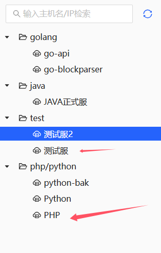
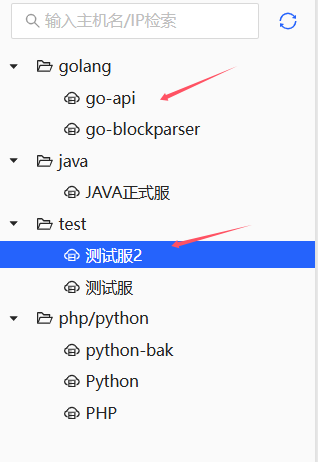

# 备份记录(私密)

# 网址

```sh
# ssh服务器
http://wallettest.ellipal.com:8100/ssh
# 发布代码
http://wallettest.ellipal.com:8100/deploy/request
# 代码管理
http://ellipal.asuscomm.com:6610/
# 语雀
https://ellipal.yuque.com/dashboard#doc
# 日志管理
http://wallettest.ellipal.com:3000/
```


# 节点

```sh
https://wallettest.ellipal.com/images/bscnew.png
http://wallet.ellipal.com/images/bch.png
http://wallet.ellipal.com/images/xlmnew.png
https://wallet.ellipal.com/images/ltc.png
http://www.w3.org/2000/svg
# 测试环境ip
http://94.74.83.47:5011
```

```sh
# 查询ip
curl cip.cc
IP      : 159.138.88.172
地址    : 新加坡  新加坡

数据二  : 新加坡 | 华为云

数据三  : 中国香港

URL     : http://www.cip.cc/159.138.88.172
```

```sh
# 北极星测试
polaris:
  address: grpc://159.138.88.172:8091
# 北极星正式
polaris:
  address: grpc://192.168.1.65:8091
```


```sh

nginx图片文件目录: /data/wwwroot/wallet/public/images
更新币价: /data/wwwroot/wallet/storage/monitor/exchangecoinpricemonitor/updatepairprice.py
```

```sh
nTqm.8VjUaU-PY:
```


# TG

```sh
id=0zovr1ns5xmcg3ll

Hello, Please help me check the order.If the exchange cannot continue, can you refund the user?
user address: DDafnDs7sKPWsX5kw41ptfvmZiKeBDxM3U

https://verge-blockchain.info/tx/ab5fff59da470f884c5b8ec36dfc06521bb72e13651c1689226be95011ae20e6
Hello, Please help me check the order.The user is urging.
```

```sh
id=595d2831-379c-46cb-91b5-5704bd8ea2f5

你好，请帮我查一下订单, 如果不能兑换请原地址退款。
用户原地址: 7uQfALgCXGuDZuu4mqCZ8gTCxDz1F1HFWYciUDE5mPNj


https://solscan.io/tx/U3Zv1PhFWe3YwTNdVpW3XX6SnnVHzrRwxzcjhwcD2hV5W99dekYv65HsngX4jb6Ch1LdZXh6siFfbHHo8tQwkVk
```


# 日志

# php



```sh
# php部署目录: 
cd /root/wallet

# php日志目录: 
tail -f -n 11 /data/wwwroot/wallet/storage/logs/laravel-2025-01-15.log
```


# go兑换



```sh
# 通用
tail -f -n 111 /var/log/finance-go/logs/app.log
# 请求参数日志
tail -f -n 111 /var/log/finance-go/logs/RequestDetail/RequestDetail.log
# 转账日志
tail -f -n 111 /var/log/finance-go/logs/Transaction/Transaction.log

# 获取范围汇率 没有币种价格
tail -f -n 11111 /var/log/finance-go/logs/app.log | grep "获取范围"
tail -f -n 11111 /var/log/finance-go/logs/app.log | grep "获取汇率"
tail -f -n 11111 /var/log/finance-go/logs/app.log | grep -E "获取范围|获取汇率"

# 订单追踪更改状态
tail -f -n 11111 /var/log/finance-go/logs/app.log | grep "追踪订单状态" 
tail -f -n 11111 /var/log/finance-go/logs/app.log | grep "追踪订单状态: 已完成"
tail -f -n 11111 /var/log/finance-go/logs/app.log | grep "获取交易对价格"
tail -f -n 11111 /var/log/finance-go/logs/app.log | grep "获取交易对价格异常"
```


# portal模块

```sh
# 通用
tail -f -n 111 /data/repos/exchange/logs/crypto-portal-5010.log

# 获取汇率和范围 
tail -f -n 111 /data/repos/exchange/logs/crypto-portal-5010.log | grep "获取汇率和范围"
tail -f -n 111 /data/repos/exchange/logs/crypto-portal-5010.log | grep "获取汇率和范围结果"
tail -f -n 111 /data/repos/exchange/logs/crypto-portal-5010.log | grep "获取法币交易范围"

# 创建订单部分 
tail -f -n 111 /data/repos/exchange/logs/crypto-portal-5010.log | grep "创建兑换订单"
tail -f -n 111 /data/repos/exchange/logs/crypto-portal-5010.log | grep "创建兑换订单结果"
tail -f -n 111 /data/repos/exchange/logs/crypto-portal-5010.log | grep "保存创建订单记录到MongoDB"
tail -f -n 111 /data/repos/exchange/logs/crypto-portal-5010.log | grep "上报错误信息"
```

# strategy策略	

```sh
# 通用
tail -f -n 111 /data/repos/exchange/logs/crypto-strategy-5005.log

# 创建订单部分
tail -f -n 111 /data/repos/exchange/logs/crypto-strategy-5005.log | grep "\-\-\-\-\-\-" 
tail -f -n 111 /data/repos/exchange/logs/crypto-strategy-5005.log | grep "创建兑换订单"
tail -f -n 111 /data/repos/exchange/logs/crypto-strategy-5005.log | grep "创建兑换订单" | grep "检查货币兑换是否受支持"
tail -f -n 111 /data/repos/exchange/logs/crypto-strategy-5005.log | grep "交易所查询汇率结果: 交易所"
tail -f -n 111 /data/repos/exchange/logs/crypto-strategy-5005.log | grep "创建买币卖币订单"
tail -f -n 11111 /data/repos/exchange/logs/crypto-strategy-5005.log | grep "保存orderUser订单到MySQL"
```

# data模块

```sh
# 通用
tail -f -n 111 /data/repos/exchange/logs/crypto-data-5001.log | grep "上报错误信息"

# Gas费用
tail -f -n 111 /data/repos/exchange/logs/crypto-data-5001.log | grep "获取Gas费"
# 获取币种usd价格
tail -f -n 111 /data/repos/exchange/logs/crypto-data-5001.log | grep "获取币种usd价格"

# 获取汇率和范围
tail -f -n 111 /data/repos/exchange/logs/crypto-data-5001.log | grep "获取范围"
tail -f -n 111 /data/repos/exchange/logs/crypto-data-5001.log | grep "获取范围:" | grep "交易所" | grep "是否支持"
tail -f -n 111 /data/repos/exchange/logs/crypto-data-5001.log | grep "获取范围: 可用交易所信息"
tail -f -n 111 /data/repos/exchange/logs/crypto-data-5001.log | grep "获取范围: 最终范围"
tail -f -n 111 /data/repos/exchange/logs/crypto-data-5001.log | grep "获取汇率"
tail -f -n 111 /data/repos/exchange/logs/crypto-data-5001.log | grep -E "获取汇率: 加入缓存 | 获取汇率和范围: 最终汇率"
tail -f -n 111 /data/repos/exchange/logs/crypto-data-5001.log | grep "获取汇率和范围:"
tail -f -n 111 /data/repos/exchange/logs/crypto-data-5001.log | grep "获取汇率和范围: 最終汇率"
tail -f -n 111 /data/repos/exchange/logs/crypto-data-5001.log | grep "获取汇率和范围: 最终结果" 
tail -f -n 111 /data/repos/exchange/logs/crypto-data-5001.log | grep "获取法币交易范围"
tail -f -n 111 /data/repos/exchange/logs/crypto-data-5001.log | grep "获取法币汇率信息"
tail -f -n 111 /data/repos/exchange/logs/crypto-data-5001.log | grep "获取买币卖币记录"

# 获取指定网络的Gas费用 
tail -f -n 111 /data/repos/exchange/logs/crypto-data-5001.log | grep "获取指定网络的Gas费用"
tail -f -n 111 /data/repos/exchange/logs/crypto-data-5001.log | grep "远程调用获取Gas费用"

# 创建订单
tail -f -n 111 /data/repos/exchange/logs/crypto-data-5001.log | grep "检查货币兑换是否受支持"
tail -f -n 111 /data/repos/exchange/logs/crypto-data-5001.log | grep "交易所获取汇率"
tail -f -n 111 /data/repos/exchange/logs/crypto-data-5001.log | grep "上报错误信息"
```

# swft交易所

```sh
tail -f -n 111 /data/repos/exchange/logs/exchange-swft-5073.log

# 获取汇率
tail -f -n 111 /data/repos/exchange/logs/exchange-swft-5073.log | grep "交易所调用: url: v1/getBaseInfo"
```

# changelly交易所

```sh
tail -f -n 111 /data/repos/exchange/logs/exchange-changelly-5071.log
```

# changenow交易所

```sh
tail -f -n 111 /data/repos/exchange/logs/exchange-changenow-5072.log 
```

# ellipal自有兑换

```sh
# 日志目录
cd /data/repos/exchange/logs
# 日志备份目录
cd /data/repos/exchange/logs/archive

# 解压日志
gunzip /data/repos/exchange/logs/archive/exchange-ellipal-5075.log.2025-02-03.0.gz
tail -f -n 11111 /data/repos/exchange/logs/archive/exchange-ellipal-5075.log.2025-02-07.1 | grep "\-\-\-\-\-\-"

# 通用  获取收费策略 获取钱包余额
tail -f -n 11111 /data/repos/exchange/logs/exchange-ellipal-5075.log
tail -f -n 11111 /data/repos/exchange/logs/archive/exchange-ellipal-5075.log.2025-02-07.1
tail -f -n 11111 /data/repos/exchange/logs/exchange-ellipal-5075.log | grep "\-\-\-\-\-\-"
tail -f -n 11111 /data/repos/exchange/logs/exchange-ellipal-5075.log | grep -E "\-\-\-\-\-\-|\*\*\*\*\*\*" 
tail -f -n 11111 /data/repos/exchange/logs/exchange-ellipal-5075.log | grep "\*\*\*\*\*\*"
tail -f -n 11111 /data/repos/exchange/logs/exchange-ellipal-5075.log | grep "兑入数量" 
tail -f -n 11111 /data/repos/exchange/logs/exchange-ellipal-5075.log | grep "获取币种的美元价格"
tail -f -n 11111 /data/repos/exchange/logs/exchange-ellipal-5075.log | grep "获取收费策略"

# 创建订单成功
tail -f -n 11111 /data/repos/exchange/logs/exchange-ellipal-5075.log | grep "状态: WAITING_PAYMENT"

# ws连接: 接收到的文本消息
tail -f -n 11111 /data/repos/exchange/logs/exchange-ellipal-5075.log | grep "ws"
tail -f -n 11111 /data/repos/exchange/logs/exchange-ellipal-5075.log | grep "ws连接: 接收到的文本消息"

# 轮询转账状态
tail -f -n 11111111 /data/repos/exchange/logs/exchange-ellipal-5075.log | grep "轮询转账状态开始"
tail -f -n 11111111 /data/repos/exchange/logs/exchange-ellipal-5075.log | grep "获取钱包余额"

# 兑换对冲买现货开空单
tail -f -n 11111111 /data/repos/exchange/logs/exchange-ellipal-5075.log | grep "对冲兑"

# 链上确认成功
tail -f -n 11111111 /data/repos/exchange/logs/exchange-ellipal-5075.log | grep "链上确认成功"
# 链上确认失败
tail -f -n 11111111 /data/repos/exchange/logs/exchange-ellipal-5075.log | grep "链上确认失败"

# 兑换: 
tail -f -n 11111111 /data/repos/exchange/logs/exchange-ellipal-5075.log | grep --color=always "兑换结束:.*false\|兑换结束:"
# 兑换完成
tail -f -n 11111111 /data/repos/exchange/logs/exchange-ellipal-5075.log | grep "兑换结束: 状态: true"
# 兑换错误
tail -f -n 11111111 /data/repos/exchange/logs/exchange-ellipal-5075.log | grep "兑换结束: 状态: false"


# 对冲入口 
tail -f -n 11111111 /data/repos/exchange/logs/exchange-ellipal-5075.log | grep -E "对冲第一步|对冲初始化"
tail -f -n 11111111 /data/repos/exchange/logs/archive/exchange-ellipal-5075.log.2025-02-07.2 | grep -E "对冲第一步|对冲初始化"

# 对冲充币
tail -f -n 11111111 /data/repos/exchange/logs/exchange-ellipal-5075.log | grep --color=always -E "对冲初始化: 充币到交易所|充币到交易所, 状态:.*false|充币到交易所, 状态:|充币开始"
tail -f -n 11111111 /data/repos/exchange/logs/archive/exchange-ellipal-5075.log.2025-02-07.2 | grep --color=always -E "对冲初始化: 充币到交易所|充币到交易所, 状态:.*false|充币到交易所, 状态:|充币开始"

# 对冲提币
tail -f -n 11111111 /data/repos/exchange/logs/exchange-ellipal-5075.log | grep -E "对冲初始化: 提币到币池|提币到币池完成"
tail -f -n 11111111 /data/repos/exchange/logs/archive/exchange-ellipal-5075.log.2025-02-07.2 | grep -E "对冲初始化: 提币到币池|提币到币池完成"

# 对冲交易所到账, 卖现货平合约
tail -f -n 11111111 /data/repos/exchange/logs/exchange-ellipal-5075.log | grep -E "对冲初始化: 充币到交易所|交易所确认到账成功|对冲结束"
tail -f -n 11111111 /data/repos/exchange/logs/archive/exchange-ellipal-5075.log.2025-02-07.2 | grep -E "对冲初始化: 充币到交易所|交易所确认到账成功|对冲结束"

# 对冲结束
tail -f -n 11111111 /data/repos/exchange/logs/exchange-ellipal-5075.log | grep "对冲结束"

# 链上确认开始
tail -f -n 11111111 /data/repos/exchange/logs/exchange-ellipal-5075.log | grep "链上确认开始"
```

# 买币卖币

```sh
# moonpay
tail -f -n 11 /data/repos/exchange/logs/fiat-moonpay-5052.log
tail -f -n 1111 /data/repos/exchange/logs/fiat-moonpay-5052.log | grep "获取汇率"
tail -f -n 1111 /data/repos/exchange/logs/fiat-moonpay-5052.log | grep -E "获取范围|获取汇率"
tail -f -n 1111 /data/repos/exchange/logs/fiat-moonpay-5052.log | grep -E "构建请求的URL|请求响应|请求失败"
tail -f -n 1111 /data/repos/exchange/logs/fiat-moonpay-5052.log | grep "创建交易订单"
tail -f -n 1111 /data/repos/exchange/logs/fiat-moonpay-5052.log | grep "获取卖币订单状态"
tail -f -n 1111 /data/repos/exchange/logs/fiat-moonpay-5052.log | grep "获取买币订单状态"

# simplex 
tail -f -n 11 /data/repos/exchange/logs/fiat-simplex-5050.log
tail -f -n 1111 /data/repos/exchange/logs/fiat-simplex-5050.log | grep -E "获取范围|获取汇率"
tail -f -n 1111 /data/repos/exchange/logs/fiat-simplex-5050.log | grep -E "构建请求的URL|请求响应|请求失败"
tail -f -n 1111 /data/repos/exchange/logs/fiat-simplex-5050.log | grep "创建交易订单"

# kafka消息监听器: 处理法币交易订单
tail -f -n 1111111 /data/repos/exchange/logs/crypto-strategy-5005.log | grep "kafka消息监听器: 处理法币交易订单"
tail -f -n 1111111 /data/repos/exchange/logs/crypto-strategy-5005.log | grep "kafka消息监听器: 处理法币交易订单, orderId: ewtn48e4eba937a648adb3d5cd544f43a143"
```

# Kafka

```sh
ngrep \"coin\":{\"network\":\"SOL\",\"contractAddress\":\"Es9vMFrzaCERmJfrF4H2FYD4KCoNkY11McCe8BenwNYB\",\"name\":\"USDT\" -W byline -d any src port 9092 -q

# 查询 {"exchange":"Changelly","coin":{"network":"BSC","contractAddress":"0XA260E12D2B924CB899AE80BB58123AC3FEE1E2F0","name":"HOOK","fullName":"Hooked Protocol","enabled":true,"image":"https://cdn.changelly.com/icons/hook.png"},"pairs":
ngrep \"exchange\":\"EllipalExchange\",\"coin\":{\"network\":\"SOL\" -W byline -d any src port 9092 -q
ngrep \"exchange\":\"ChangeNow\",\"coin\":{\"network\":\"BTC\" -W byline -d any src port 9092 -q
ngrep \"exchange\":\"Changelly\",\"coin\":{\"network\":\"SOL\" -W byline -d any src port 9092 -q
ngrep \"exchange\":\"SWFT\",\"coin\":{\"network\":\"SOL\" -W byline -d any src port 9092 -q

# ChangeNow
{
  "exchange": "ChangeNow",
  "coin": {
    "network": "eth",
    "contractAddress": "0x42bBFa2e77757C645eeaAd1655E0911a7553Efbc",
    "name": "BOBA",
    "fullName": "Boba Network",
    "enabled": true,
    "image": "https://content-api.changenow.io/uploads/boba_59f841cfb6.svg"
  },
  "pairs": [
    {
      "network": "xmr",
      "name": "XMR",
      "fullName": "Monero",
      "enabled": true,
      "image": "https://content-api.changenow.io/uploads/xmr_f7131e8067.svg"
    }
  ]
}

# Changelly
{
  "exchange": "Changelly",
  "coin": {
    "network": "SOL",
    "contractAddress": "",
    "name": "BENDOG",
    "fullName": "Ben the Dog",
    "enabled": true,
    "image": "https://cdn.changelly.com/icons/bendog.png"
  },
  "pairs": [
    {
      "network": "ETH",
      "contractAddress": "0X9E46A38F5DAABE8683E10793B06749EEF7D733D1",
      "name": "NCT",
      "fullName": "PolySwarm",
      "enabled": true,
      "image": "https://cdn.changelly.com/icons/nct.png"
    }
  ]
}
# SWFT
{
  "exchange": "SWFT",
  "coin": {
    "network": "SOL",
    "contractAddress": "HX5EpJxT61cbJg177Pi9ZKe15HWAn4aJCmPVuz6pyp36",
    "name": "TRUMPJR",
    "fullName": "TRUMPJR(SOL)",
    "enabled": true
  },
  "pairs": [
    {
      "network": "SOL",
      "contractAddress": "FUAfBo2jgks6gB4Z4LfZkqSZgzNucisEHqnNebaRxM1P",
      "name": "MELANIA",
      "fullName": "MELANIA(SOL)",
      "enabled": true
    }
  ]
}

# EllipalExchange
{
  "exchange": "EllipalExchange",
  "coin": {
    "network": "HBAR",
    "contractAddress": "",
    "name": "HBAR",
    "fullName": "Hedera",
    "enabled": true,
    "image": "https://s2.coinmarketcap.com/static/img/coins/64x64/4642.png",
    "exchangeIn": true
  },
  "pairs": [
    {
      "network": "XRP",
      "contractAddress": "",
      "name": "XRP",
      "enabled": false
    }
  ]
}
```

# 管理系统

```sh
tail -f -n 111 /var/admin-go/logs/
```

# 签名设备

```sh
# 查询
lsof -i :12300
# 根据pid查询目录
lsof -p 15554 | grep cwd

# 断开
kill pid

# 后台启动 
cd luode/hedgeswapSignManager/
nohup go run main.go -f ./config.yml &

# 检查abd服务
adb devices
# 启动abd
adb start-server
```

签名日志


# 统计兑换

```sh
# 统计币对总usd交易额
SET @month = '2025-01';
SELECT 
    SUBSTRING_INDEX(pair, '_', -1) AS coin_name,
    FLOOR(SUM(rprice * volumeLast)) AS total_usd,  -- 使用 FLOOR 去除小数
    DATE_FORMAT(STR_TO_DATE(@month, '%Y-%m'), '%Y-%m') AS time
FROM `ellpal`.`orderUser`
WHERE `pair` LIKE '%_%'  -- 确保有一个 `_` 分隔符
  AND `status` = '4'
  AND ctime >= UNIX_TIMESTAMP(DATE_FORMAT(STR_TO_DATE(@month, '%Y-%m'), '%Y-%m-01'))  -- 动态开始时间
  AND ctime < UNIX_TIMESTAMP(DATE_FORMAT(STR_TO_DATE(@month, '%Y-%m'), '%Y-%m-01') + INTERVAL 1 MONTH)  -- 动态结束时间
GROUP BY coin_name
ORDER BY total_usd DESC;

# 统计月总usd交易额
SET @month = '2025-01';
select SUM(total_usd) from (
SELECT 
    SUBSTRING_INDEX(pair, '_', -1) AS coin_name,
    FLOOR(SUM(rprice * volumeLast)) AS total_usd,  -- 使用 FLOOR 去除小数
    DATE_FORMAT(STR_TO_DATE(@month, '%Y-%m'), '%Y-%m') AS time
FROM `ellpal`.`orderUser`
WHERE `pair` LIKE '%_%'  -- 确保有一个 `_` 分隔符
  AND `status` = '4'
  AND ctime >= UNIX_TIMESTAMP(DATE_FORMAT(STR_TO_DATE(@month, '%Y-%m'), '%Y-%m-01'))  -- 动态开始时间
  AND ctime < UNIX_TIMESTAMP(DATE_FORMAT(STR_TO_DATE(@month, '%Y-%m'), '%Y-%m-01') + INTERVAL 1 MONTH)  -- 动态结束时间
GROUP BY coin_name
ORDER BY total_usd DESC
) t

# 不带usdt币对总usd交易额
SET @month = '2025-01';
SELECT 
    SUBSTRING_INDEX(pair, '_', -1) AS coin_name,
    FLOOR(SUM(rprice * volumeLast)) AS total_usd,  -- 使用 FLOOR 去除小数
    DATE_FORMAT(STR_TO_DATE(@month, '%Y-%m'), '%Y-%m') AS time
FROM `ellpal`.`orderUser`
WHERE `pair` LIKE '%_%'  -- 确保有一个 `_` 分隔符
  AND `status` = '4'
  AND ctime >= UNIX_TIMESTAMP(DATE_FORMAT(STR_TO_DATE(@month, '%Y-%m'), '%Y-%m-01'))  -- 动态开始时间
  AND ctime < UNIX_TIMESTAMP(DATE_FORMAT(STR_TO_DATE(@month, '%Y-%m'), '%Y-%m-01') + INTERVAL 1 MONTH)  -- 动态结束时间
  AND SUBSTRING_INDEX(pair, '_', -1) NOT LIKE '%USDT%'  -- 排除 coin_name 包含 'USDT'
GROUP BY coin_name
ORDER BY total_usd DESC;


# 不带usdt月总usd交易额
SET @month = '2025-01';
select SUM(total_usd) from (
SELECT 
    SUBSTRING_INDEX(pair, '_', -1) AS coin_name,
    FLOOR(SUM(rprice * volumeLast)) AS total_usd,  -- 使用 FLOOR 去除小数
    DATE_FORMAT(STR_TO_DATE(@month, '%Y-%m'), '%Y-%m') AS time
FROM `ellpal`.`orderUser`
WHERE `pair` LIKE '%_%'  -- 确保有一个 `_` 分隔符
  AND `status` = '4'
  AND ctime >= UNIX_TIMESTAMP(DATE_FORMAT(STR_TO_DATE(@month, '%Y-%m'), '%Y-%m-01'))  -- 动态开始时间
  AND ctime < UNIX_TIMESTAMP(DATE_FORMAT(STR_TO_DATE(@month, '%Y-%m'), '%Y-%m-01') + INTERVAL 1 MONTH)  -- 动态结束时间
  AND SUBSTRING_INDEX(pair, '_', -1) NOT LIKE '%USDT%'  -- 排除 coin_name 包含 'USDT'
GROUP BY coin_name
ORDER BY total_usd DESC
) t

# 计算某一天的数据
SET @date = '2024-12-15';  -- 指定日期
SELECT 
    SUBSTRING_INDEX(pair, '_', -1) AS coin_name,
    FLOOR(SUM(rprice * volumeLast)) AS total_usd,  -- 使用 FLOOR 去除小数
    DATE_FORMAT(STR_TO_DATE(@date, '%Y-%m-%d'), '%Y-%m-%d') AS time
FROM `ellpal`.`orderUser`
WHERE `pair` LIKE '%_%'  -- 确保有一个 `_` 分隔符
  AND `status` = '4'
  AND ctime >= UNIX_TIMESTAMP(STR_TO_DATE(@date, '%Y-%m-%d'))  -- 指定日期的开始时间
  AND ctime < UNIX_TIMESTAMP(STR_TO_DATE(@date, '%Y-%m-%d') + INTERVAL 1 DAY)  -- 指定日期的结束时间
  AND SUBSTRING_INDEX(pair, '_', -1) NOT LIKE '%USDT%'  -- 排除 coin_name 包含 'USDT'
GROUP BY coin_name
ORDER BY total_usd DESC;
```

# 导出钱包币种

```sql
SELECT 
id as 'id',
addresstype as '钱包类型（1 冷钱包 2 热钱包 3 观察钱包 4 其他）',
cType as '币种类型',
shortName as '币名',
currency_num as '币数量',
contractAddr as '币合约地址',
address_num as '地址数',
record_currency_usdt as '统计时币种USDT单价',
money as '币数*单价',
yesterday_money as '昨天USD',
diff_money as '差额1亿美金就是异常',
status as '-1异常，0正常，1修复好',
record_time as '统计时间'
FROM `ellpal`.`admin_currency_status_details` 
where record_time >= '2025-01-01 00:00:00' and record_time < '2025-01-02 00:00:00'
```

# 导出买币买币

```sql
SELECT 
  `id` AS 'ID ',
  `orderid` AS '内部订单号: 交易所的前缀 + "ewtn" + UUID',
  `extendorderid` AS '扩展订单号，默认为 "Moonpay"',
  `fiat` AS '买币=法币USD, 卖币=加密货币',
  `currency` AS '买币=加密货币, 卖币=法币USD',
  `amout` AS '支付金额',
  `address` AS '接收地址',
  `provideraddr` AS '币商加密货币地址',
  `volumelast` AS '最后成交额',
  `volume` AS '预估金额',
  `status` AS '状态: 1 申请订单  2 已经支付 3 回款中 4 成功 5 失败',
  `type` AS '交易类型: BUY: 买, SELL: 卖',
  `typebuy` AS '币商类型: 2: Simplex 4: Legend 5: MoonPay',
  `clientip` AS '客户端标识',
  `usertoken` AS '客户token, 注册用户',
  FROM_UNIXTIME(`ctime`) AS '创建时间戳'
FROM 
  `ellpal`.`mercuryobusiness`
WHERE 
  `ctime` >= '1732896000'
ORDER BY 
  `ctime`;
```

# vscode

```sh
# 兑换系统
{
    // 使用 IntelliSense 了解相关属性。 
    // 悬停以查看现有属性的描述。
    // 欲了解更多信息，请访问: https://go.microsoft.com/fwlink/?linkid=830387
    "version": "0.2.0", // 配置文件版本，VS Code 使用 "0.2.0" 表示调试配置文件版本。
    "configurations": [ // 配置数组，包含不同的调试配置。
        {
            "name": "dev环境启动", // 调试配置名称，在调试配置菜单中显示。
            "type": "go", // 指定调试器类型，这里为 Go 语言。
            "request": "launch", // 表示调试请求类型，"launch" 表示启动程序。
            "mode": "auto", // 调试模式，可以是 "auto"、"debug" 或 "test"。`auto` 会自动选择合适的模式。
            "args": "-env=lcoal", // 启动程序时的命令行参数。
            "program": "${workspaceFolder}" // 要调试的程序路径，`${workspaceFolder}` 表示当前工作区的根目录。
        },
        {
            "name": "test环境启动", // 调试配置名称，在调试配置菜单中显示。
            "type": "go", // 指定调试器类型，这里为 Go 语言。
            "request": "launch", // 表示调试请求类型，"launch" 表示启动程序。
            "mode": "auto", // 调试模式，可以是 "auto"、"debug" 或 "test"。`auto` 会自动选择合适的模式。
            "args": "-env=lcoal", // 启动程序时的命令行参数。
            "program": "${workspaceFolder}/test" // 要调试的程序路径，`${workspaceFolder}` 表示当前工作区的根目录。
        }
    ]
}

# 管理系统
{
    // 使用 IntelliSense 了解相关属性。 
    // 悬停以查看现有属性的描述。
    // 欲了解更多信息，请访问: https://go.microsoft.com/fwlink/?linkid=830387
    "version": "0.2.0", // 配置文件版本，VS Code 使用 "0.2.0" 表示调试配置文件版本。
    "configurations": [ // 配置数组，包含不同的调试配置。
        {
            "name": "dev开发环境启动", // 调试配置名称，在调试配置菜单中显示。
            "type": "go", // 指定调试器类型，这里为 Go 语言。
            "request": "launch", // 表示调试请求类型，"launch" 表示启动程序。
            "mode": "auto", // 调试模式，可以是 "auto"、"debug" 或 "test"。`auto` 会自动选择合适的模式。
            "args": "server -c ${workspaceFolder}/config/settings.local.yml -a true", // 启动程序时的命令行参数。
            "program": "${workspaceFolder}" // 要调试的程序路径，`${workspaceFolder}` 表示当前工作区的根目录。
        }
    ]
}
```

# redis获取币对数据

```sh
redis-cli -p 6379 GET "EllipalNodeSync:ContractList" > ContractList.txt
```

# python定时任务

```sh
vim /var/spool/cron/www 

ExchangeProfit
updatepairprice
changellyTransactions12
changellyTransactions16
changellyTransactions17
changellyTransactions18
changellyTransactions19
changellyTransactions20
changellyTransactions5
```

# SQL

```sql
-- 查询当日所在周一的日期 -> 2024-12-30
SELECT DATE_SUB('2025-01-05', INTERVAL WEEKDAY('2025-01-05') DAY) AS MondayDate;
-- 查询当日所在月 -> 2025-02
SELECT DATE_FORMAT('2025-02-05', '%Y-%m') AS FirstDayOfYear;
-- 查询当日所在年 -> 2024
SELECT DATE_FORMAT('2024-02-05', '%Y') AS FirstDayOfYear;

SET @timestamp = 1736006400; -- 替换为你的时间戳
SELECT 
  FROM_UNIXTIME(@timestamp,'%Y-%m-%d') AS Date,
  DATE_SUB(FROM_UNIXTIME(@timestamp,'%Y-%m-%d'), INTERVAL WEEKDAY(FROM_UNIXTIME(@timestamp,'%Y-%m-%d')) DAY) AS DateWeek,
  DATE_FORMAT(FROM_UNIXTIME(@timestamp,'%Y-%m-%d'), '%Y-%m') AS DateMonth,
  DATE_FORMAT(FROM_UNIXTIME(@timestamp,'%Y-%m-%d'), '%Y') AS DateYear

INSERT INTO admin_exchangeprofit_copy1 (
    date_time,
    date,
    order_creat_num,
    order_succeed_num,
    profit_usd,
    date_week,
    date_month,
    date_year,
    atime
)
VALUES
(
    FROM_UNIXTIME(@timestamp),
    FROM_UNIXTIME(@timestamp, '%Y-%m-%d'),
    @order_creat_num,
    @order_succeed_num,
    @profit_usd,
    DATE_SUB(FROM_UNIXTIME(@timestamp,'%Y-%m-%d'), INTERVAL WEEKDAY(FROM_UNIXTIME(@timestamp,'%Y-%m-%d')) DAY),
    DATE_FORMAT(FROM_UNIXTIME(@timestamp,'%Y-%m-%d'), '%Y-%m'),
    DATE_FORMAT(FROM_UNIXTIME(@timestamp,'%Y-%m-%d'), '%Y'),
    FROM_UNIXTIME(@timestamp)
);


-- 查询收益
SELECT SUM(fb) FROM (

	SELECT 
			FROM_UNIXTIME(ctime, '%Y-%m-%d %H:%i:%s') AS ctime_formatted,
			orderID,shiftOrderID,
			pair,amount,volumeLast,
			lprice,
			rprice,
			fb
	FROM 
			`ellpal`.`orderUser`
	WHERE 
			`ctime` >= '1735660800'  and ctime <= '1738339199'
			AND `status` = '4' 
			AND `channel` LIKE '%SWFT%'
	ORDER BY 
			`ctime`
		
) tb_demo
    
-- 卖币记录
		SELECT id,orderid as '内部订单号',extendorderid as '币商订单',fiat as 'from',currency 'to',amout,address as 'fromaddr',provideraddr as 'toaddr',volumelast as '最新更新的金额',volume as '预估金额',status as '1 申请订单  2 等待 3 支付中 4 成功 5 失败',type as 'BUY: 买, SELL: 卖',typebuy as '币商类型: 2: Simplex 4: Legend 5: MoonPay',FROM_UNIXTIME(ctime, '%Y-%m-%d %H:%i:%s') AS ctime_formatted,FROM_UNIXTIME(utime, '%Y-%m-%d %H:%i:%s') AS utime_formatted 
		FROM `ellpal`.`mercuryobusiness` WHERE `type` LIKE '%SELL%' 
		ORDER BY ctime
```

# 更新收益

```sql
# 兑换记录
SELECT orderID,pair,status,orderType,amount,volume,volumeLast,lprice,rprice,exchangeProfit,profit,fb 
FROM `orderUser` 
WHERE status = 4 and ctime >= 1639497600 and ctime < 1639584000
ORDER BY ctime DESC

# 兑换收益 -> 42.10182255
SELECT SUM(CAST(fb AS DECIMAL(20,8))) AS profit_usd FROM `orderUser` 
WHERE status = 4 and ctime >= 1639497600 and ctime < 1639584000

# 兑换金额 -> 4449.3753130081871588
SELECT SUM(CAST(amount AS DECIMAL(20,8)) * CAST(lprice AS DECIMAL(20,8))) AS order_usd FROM `orderUser` 
WHERE status = 4 and ctime >= 1639497600 and ctime < 1639584000

# 统计日数据
SELECT 
    date,date_week,date_month,date_year,
    SUM(order_creat_num) AS total_order_creat_num,
    SUM(order_succeed_num) AS total_order_succeed_num,
    SUM(CAST(order_usd AS DECIMAL(16,8))) AS total_order_usd,
    SUM(CAST(profit_usd AS DECIMAL(16,8))) AS total_profit_usd
FROM 
    admin_exchangeprofit
GROUP BY 
    date
ORDER BY 
    date DESC
LIMIT 10;

# 统计周数据
SELECT 
    date,date_week,date_month,date_year,
    SUM(order_creat_num) AS total_order_creat_num,
    SUM(order_succeed_num) AS total_order_succeed_num,
    SUM(CAST(order_usd AS DECIMAL(16,8))) AS total_order_usd,
    SUM(CAST(profit_usd AS DECIMAL(16,8))) AS total_profit_usd
FROM 
    admin_exchangeprofit
GROUP BY 
    date_week
ORDER BY 
    date_week DESC
LIMIT 10;


# 统计月数据
SELECT 
    date,date_week,date_month,date_year,
    SUM(order_creat_num) AS total_order_creat_num,
    SUM(order_succeed_num) AS total_order_succeed_num,
    SUM(CAST(order_usd AS DECIMAL(16,8))) AS total_order_usd,
    SUM(CAST(profit_usd AS DECIMAL(16,8))) AS total_profit_usd
FROM 
    admin_exchangeprofit
GROUP BY 
    date_month
ORDER BY 
    date_month DESC
LIMIT 10;

# 统计年数据
SELECT 
    date_year,
    SUM(CAST(order_usd AS DECIMAL(16,8))) AS total_order_usd,
    SUM(CAST(profit_usd AS DECIMAL(16,8))) AS total_profit_usd
FROM 
    admin_exchangeprofit
GROUP BY 
    date_year
ORDER BY 
    date_year
LIMIT 10;

SELECT orderID,pair,status,orderType,amount,volume,volumeLast,lprice,rprice,exchangeProfit,profit,fb 
FROM `orderUser` 
WHERE 
    CAST(rprice AS DECIMAL(20, 8)) != 0
    AND status = 4 
    AND orderType = 1
ORDER BY `ctime` DESC 
limit 1000

SELECT count(1) FROM `orderUser` 
WHERE 
    CAST(rprice AS DECIMAL(20, 8)) != 0
    AND status = 4 
    AND orderType = 19;

# 查询币价更新错误
SELECT *
FROM `orderUser` 
WHERE `status` = '4' AND `lprice` = '0' OR `rprice` = '0' AND ctime >= 1735660800
ORDER BY `ctime` DESC 
LIMIT 0,1000
#############################################################################################
# 自有兑换1 0.045
UPDATE orderUser
SET 
    exchangeProfit = ROUND(CAST(amount AS DECIMAL(20, 8)) * CAST(lprice AS DECIMAL(20, 8)), 5),
    profit = ROUND(CAST(amount AS DECIMAL(20, 8)) * 0.045, 5),
    Fb = ROUND(ROUND(CAST(amount AS DECIMAL(20, 8)) * 0.045, 5) * CAST(lprice AS DECIMAL(20, 8)), 5)
WHERE status = 4 
    AND orderType = 1;
    
# 自有兑换3 0.035
UPDATE orderUser
SET 
    exchangeProfit = ROUND(CAST(amount AS DECIMAL(20, 8)) * CAST(lprice AS DECIMAL(20, 8)), 5),
    profit = ROUND(CAST(amount AS DECIMAL(20, 8)) * 0.035, 5),
    Fb = ROUND(ROUND(CAST(amount AS DECIMAL(20, 8)) * 0.035, 5) * CAST(lprice AS DECIMAL(20, 8)), 5)
WHERE status = 4 
    AND orderType = 3;
    
# swft12 0.01
UPDATE orderUser
SET 
    exchangeProfit = ROUND(CAST(amount AS DECIMAL(20, 8)) * CAST(lprice AS DECIMAL(20, 8)), 5),
    profit = ROUND(CAST(amount AS DECIMAL(20, 8)) * 0.01, 5),
    Fb = ROUND(ROUND(CAST(amount AS DECIMAL(20, 8)) * 0.01, 5) * CAST(lprice AS DECIMAL(20, 8)), 5)
WHERE status = 4 
    AND orderType = 12;
    

# swft18 0.02
UPDATE orderUser
SET 
    exchangeProfit = ROUND(CAST(amount AS DECIMAL(20, 8)) * CAST(lprice AS DECIMAL(20, 8)), 5),
    profit = ROUND(CAST(amount AS DECIMAL(20, 8)) * 0.02, 5),
    Fb = ROUND(ROUND(CAST(amount AS DECIMAL(20, 8)) * 0.02, 5) * CAST(lprice AS DECIMAL(20, 8)), 5)
WHERE status = 4 
    AND orderType = 18;
    

# changelly16 0.015
UPDATE orderUser
SET 
    exchangeProfit = ROUND(CAST(amount AS DECIMAL(20, 8)) * CAST(lprice AS DECIMAL(20, 8)), 5),
    profit = ROUND(CAST(volumeLast AS DECIMAL(20, 8)) * 0.015, 5),
    Fb = ROUND(ROUND(CAST(volumeLast AS DECIMAL(20, 8)) * 0.015, 5) * CAST(rprice AS DECIMAL(20, 8)), 5)
WHERE status = 4 
    AND orderType = 16;
    

# changelly17 0.02
UPDATE orderUser
SET 
    exchangeProfit = ROUND(CAST(amount AS DECIMAL(20, 8)) * CAST(lprice AS DECIMAL(20, 8)), 5),
    profit = ROUND(CAST(volumeLast AS DECIMAL(20, 8)) * 0.02, 5),
    Fb = ROUND(ROUND(CAST(volumeLast AS DECIMAL(20, 8)) * 0.02, 5) * CAST(rprice AS DECIMAL(20, 8)), 5)
WHERE status = 4 
    AND orderType = 17;


# changenow19 0.015
UPDATE orderUser
SET 
    exchangeProfit = ROUND(CAST(amount AS DECIMAL(20, 8)) * CAST(lprice AS DECIMAL(20, 8)), 5),
    profit = ROUND(CAST(volume AS DECIMAL(20, 8)) * 0.015, 5),
    Fb = ROUND(ROUND(CAST(volume AS DECIMAL(20, 8)) * 0.015, 5) * CAST(rprice AS DECIMAL(20, 8)), 5)
WHERE status = 4 
    AND orderType = 19;
    
# 5
UPDATE orderUser
SET 
    exchangeProfit = ROUND(CAST(amount AS DECIMAL(20, 8)) * CAST(lprice AS DECIMAL(20, 8)), 5),
    profit = ROUND(CAST(volume AS DECIMAL(20, 8)) * 0.005, 5),
    Fb = ROUND(ROUND(CAST(volume AS DECIMAL(20, 8)) * 0.005, 5) * CAST(rprice AS DECIMAL(20, 8)), 5)
WHERE status = 4 
    AND orderType = 5;
# 2
UPDATE orderUser
SET 
    exchangeProfit = ROUND(CAST(amount AS DECIMAL(20, 8)) * CAST(lprice AS DECIMAL(20, 8)), 5),
    profit = ROUND(CAST(volume AS DECIMAL(20, 8)) * 0.005, 5),
    Fb = ROUND(ROUND(CAST(volume AS DECIMAL(20, 8)) * 0.005, 5) * CAST(rprice AS DECIMAL(20, 8)), 5)
WHERE status = 4 
    AND orderType = 2;
# 4
UPDATE orderUser
SET 
    exchangeProfit = ROUND(CAST(amount AS DECIMAL(20, 8)) * CAST(lprice AS DECIMAL(20, 8)), 5),
    profit = ROUND(CAST(volume AS DECIMAL(20, 8)) * 0.005, 5),
    Fb = ROUND(ROUND(CAST(volume AS DECIMAL(20, 8)) * 0.005, 5) * CAST(rprice AS DECIMAL(20, 8)), 5)
WHERE status = 4 
    AND orderType = 4;
# 6
UPDATE orderUser
SET 
    exchangeProfit = ROUND(CAST(amount AS DECIMAL(20, 8)) * CAST(lprice AS DECIMAL(20, 8)), 5),
    profit = ROUND(CAST(volume AS DECIMAL(20, 8)) * 0.05, 5),
    Fb = ROUND(ROUND(CAST(volume AS DECIMAL(20, 8)) * 0.05, 5) * CAST(rprice AS DECIMAL(20, 8)), 5)
WHERE status = 4 
    AND orderType = 6;
# 9
UPDATE orderUser
SET 
    exchangeProfit = ROUND(CAST(amount AS DECIMAL(20, 8)) * CAST(lprice AS DECIMAL(20, 8)), 5),
    profit = ROUND(CAST(volume AS DECIMAL(20, 8)) * 0.005, 5),
    Fb = ROUND(ROUND(CAST(volume AS DECIMAL(20, 8)) * 0.005, 5) * CAST(rprice AS DECIMAL(20, 8)), 5)
WHERE status = 4 
    AND orderType = 9;
# 20
UPDATE orderUser
SET 
    exchangeProfit = ROUND(CAST(amount AS DECIMAL(20, 8)) * CAST(lprice AS DECIMAL(20, 8)), 5),
    profit = ROUND(CAST(volume AS DECIMAL(20, 8)) * 0.003, 5),
    Fb = ROUND(ROUND(CAST(volume AS DECIMAL(20, 8)) * 0.003, 5) * CAST(rprice AS DECIMAL(20, 8)), 5)
WHERE status = 4 
    AND orderType = 20;
# 31
UPDATE orderUser
SET 
    exchangeProfit = ROUND(CAST(amount AS DECIMAL(20, 8)) * CAST(lprice AS DECIMAL(20, 8)), 5),
    profit = ROUND(CAST(volume AS DECIMAL(20, 8)) * 0.005, 5),
    Fb = ROUND(ROUND(CAST(volume AS DECIMAL(20, 8)) * 0.005, 5) * CAST(rprice AS DECIMAL(20, 8)), 5)
WHERE status = 4 
    AND orderType = 31;
    
##################################
SELECT * 
FROM `ellpal_dev`.`admin_exchangeprofit` 
WHERE `date` >= '2022-01' 
  AND `date` < '2023-01' 
  AND CONVERT(`profit_usd`, DECIMAL(10, 5)) > 2000  -- 使用 CONVERT 将 profit_usd 转为数字
ORDER BY `profit_usd` DESC 
LIMIT 0, 1000;
    
10867	1554048000	2019-04-01	376	376	81210	812.01	2019-04-01	2019-04	2019	1554048000
10868	1556640000	2019-05-01	415	415	66252	662.52	2019-05-01	2019-05	2019	1556640000
10869	1559318400	2019-06-01	472	472	66865	668.65	2019-06-01	2019-06	2019	1559318400
10870	1561910400	2019-07-01	546	546	695733	6957.33	2019-07-01	2019-07	2019	1561910400
10871	1564588800	2019-08-01	383	383	138477	1384.77	2019-08-01	2019-08	2019	1564588800
10872	1567267200	2019-09-01	312	312	284137	2841.37	2019-09-01	2019-09	2019	1567267200
10873	1569859200	2019-10-01	479	479	521496	5214.96	2019-10-01	2019-10	2019	1569859200
10874	1572537600	2019-11-01	504	504	248075	2480.75	2019-11-01	2019-11	2019	1572537600
10875	1575129600	2019-12-01	478	478	333664	3336.64	2019-12-01	2019-12	2019	1575129600
10876	1577808000	2020-01-01	668	668	178812	1788.12	2020-01-01	2020-01	2020	1577808000
10877	1580486400	2020-02-01	598	598	426291	4262.91	2020-02-01	2020-02	2020	1580486400
10878	1582992000	2020-03-01	873	873	362297	3622.97	2020-03-01	2020-03	2020	1582992000
10879	1585670400	2020-04-01	831	831	229988	2299.88	2020-04-01	2020-04	2020	1585670400
10880	1588262400	2020-05-01	1131	1131	313127	3131.27	2020-05-01	2020-05	2020	1588262400
10881	1590940800	2020-06-01	1240	1240	346404	3464.04	2020-06-01	2020-06	2020	1590940800
10882	1593532800	2020-07-01	1759	1759	879344	8793.44	2020-07-01	2020-07	2020	1593532800
10883	1596211200	2020-08-01	1084	1084	243018	2430.18	2020-08-01	2020-08	2020	1596211200
10884	1598889600	2020-09-01	422	422	158885	1588.85	2020-09-01	2020-09	2020	1598889600
10885	1601481600	2020-10-01	539	539	1602482	16024.82	2020-10-01	2020-10	2020	1601481600
10886	1604160000	2020-11-01	878	878	2990834	29908.34	2020-11-01	2020-11	2020	1604160000
10887	1606752000	2020-12-01	1360	1360	4834569	48345.69	2020-12-01	2020-12	2020	1606752000
10888	1609430400	2021-01-01	1807	1807	7390577	73905.77	2021-01-01	2021-01	2021	1609430400
10889	1612118400	2021-02-01	1914	1914	651675	65167.5	2021-02-01	2021-02	2021	1612118400
10890	1614537600	2021-03-01	940	940	1527738	15277.38	2021-03-01	2021-03	2021	1614537600
10891	1617216000	2021-04-01	1164	1164	1454074	14540.74	2021-04-01	2021-04	2021	1617216000
10892	1619808000	2021-05-01	1305	1305	1993704	19937.04	2021-05-01	2021-05	2021	1619808000
10893	1622486400	2021-06-01	759	759	10689.98	10689.98	2021-06-01	2021-06	2021	1622486400
10894	1625078400	2021-07-01	809	809	981986	9819.86	2021-07-01	2021-07	2021	1625078400
10895	1627756800	2021-08-01	1119	1119	1588948	15889.48	2021-08-01	2021-08	2021	1627756800
10896	1630435200	2021-09-01	1362	1362	1905717	19057.17	2021-09-01	2021-09	2021	1630435200
10897	1633027200	2021-10-01	1599	1599	1959613	19596.13	2021-10-01	2021-10	2021	1633027200
10898	1635705600	2021-11-01	1584	1584	2098612	20986.12	2021-11-01	2021-11	2021	1635705600
10899	1638297600	2021-12-01	1405	1405	1611121	16111.21	2021-12-01	2021-12	2021	1638297600
```

# 视图

```sql
CREATE ALGORITHM=UNDEFINED DEFINER=`ellipaladmin`@`%` SQL SECURITY DEFINER VIEW `v_admin_exchange_profit` AS select `admin_exchangeprofit`.`id` AS `id`,`admin_exchangeprofit`.`date` AS `date`,`admin_exchangeprofit`.`date_time` AS `date_time`,`admin_exchangeprofit`.`click_exchange_peo` AS `click_exchange_peo`,`admin_exchangeprofit`.`app_sub_peo_num` AS `app_sub_peo_num`,`admin_exchangeprofit`.`conversion_rate` AS `conversion_rate`,`admin_exchangeprofit`.`profit` AS `profit`,`admin_exchangeprofit`.`atime` AS `atime`,date_format(`admin_exchangeprofit`.`date`,'%Y') AS `year`,date_format(`admin_exchangeprofit`.`date`,'%Y-%m') AS `month`,date_format(`admin_exchangeprofit`.`date`,'%Y-%u') AS `week` from `admin_exchangeprofit`

# 正式

CREATE ALGORITHM=UNDEFINED DEFINER=`ellipaladmin`@`%` SQL SECURITY DEFINER VIEW `v_admin_exchange_profit` AS select `admin_exchangeprofit`.`id` AS `id`,`admin_exchangeprofit`.`date` AS `date`,`admin_exchangeprofit`.`date_time` AS `date_time`,`admin_exchangeprofit`.`click_exchange_peo` AS `click_exchange_peo`,`admin_exchangeprofit`.`app_sub_peo_num` AS `app_sub_peo_num`,`admin_exchangeprofit`.`conversion_rate` AS `conversion_rate`,`admin_exchangeprofit`.`profit` AS `profit`,`admin_exchangeprofit`.`atime` AS `atime`,date_format(`admin_exchangeprofit`.`date`,'%Y') AS `year`,date_format(`admin_exchangeprofit`.`date`,'%Y-%m') AS `month`,date_format(`admin_exchangeprofit`.`date`,'%Y-%u') AS `week` from `admin_exchangeprofit`

# 兑换订单占比
select sum((case when ((`v_admin_order_date`.`orderType` = 4) or (`v_admin_order_date`.`orderType` = 9)) then `v_admin_order_date`.`num` else 0 end)) AS `third`,sum((case when ((`v_admin_order_date`.`orderType` = 16) or (`v_admin_order_date`.`orderType` = 17)) then `v_admin_order_date`.`num` else 0 end)) AS `changelly`,sum((case when ((`v_admin_order_date`.`orderType` = 12) or (`v_admin_order_date`.`orderType` = 18)) then `v_admin_order_date`.`num` else 0 end)) AS `swft`,sum((case when (`v_admin_order_date`.`orderType` = 19) then `v_admin_order_date`.`num` else 0 end)) AS `changenow`,sum((case when (`v_admin_order_date`.`orderType` = 1) then `v_admin_order_date`.`num` else 0 end)) AS `ellipal`,sum((case when (`v_admin_order_date`.`orderType` = 16) then `v_admin_order_date`.`num` else 0 end)) AS `changelly15`,sum((case when (`v_admin_order_date`.`orderType` = 17) then `v_admin_order_date`.`num` else 0 end)) AS `changelly2`,sum((case when (`v_admin_order_date`.`orderType` = 18) then `v_admin_order_date`.`num` else 0 end)) AS `swft15`,sum((case when ((`v_admin_order_date`.`orderType` <> 18) and (`v_admin_order_date`.`orderType` <> 19) and (`v_admin_order_date`.`orderType` <> 16) and (`v_admin_order_date`.`orderType` <> 1) and (`v_admin_order_date`.`orderType` <> 17) and (`v_admin_order_date`.`orderType` <> 4) and (`v_admin_order_date`.`orderType` <> 9) and (`v_admin_order_date`.`orderType` <> 12) and (`v_admin_order_date`.`orderType` <> 5) and (`v_admin_order_date`.`orderType` <> 6)) then `v_admin_order_date`.`num` else 0 end)) AS `other`,sum(`v_admin_order_date`.`num`) AS `all_num`,`v_admin_order_date`.`date` AS `date`,date_format(`v_admin_order_date`.`date`,'%Y') AS `year`,date_format(`v_admin_order_date`.`date`,'%Y-%m') AS `month`,date_format(`v_admin_order_date`.`date`,'%Y-%u') AS `week` from `v_admin_order_date` group by `v_admin_order_date`.`date`
```

# 转账错误统计

```
测试服，我放了个脚本，/root/python_tools/trans_stats.py,用来查询转账成功率和失败信息分布的，后面针对性分析各个链转账失败问题

./root/python_tools/trans_stats.py --DAY 2 --cType SOL
```

# 兑换错误记录

1. dot 节点异常, 有时候会req成功, 但是sand失败, 需要删除MongoDB的签名, 重新签名转账


# 兑换模拟数据

```sh
# 修改币名称, 和 DJ47Ss18D5wjtUkAews9SNHp4XqiXj8jbY 地址, 转换成二维码 https://tool.lu/qrcode/

# ETH
elp://1:1@sync2/EC02+_V4.3.0/3146B9B4BA527A436BBFA9F0C993B4E2B868CED5/兑换模拟数据/ETH[0x55EFb45082183dc8f6B44768A1b830B7ea222f93[CF848C741D1989C0F779851B9ECBD6FDF9084D1382ED4DA19163185DFC4FE46F/17xNxkEwUDEPBUFT83z4RqpWRi5wL8zfuL
# DOGE
elp://1:1@sync2/EC02+_V4.3.0/3146B9B4BA527A436BBFA9F0C993B4E2B868CED5/兑换模拟数据/DOGE[D69MsDtPMt4FunKauubinuMHj3sY1YYzDv[CF848C741D1989C0F779851B9ECBD6FDF9084D1382ED4DA19163185DFC4FE46F/17xNxkEwUDEPBUFT83z4RqpWRi5wL8zfuL
# XLM
elp://1:1@sync2/EC02+_V4.3.0/3146B9B4BA527A436BBFA9F0C993B4E2B868CED5/兑换模拟数据/XLM[GDPGYFYNC7RQ5NZ4E5U554FZ5YMUPEFSN4JE3XG6MVNNDAKZ3EU5KHB7[CF848C741D1989C0F779851B9ECBD6FDF9084D1382ED4DA19163185DFC4FE46F/17xNxkEwUDEPBUFT83z4RqpWRi5wL8zfuL
# SOL
elp://1:1@sync2/EC02+_V4.3.0/3146B9B4BA527A436BBFA9F0C993B4E2B868CED5/兑换模拟数据/SOL[J1bMwEFcyjqpjzw4EMGSxQPeUMBN8paJyhVnZctgmyqt[CF848C741D1989C0F779851B9ECBD6FDF9084D1382ED4DA19163185DFC4FE46F/17xNxkEwUDEPBUFT83z4RqpWRi5wL8zfuL
# ADA
elp://1:1@sync2/EC02+_V4.3.0/3146B9B4BA527A436BBFA9F0C993B4E2B868CED5/兑换模拟数据/ADA[addr1qx2fef9jaltkhfsmtzslytc0egrnvepgf7pkwz8vg09w4vmy5qugvmmu9lvlxtw2wkkqfazlxch69phlw8qk4sxz2rnqctwgvq[CF848C741D1989C0F779851B9ECBD6FDF9084D1382ED4DA19163185DFC4FE46F/17xNxkEwUDEPBUFT83z4RqpWRi5wL8zfuL
```

# 时间

```
"yyyy-MM-dd HH:mm:ss"
```

