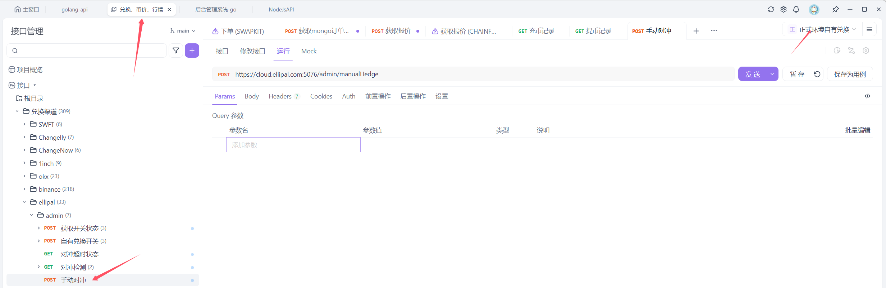
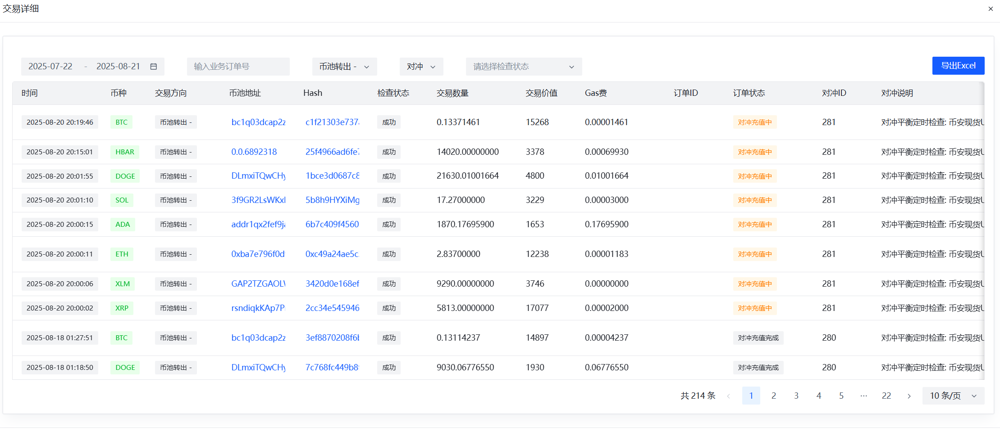
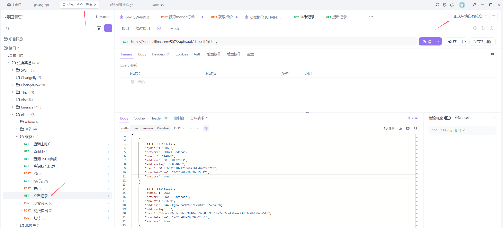
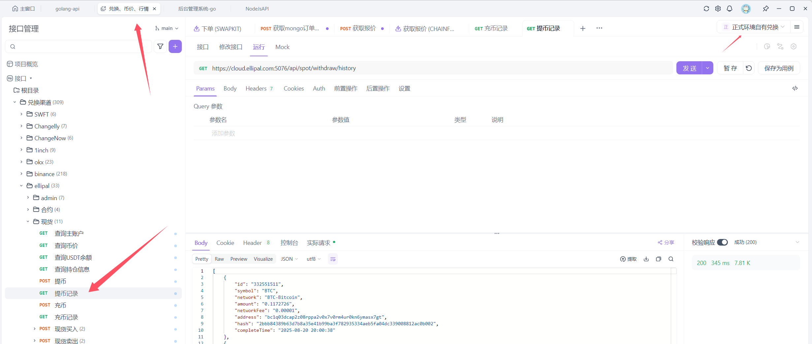
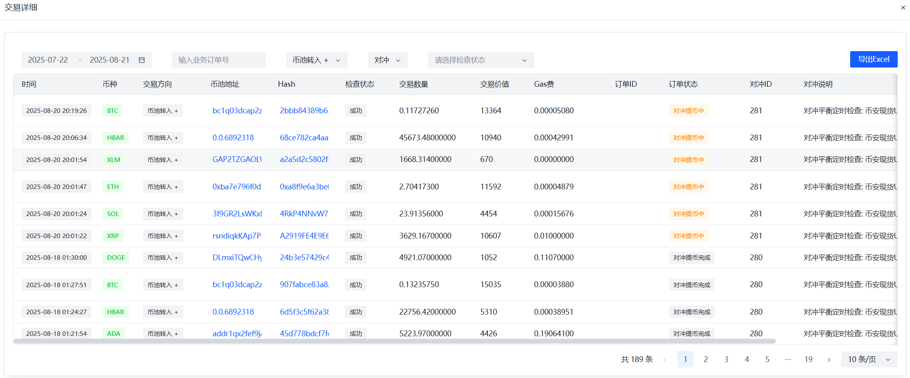
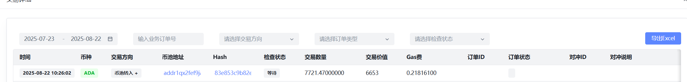

# 自有兑换对冲失败处理


# 处理方案-重启

> 如果失败, 重启自有兑换, 不会自动再次启动之前没有对冲完成的对冲, 但是管理系统对冲会标识对冲中
>
> 推荐第二种方案, 只需要2步: 重启自有兑换, 更新数据库状态完成


1.重启后api手动触发对冲, 会继续上次未完成的对冲

​	- (不推荐, 如果失败一般是外部因素无法完成了. 比如交易所维护, 重启手动触发也不会成功对冲)



2.手动更新数据库状态为4, 标识完成对冲, 上次对冲失败的单会再下次对冲执行

​	-  (推荐, 手动更新这个状态为完成, 让这个失败再下次对冲中自动完成)

```sql
UPDATE ellipal_transfer_record
SET status = 4 
WHERE status != 4 ;
```


# 对冲表

```sql
CREATE TABLE `internal_hedge_process_record` (
  `id` bigint(20) NOT NULL AUTO_INCREMENT,
  `create_at` datetime NOT NULL COMMENT '对冲开始时间',
  `update_at` datetime DEFAULT NULL COMMENT '对冲结束时间',
  `status` tinyint(3) NOT NULL COMMENT '1对冲中 4对冲成功 ',
  `reason` text COMMENT '对冲原因',
  `transferred_json` json DEFAULT NULL COMMENT '对冲充币转账快照',
  `deposit_json` json DEFAULT NULL COMMENT '对冲充币到交易所快照(记录哪些订单参与了对冲充值)',
  `withdraw_json` json DEFAULT NULL COMMENT '对冲提币到币池快照(记录哪些订单参与了对冲提币)',
  `binance_deposit_json` json DEFAULT NULL COMMENT '币安充值记录快照, 用于查看账户的充值记录',
  `binance_withdraw_json` json DEFAULT NULL COMMENT '币安提币记录快照, 用于查看账户的提币记录',
  `binance_wallet_json` json DEFAULT NULL COMMENT '币安钱包资产快照(只保留对冲开始前的数据), 用于查看现货,合约',
  `type` tinyint(3) DEFAULT NULL COMMENT '类型，0自动对冲，1手动对冲(弃用)',
  `process_json` json DEFAULT NULL COMMENT '任务执行快照json(弃用)',
  `binance_spot_volume` varchar(100) CHARACTER SET utf8mb4 DEFAULT NULL COMMENT '币安现货余额(弃用)',
  `binance_future_volume` varchar(100) CHARACTER SET utf8mb4 DEFAULT NULL COMMENT '币安期货余额(弃用)',
  PRIMARY KEY (`id`)
) ENGINE=InnoDB AUTO_INCREMENT=282 DEFAULT CHARSET=utf8 COMMENT='对冲记录任务表';
```

- deposit_json: 对冲充币到交易所快照(记录哪些订单参与了对冲充值), 订单是HEDGE_RECHARGED成功, 如果有OPENED状态, 说明这个订单对冲充值失败
- withdraw_json: 对冲提币到币池快照(记录哪些订单参与了对冲提币), 订单是HEDGE_WITHDRAW成功, 如果有OPENED状态, 说明这个订单对冲提现失败
- transferred_json: 对冲充币转账快照,  管理系统需要用这个来分析币池这笔Hash转账是充值到交易所的类型, 而不是普通兑换转账
- binance_deposit_json: 币安充值记录快照, 管理系统需要用这个来分析币池转出是否是对冲转账到交易所
- binance_withdraw_json: 币安提币记录快照, 管理系统需要用这个来分析币池转入是否是交易所对冲转账到币池


# 查询最近一条失败的对冲订单

```sql
SELECT * FROM internal_hedge_process_record where  status != 4
ORDER BY id DESC
limit 10
```


# 对冲充币分析

结合json和管理系统分析


- 管理系统打开币池管理, 选择顶部交易详情, 选择订单类型**对冲**, 交易方向**币池转出**
- 交易有Hash -> 充币完成




- transferred_json
- 状态 status: RECEIPT -> 充币完成

```json
[
  {
    "id": 8595,
    "name": "XRP",
    "seqNo": "SEQ_174FDEF1864C43CDA25AA5A5A5833539",
    "status": "RECEIPT",
    "txHash": "2cc34e545946ccf880e5e8287d314893981040b4d53deedf449815c04d87d732",
    "volume": 5813,
    "network": "XRP",
    "orderId": "HEDGE-01931165c47d4afe-20250820200000562",
    "failCount": 0,
    "toAddress": "rBuZfn1m4tA6znziHsRp9AyC1M3qg6rgbF",
    "createTime": 1755691212000,
    "targetType": "BINANCE",
    "updateTime": 1755691227132,
    "fromAddress": "rsndiqkKAp7PmPGEo4qJqNxxa7VRFouHiB",
    "triggerType": "SPOT_BALANCE_WARNING",
    "binanceTxHash": "2cc34e545946ccf880e5e8287d314893981040b4d53deedf449815c04d87d732",
    "contractAddress": ""
  }
]
```

```sql
# 充币转账表 -> 数据库也有这份数据
SELECT * FROM ellipal_transfer_record where target_type = 'BINANCE'
ORDER BY id DESC
```


# 对冲充币到交易所

结合api接口和管理系统分析转账记录


## "success": true" -> 交易所收到充币转账



```json
[
    {
        "id": "331484715",
        "symbol": "HBAR",
        "network": "HBAR-Hedera",
        "amount": "14020",
        "address": "0.0.8172693",
        "addressTag": "6034029",
        "hash": "0.0.6892318-1755692101-020220718",
        "completeTime": "2025-08-20 20:15:27",
        "success": true
    }
]
```


## 管理系统出现Hash, 说明转出上链已经成功, 钱已经转出了

- 会出现有Hash的情况, 但是没有标识是否是对冲, 说明对冲转出了, 但是交易所没有识别到转账
- 有可能交易所关闭了充值, 维护, 暂时查不到


>  数据库**deposit_json**字段分析记录哪些订单参与了此次对冲充值, 为什么要充值这么多(兑出币, 开空单, 需要充币到交易所, 平空单)

- 每个币种只会在充值成功的时候才把参与此次对冲的订单保存到**deposit_json**字段

- 出现在**deposit_json**字段的数据, 订单是HEDGE_RECHARGED成功, 如果有OPENED状态, 说明这个订单对冲失败

- 如果充值异常, 有个币充值失败, deposit_json没有保存数据, 下次重新发起另一次对冲, 会出现在下一次对冲**deposit_json**中

  

# 对冲提币到币池

结合api接口和管理系统分析转账记录



```json
[
    {
        "id": "332551511",
        "symbol": "BTC",
        "network": "BTC-Bitcoin",
        "amount": "0.1172726",
        "networkFee": "0.00001",
        "address": "bc1q03dcap2z08rppa2v0x7v0rm4ur0kn6ymasx7gt",
        "hash": "2bbb84389b63d7b8a35e41b99ba3f782935334aeb5fa04dc339008812ac0b002",
        "completeTime": "2025-08-20 20:00:38"
    }
]
```


## 管理系统出现Hash, 说明币池收到钱

- 注意会有缺漏的数据, 交易所可能会少提现了币种(上图少了ADA对冲提币)
- 交易所维护ADA, 可能会暂停提现, 交易所冻结也可能不能提现, 信息查看后台日志




> 数据库**withdraw_json**字段分析记录哪些订单参与了此次对冲提币, 为什么要提币这么多(兑入币, 买现货, 需要提币, 提出现货到币池)

- 每个币种只会在提币成功的时候才把参与此次对冲的订单保存到**deposit_json**字段
- 出现在**withdraw_json**字段的数据, 订单是**HEDGE_WITHDRAW**成功, 如果有OPENED状态, 说明这个订单对冲失败
- 如果提币异常, 有个币提币失败, **withdraw_json**没有保存数据, 下次重新发起另一次对冲, 会出现在下一次对冲**withdraw_json**中


# 交易所充值记录

作用: 管理系统用这个数据来分析币池这笔Hash的订单是否是充值到交易所的

- 数据库**binance_deposit_json**字段记录交易所充值记录
- 如果缺少了充币记录, 管理系统可能会分析不到这条币池抓出的钱是转出到交易所的
  - 理论上快照记录会有的, 不排除出现bug, 如果出现问题, 通过交易所充值api查询实时记录
  - 如果交易所真实缺少充值记录, 说明充值出现问题, 后台日志排查

````json
[
    {
        "id": "331484715",
        "symbol": "HBAR",
        "network": "HBAR-Hedera",
        "amount": "14020",
        "address": "0.0.8172693",
        "addressTag": "6034029",
        "hash": "0.0.6892318-1755692101-020220718",
        "completeTime": "2025-08-20 20:15:27",
        "success": true
    }
]
````


# 交易所提币记录

作用: 管理系统用这个数据来分析币池这笔Hash的订单是否是交易所提现过来的

- 数据库**binance_withdraw_json**字段记录交易所提币记录
- 如果缺少了提币记录, 管理系统可能会分析不到这条币池收到的钱是来自交易所提现过来的
  - 理论上快照记录会有的, 不排除出现bug, 如果出现问题, 通过交易所提现api查询实时记录
  - 如果交易所真实缺少提币记录, 说明提币出现问题, 后台日志排查

```json
[
    {
        "id": "332551511",
        "symbol": "BTC",
        "network": "BTC-Bitcoin",
        "amount": "0.1172726",
        "networkFee": "0.00001",
        "address": "bc1q03dcap2z08rppa2v0x7v0rm4ur0kn6ymasx7gt",
        "hash": "2bbb84389b63d7b8a35e41b99ba3f782935334aeb5fa04dc339008812ac0b002",
        "completeTime": "2025-08-20 20:00:38"
    }
]
```


# 异常1

管理系统出现对冲单, 但是没有被检测正确




数据库binance_withdraw_json,binance_deposit_json没有更新到最新的记录

需要改bug

可以手动加进数据库字段, 调用api获取最新的交易所充币提币记录