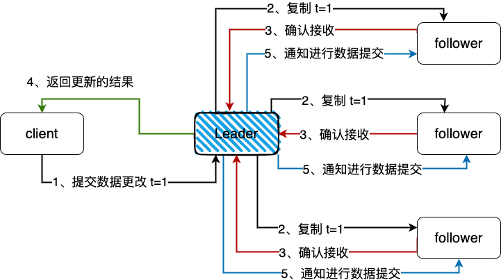
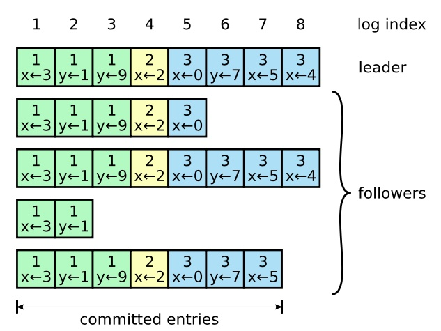

# Raft原理了解

> Raft 是一种为了管理复制日志的一致性算法。

Raft是一种分布式一致性算法。

- 它被设计得易于理解, 解决了即使在出现故障时也可以让**多个服务器对共享状态达成一致**的问题。

- 共享状态: 通常是支持日志复制的数据结构。

- Raft的工作方式是在集群中选举一个领导者。领导者负责接受客户端请求并管理到其他服务器的日志复制。

- 数据只在一个方向流动: **从领导者到其他服务器**

Raft将一致性问题分解为三个子问题:

- 领导者选举: 现有领导者失效时，需要选举新的领导者；
- 日志复制: 领导者需要通过复制保持所有服务器的日志与自己的同步；
- 安全性: 如果其中一个服务器在特定索引上提交了日志条目，那么其他服务器不能在该索引应用不同的日志条目。

# Raft领导者选举

## Raft中的几种状态

在raft算法中，在任何时刻，每一个服务器节点都处于这三个状态之一：

- `Follower`: 追随者，跟随者都是被动的：他们**不会发送任何请求**，只是简单的响应来自领导者或者候选人的请求；

- `Candidate`: 候选人，如果跟随者接收不到消息，那么他就会变成候选人并发起一次选举，获得集群中大多数选票的候选人将成为领导者。

- `Leader`: 领导者，系统中只有一个领导人并且其他的节点全部都是跟随者，领导人处理所有的客户端请求

  - （如果一个客户端和跟随者联系，那么跟随者会把请求重定向给领导人）

  

来看下几个状态的关系:

#### 任期

Raft将时间划分为任意长度的任期(每4年一届的总统选举)

- 每个任期都以一次选举开始。如果一名候选人赢得选举，他在剩下的任期时间内仍然是领导者。

- 如果投票出现分歧，那么这个任期则没有领导者,及时结束。

- 任期号(第几届总统)单调递增。每个服务器存储当前任期号，并在每次通信中交换对比该任期编号。

- 如果一个服务器的当前任期号 小于 其他服务器，那么它将把当前任期更新为更大的值。
- 如果候选人或领导者发现其自己的任期已过期，则立即转化为追随者状态(变成普通人)。
- 如果服务器接收到带有过期任期号的请求，它将拒绝该请求。
  - 我们知道一个前提: 只有领导者才可以发送消息, 理论上跟随着不会发送任何请求
  - 所以如果服务器接收到带有过期任期号的请求, 就说明这个发送请求的领导者已经过期了, 这个请求将无效

#### leader选举

领导者定期向跟随者发送心跳，来维持自己的leader角色。

如果跟随者在一定的时间内没有接收到任何的消息，也就是选举超时，那么他就会认为系统中没有可用的领导者, 并且发起选举以选出新的领导者。

要开始一次选举过程，跟随者先要增加自己的当前任期号并且转换到候选人状态。

然后他会并行的向集群中的其他服务器节点发送请求投票的 RPCs 来给自己投票。

候选人的选举会有下面三种结果：

1、候选人自己赢得了选举；

- 票多,当选

2、其他服务成为了leader；

- 其他候选者票多, 当选

3、候选人中没有选出领导者，可能是多个跟随者同时成为候选人，然后选票被平均瓜分了，以至于没有候选人能获得最大的票数。

- 对于选举过程，对于选票被平均瓜分的情况，Raft算法使用**随机候选超时时间**的方法来确保很少会发生选票瓜分的情况
- 为了阻止选票起初就被瓜分，候选超时时间是从一个固定的区间（例如 150-300 毫秒）随机选择；
- 这个候选超时时间就是follower跟随着要等待成为candidate候选者的时间；
- 每一个候选人在开始一次选举的时候会重置一个随机候选的时间，也就是150-300中随机一个值；
- 这个时间结束之后follower跟随着变成candidate候选者开始选举，不同时候苏醒竞争leader，这样苏醒早的就有竞争优势；
- 这样大大减少了选票被平均瓜分的情况，如果选票还是被瓜分，就继续重新开始选举。

#### 日志复制

一旦leader被选举成功，就可以对客户端提供服务了。

客户端提交每一条命令都会被按顺序记录到leader的日志中，每一条命令都包含任期号（term）和顺序索引(index)

然后向其他节点 并行 发送AppendEntries RPC用以复制命令(如果命令丢失会不断重发)

当复制成功也就是大多数节点成功复制后，leader就会提交命令，将执行结果返回客户端

具体的流程：

- 所有的请求都先经过leader,每个请求首先以日志的形式保存在leader中，然后这时候日志的状态是 uncommited 未提交状态；
  - (就算客户端连接的是跟随着节点, 跟随者也会把请求重定向给领导者)

- 然后leader将这些更改的请求发送到follower跟随着；

- leader等待大多数的follower跟随着保存好日志之后确认提交(跟随着标记提交, 并没有提交)；

- leader领导者 commit 提交这些更改，提交这个信息到自己的状态机中，然后通知客户端更新的响应结果；

- 同时leader会不断的尝试通知follower去存储所有更新的信息(跟随着提交日志到本地)。

日志由有序编号（log index）的日志条目组成。每个日志条目包含它被创建时的任期号（term），和用于状态机执行的命令。

如果一个日志条目被复制到大多数服务器上，就被认为可以提交（commit）了。

- 由下图可以看到, 并不是所有跟随着都时时刻刻复制了所有日志的
- 也可能因为网络延迟的原因导致复制慢, 但是通过leader节点不停的通知跟随着复制, 达到最终一致性

Raft日志同步保证如下两点：

- 如果不同日志中的两个条目有着相同的索引和任期号，则它们所存储的命令是相同的；
- 如果不同日志中的两个条目有着相同的索引和任期号，则它们之前的所有条目都是完全一样的。

第一条特性: 源于Leader在一个任期号(term)内在给定的一个顺序索引(index)最多创建一条日志条目，同时该条目在日志中的位置也从来不会改变。

第二条特性：Raft算法在发送日志复制请求时会携带前置日志的任期号(term)和顺序索引(index)值，只有在前置日志匹配的情况下才能成功响应请求。

- 如果前置的任期号(term)和顺序索引(index)值不匹配，则说明当前的日志是不完整的, 当前节点的日志的最后一个日志条目并不是leader节点的最后一个。
- 为了兑现承诺二(它们之前的所有条目都是完全一样的)，Leader节点需要与该Follower节点向前追溯找到任期号(term)和顺序索引(index)匹配的那条日志
- 并使用Leader节点的日志强行覆盖该Follower此后的日志数据。

一般情况下，Leader和Followers的日志保持一致，因此AppendEntries一致性检查通常不会失败。

然而，Leader崩溃可能会导致日志不一致：

- 旧的Leader可能没有完全复制完日志中的所有条目。
  - 当旧的 Leader 在崩溃之前未能将所有日志条目成功复制给大多数节点时，可能会导致部分节点的日志状态不完整，从而造成日志不一致的情况。

- 一个Follower可能会丢失掉Leader上的一些条目，也有可能包含一些Leader没有的条目，也有可能两者都会发生。

  - 在 Leader 崩溃后，新选举出的 Leader 可能无法准确知道每个 Follower 的日志状态
  - 一些 Follower 日志可能 少于 新 Leader 上的日志条目, 日志同步落后于新的 leader
  - 一些 Follower 可能日志 多于 新 Leader 上的日志条目, 日志同步超前于新的 leader
    - 数据不一致怎么恢复到最新数据的问题在安全性部分会解释

  

为了解决这种情况，Raft 算法中引入了一致性检查机制，即 Leader 在向 Followers 发送 AppendEntries RPC 请求时会包含自己的当前任期号和日志条目的索引号等信息，以便 Followers 可以根据这些信息来检查自己的日志状态是否与 Leader 保持一致。

如果发现日志不一致，Followers 可以根据 Leader 提供的信息来进行日志同步，从而保持整个集群的数据一致性。

## 安全性

#### leader宕机，新的leader未同步前任commit的数据

leader宕机了，然后又选出了新的leader，但是新的leader没有同步完全前任commit的数据

而新leader节点引入了一致性检查机制, 又会强行覆盖集群中其它节点与自己冲突的日志数据, 会出现日志缺少的问题。

这种情况Raft会对参加选举的节点进行限制，只有包含已经commit日志的节点才有机会竞选成功

(也就是只有 顺序索引(index) 最大的那几个节点才能选举)

- 参选节点的任期号(term)值大于等于投票节点的任期号(term)值；
- 如果任期号(term)值相等，则参选节点的 顺序索引(index)  大于等于投票节点的 顺序索引(index) 值;
  - 当然这里有个细节: 并不一定是绝对最大的索引, 也可能会小于最大的索引
  - 因为这里的最大索引必须有一个前提条件, 就是大多数节点的最大索引, 如果只有少部分节点有最大也是不行的
  - 少部分说明了这个日志实际上是不被共识确认的, 此时这些不被确认的应被丢弃

这样就保证了新的leader节点的日志一定是数据最完整的节点。

#### leader在将日志复制给Follower节点之前宕机

如果在复制之前宕机，当然这时候消息处于 uncommitted 未提交状态，新选出的leader一定不包含这些日志信息

所以新的leader会强制覆盖follower中跟他冲突的日志，也就是刚刚宕机的leader，如果变成follower，他未同步的信息会被新的leader覆盖掉(丢弃)。

尽管是丢弃日志, 但是因为leader宕机所有也不会响应给客户端成功的标识, 所以丢弃也没问题, 客户端可以重试发送

#### leader在将日志复制给Follower节点之间宕机

在复制的过程中宕机，会有两种情况：

- 只有少数的follower被同步到了；
- 大多数的follower被同步到了；

情况1：如果只有少数的follower被同步了，如果新的leader不是者几个少数节点之一, 不包含这些信息，新的leader会直接截断这些少数节点日志, 因为虽然太慢同步了最新的数据, 但是没有和大多数节点达成共识确认, 是可以被丢失的

情况2：Leader在复制的过程中宕机,所以肯定消息是没有commit的，新的leader属于大多数被同步的节点, 需要再次尝试将其日志复制给各个Follower节点，并依据自己的复制状态决定是否提交这些日志。

#### leader在响应客户端之前宕机

这种情况，我们根据上面的同步机制可以知道，消息肯定是committed状态的，新的leader肯定包含这个信息，但是新任Leader可能还未被通知该日志已经被提交，不过这个信息在之后一定会被新任Leader标记为committed。

不过对于客户端可能超时拿不到结果，认为本次消息失败了，客户端需要考虑重试/幂等。