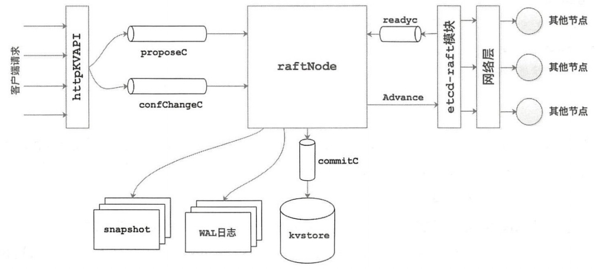

# Raft实现

先来看几个源码中定义的一些变量概念

- Node实例: 对etcd-raft模块具体实现的一层封装，方便上层模块使用etcd-raft模块；
- 上层模块: etcd-raft的调用者，上层模块通过Node提供的API与底层的etcd-raft模块进行交互；
- Cluster集群: 表示一个集群,其中记录了该集群的基础信息；
- Consenter共识成员: 组层Cluster的元素之一，其中封装了一个节点的基本信息；
- Peer节点: 集群中某个节点对集群中另一个节点的称呼, 也是一个共识成员的标识, 有共识id等属性, 没有详细信息；
- Message: 是所有消息的抽象，包括各种消息所需要的字段，raft集群中各个节点之前的通讯都是通过这个message进行的。
- Entry记录: 节点之间的传递是通过message进行的，每条消息中可以携带多条Entry记录,每条Entry对应一条一个独立的操作

- raftLog: Raft中日志同步的核心就是集群中leader如何同步日志到各个follower。日志的管理是在raftLog结构上完成的。


# 结构体源码

## Node实例

```go
// Node 表示 Raft 集群中的一个节点。
type Node interface {
	Tick()	// 将节点的内部逻辑时钟向前推进一个 tick。选举超时和心跳超时以 tick 为单位。
	Campaign(ctx context.Context) error	// 使节点转换为候选人状态并开始竞选成为 Leader。
	Propose(ctx context.Context, data []byte) error	// 提议将数据附加到日志中。提议可能会在没有通知的情况下丢失，因此用户需要确保提议的重试。
	// ProposeConfChange 提议配置更改。
	// 最多只能有一个 ConfChange 在通过一致性过程中。
	// 应用程序在应用 EntryConfChange 类型条目时需要调用 ApplyConfChange。
	ProposeConfChange(ctx context.Context, cc pb.ConfChange) error
	Step(ctx context.Context, msg pb.Message) error	// 使用给定的消息推进状态机。如果有任何错误，将返回 ctx.Err()。

	// Ready 返回一个通道，用于返回当前时刻的状态。
	// 节点的用户必须在获取 Ready 返回的状态后调用 Advance。
	//
	// 注意：在应用下一个 Ready 中的提交条目之前，不能应用来自上一个 Ready 的所有提交条目和快照。
	Ready() <-chan Ready

	// Advance 通知节点应用程序已保存到上一个 Ready 的进度。
	// 它准备节点返回下一个可用的 Ready。
	//
	// 应用程序通常在应用上一个 Ready 中的条目后调用 Advance。
	//
	// 但是，作为优化，应用程序可能在应用命令时调用 Advance。
	// 例如，当上一个 Ready 包含快照时，应用程序可能需要很长时间来应用快照数据。
	// 为了在不阻塞 Raft 进展的情况下继续接收 Ready，它可以在完成应用上一个 Ready 之前调用 Advance。
	Advance()
	// ApplyConfChange 将配置更改应用于本地节点。
	// 返回一个不透明的 ConfState protobuf，必须记录在快照中。
	// 永远不会返回 nil；仅返回指针以匹配 MemoryStorage.Compact。
	ApplyConfChange(cc pb.ConfChange) *pb.ConfState

	TransferLeadership(ctx context.Context, lead, transferee uint64)	// 尝试将领导权转移给指定的接收者。

	// ReadIndex 请求一个读取状态。读取状态将设置在 Ready 中。
	// 读取状态具有读取索引。一旦应用程序进展超过读取索引，可以安全地处理在读取请求之前发出的任何线性读取请求。
	// 读取状态将附加相同的 rctx。
	ReadIndex(ctx context.Context, rctx []byte) error

	Status() Status	// 返回 Raft 状态机的当前状态。
	ReportUnreachable(id uint64)	// 报告给定节点在最后一次发送时不可达。
	// ReportSnapshot 报告发送的快照的状态。id 是应该接收快照的 Follower 的 Raft ID，status 是 SnapshotFinish 或 SnapshotFailure。
	// 使用 SnapshotFinish 调用 ReportSnapshot 是一个空操作。但是，应该将任何应用快照失败（例如，在从 Leader 流式传输到 Follower 时）的情况报告给 Leader，使用 SnapshotFailure。
	// 当 Leader 向 Follower 发送快照时，它会暂停任何 Raft 日志探测，直到 Follower 能够应用快照并推进其状态。
	// 如果 Follower 无法做到这一点，例如由于崩溃，它可能会陷入僵局，永远不会从 Leader 获取任何更新。
	// 因此，应用程序必须确保捕获并向 Leader 报告任何快照发送失败；这样 Leader 就可以恢复 Raft 日志在 Follower 中的探测。
	ReportSnapshot(id uint64, status SnapshotStatus)
	Stop()	// 执行节点的任何必要终止操作。
}
```

## Consenter共识成员

```go
// Consenter 表示一个共识节点（即副本）。
type Consenter struct {
	Host                 string   `protobuf:"bytes,1,opt,name=host,proto3" json:"host,omitempty"` // 主机地址
	Port                 uint32   `protobuf:"varint,2,opt,name=port,proto3" json:"port,omitempty"` // 端口号
	ClientTlsCert        []byte   `protobuf:"bytes,3,opt,name=client_tls_cert,json=clientTlsCert,proto3" json:"client_tls_cert,omitempty"` // 客户端 TLS 证书
	ServerTlsCert        []byte   `protobuf:"bytes,4,opt,name=server_tls_cert,json=serverTlsCert,proto3" json:"server_tls_cert,omitempty"` // 服务器端 TLS 证书
	XXX_NoUnkeyedLiteral struct{} `json:"-"` // 无键字面量
	XXX_unrecognized     []byte   `json:"-"` // 未识别的字段
	XXX_sizecache        int32    `json:"-"` // 大小缓存
}
```

## Peer节点

```go
type Peer struct {
	ID      uint64 // 共识 id
	Context []byte // 上下文数据
}
```

## Entry记录

```go
type Entry struct {
    // Term：表示该Entry所在的任期号(第几届总统)。
	Term             uint64    `protobuf:"varint,2,opt,name=Term" json:"Term"`
	// Index:当前这个entry在整个raft日志中的位置索引,有了Term和Index之后，一个`log entry`就能被唯一标识。 
	Index            uint64    `protobuf:"varint,3,opt,name=Index" json:"Index"`
	// 当前entry的类型
	// 目前etcd支持两种类型：EntryNormal和EntryConfChange 
	// EntryNormaln表示普通的数据操作
	// EntryConfChange表示集群的变更操作
	Type             EntryType `protobuf:"varint,1,opt,name=Type,enum=raftpb.EntryType" json:"Type"`
	// 具体操作使用的数据
	Data             []byte    `protobuf:"bytes,4,opt,name=Data" json:"Data,omitempty"`
	XXX_unrecognized []byte    `json:"-"`
}
```

## Message

```go
type Message struct {
	// 该字段定义了不同的消息类型，etcd-raft就是通过不同的消息类型来进行处理的，etcd中一共定义了19种类型
	Type MessageType `protobuf:"varint,1,opt,name=type,enum=raftpb.MessageType" json:"type"`
	// 消息的目标节点 ID，在急群中每个节点都有一个唯一的id作为标识
	To   uint64      `protobuf:"varint,2,opt,name=to" json:"to"`
	// 发送消息的节点ID
	From uint64      `protobuf:"varint,3,opt,name=from" json:"from"`
	// 整个消息发出去时，所处的任期
	Term uint64      `protobuf:"varint,4,opt,name=term" json:"term"`
	// 该消息携带的第一条Entry记录的的Term值
	LogTerm    uint64   `protobuf:"varint,5,opt,name=logTerm" json:"logTerm"`
	// 索引值，该索引值和消息的类型有关,不同的消息类型代表的含义不同
	Index      uint64   `protobuf:"varint,6,opt,name=index" json:"index"`
	// 需要存储的日志信息
	Entries    []Entry  `protobuf:"bytes,7,rep,name=entries" json:"entries"`
	// 已经提交的日志的索引值，用来向别人同步日志的提交信息。
	Commit     uint64   `protobuf:"varint,8,opt,name=commit" json:"commit"`
	// 在传输快照时，该字段保存了快照数据
	Snapshot   Snapshot `protobuf:"bytes,9,opt,name=snapshot" json:"snapshot"`
	// 主要用于响应类型的消息，表示是否拒绝收到的消息。  
	Reject     bool     `protobuf:"varint,10,opt,name=reject" json:"reject"`
	// Follower 节点拒绝 eader 节点的消息之后，会在该字段记录 一个Entry索引值供Leader节点。
	RejectHint uint64   `protobuf:"varint,11,opt,name=rejectHint" json:"rejectHint"`
	// 携带的一些上下文的信息
	Context    []byte   `protobuf:"bytes,12,opt,name=context" json:"context,omitempty"`
}
```

## raftLog

```go
type raftLog struct {
	// 用于保存自从最后一次snapshot之后提交的数据
	storage Storage
	// 用于保存还没有持久化的数据和快照，这些数据最终都会保存到storage中
	unstable unstable
	// 当天提交的日志数据索引
	committed uint64
	// committed保存是写入持久化存储中的最高index，而applied保存的是传入状态机中的最高index
	// 即一条日志首先要提交成功（即committed），才能被applied到状态机中
	// 因此以下不等式一直成立：applied <= committed
	applied uint64
	logger Logger
	// 调用 nextEnts 时，返回的日志项集合的最大的大小
	// nextEnts 函数返回应用程序已经可以应用到状态机的日志项集合
	maxNextEntsSize uint64
}
```

# 架构图



# 函数

## StartNode: 根据配置和节点列表启动Raft节点

```go
// 开始 Raft 节点的运行, 这里有接受其他节点消息的处理
// fresh: 用于标记这是不是一个全新的 raft 节点，初始启动时使用, 由是否存在共识日志文件判断
// join: 判断是否为全新启动或加入现有通道
func (n *node) start(fresh, join bool) {
	// 根据共识者的ID列表创建RaftPeers
	raftNodes := RaftNodes(n.metadata.ConsenterIds)
	n.logger.Debugf("正在启动 Raft 节点：节点数：%v", len(raftNodes))

    // 根据配置和节点列表启动或新建Raft节点
    n.Node = raft.StartNode(n.config, raftNodes)

	// 运行raft, 持久化raft共识的数据, 和发送/接受消息给raft的其他节点
	go n.run(campaign)
}

// RaftNodes 将共识者ID映射为raft.Peer切片(这个不是peer节点, 这里的peer代表节点的意思, 实际上是排序节点)
func RaftNodes(consenterIDs []uint64) []raft.Peer {
	var orderers []raft.Peer // 初始化一个空的raft.Peer切片用于存放Peer对象

	// 遍历所有共识者ID
	for _, raftID := range consenterIDs {
		// 为每个共识者ID创建一个新的raft.Peer实例并将其追加到peers切片中
		orderers = append(orderers, raft.Peer{ID: raftID})
	}

	// 返回包含所有raft.Peer实例的切片
	return orderers
}
```


## propose: 提议到Raft

```go
		go func(ctx context.Context, propC <-chan *common.Block) {
			for {
				select {
				// 从通道接收待提议的区块
				case b := <-propC:
					// 序列化区块数据，准备提交给Raft
					data := protoutil.MarshalOrPanic(b)
					// 提议区块到Raft，若失败则记录错误并返回
					if err := c.Node.Propose(ctx, data); err != nil {
						c.logger.Errorf("向Raft提议区块[%d]失败，丢弃队列中%d个区块: %s", b.Header.Number, len(propC), err)
						return
					}
					// 成功提议后记录日志
					c.logger.Debugf("向Raft共识提议了区块[%d]", b.Header.Number)

				// 上下文被取消时，退出提议循环
				case <-ctx.Done():
					c.logger.Debugf("停止提议区块，队列中丢弃了%d个区块", len(propC))
					return
				}
			}
		}(ctx, ch)
```

## Ready: 读取raft共识消息

```go
// 读取raft共识消息, 返回当前时间点状态的通道
case rd := <-n.Ready():
    // 如果存储失败，则记录错误并终止程序
    // Entries: 条目指定在发送消息之前要保存到稳定存储的数据实体
    // HardState: 在发送消息之前要保存到稳定存储的节点的当前状态
    // Snapshot: 快照指定要保存到稳定存储的快照
    if err := n.storage.Store(rd.Entries, rd.HardState, rd.Snapshot); err != nil {
        n.logger.Panicf("etcd/raft 数据持久化失败: %s", err)
    }

    if !raft.IsEmptySnap(rd.Snapshot) {
        // 如果快照不为空，则将其发送到 n.chain.snapC 通道
        n.chain.snapC <- &rd.Snapshot
    }

    // 加载 leaderChangeSubscription 领导者更改订阅
    lcs := n.leaderChangeSubscription.Load()

    if lcs != nil && rd.SoftState != nil {
        // 调用 leaderChangeSubscription 函数，传递当前的领导者 ID
        if l := atomic.LoadUint64(&rd.SoftState.Lead); l != raft.None {
            subscription := lcs.(func(uint64))
            subscription(l)
        }
    }

    // 跳过空的应用
    if len(rd.CommittedEntries) != 0 || rd.SoftState != nil {
        // 将应用的数据发送到 n.chain.applyC 通道, 节点接受到来自raft的其他节点的消息
        n.chain.applyC <- apply{rd.CommittedEntries, rd.SoftState}
    }

    // 当前节点是否正在进行选举, SoftState = 当前节点的状态
    if campaign && rd.SoftState != nil {
        // 使用原子操作获取 SoftState 中的 Lead 字段，即当前节点的领导者 ID
        leader := atomic.LoadUint64(&rd.SoftState.Lead)
        // 如果 leader 不等于 raft.None，表示当前节点已经有了领导者
        if leader != raft.None {
            n.logger.Infof("raft领导者 %d 存在, 退出选举活动", leader)
            campaign = false
            close(elected)
        }
    }

    // 已经处理完当前的 Ready 事件，可以继续处理下一个 Ready 事件
    n.Advance()

    // TODO(jay_guo) leader可以复制并行地写入磁盘
    // 给追随者和他们写到他们的磁盘。在论文中检查10.2.1
    // 将 Ready() 中的消息发送给其他节点。rd.Messages 是一个消息列表，其中包含了需要发送给其他节点的消息。这些消息可能包括附加日志条目、请求投票等
    // Messages: 消息指定在将条目提交到稳定存储之后要发送的出站消息。
    // 		Raft 算法的核心之一是通过日志复制来确保所有节点上的日志保持一致。
    // 		当领导者节点接收到客户端的请求后，会将该请求转化为日志条目并发送给其他节点，其他节点收到日志条目后会复制这些日志并在本地应用，从而保持所有节点上的日志一致。
    //
    // 		在 Raft 中，节点通过相互通信来进行领导者选举。
    //		当节点发现当前的领导者不可用时，会发起选举过程，节点之间会相互投票并选举出新的领导者。节点需要发送请求投票的消息给其他节点来参与选举过程。
    n.send(rd.Messages)

```

