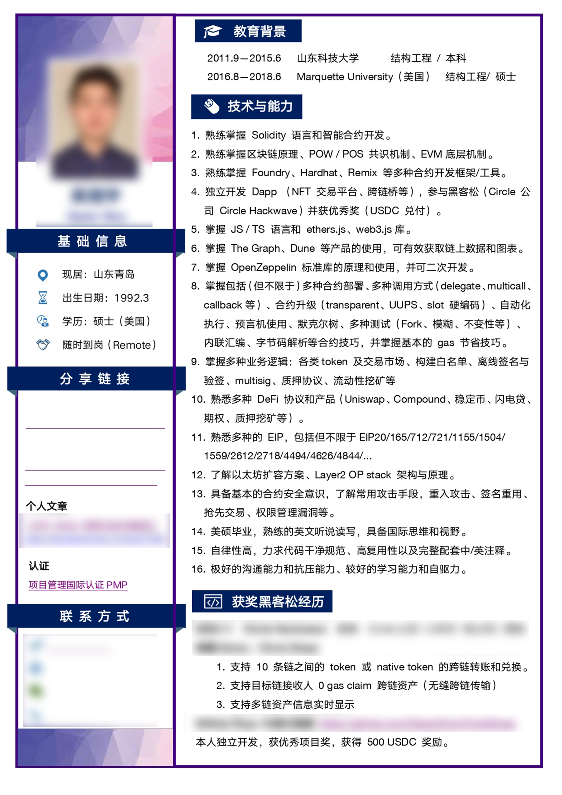
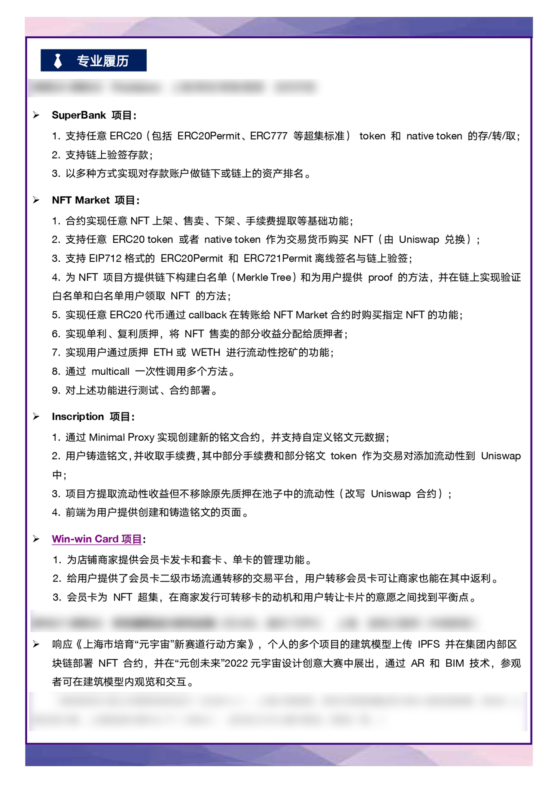
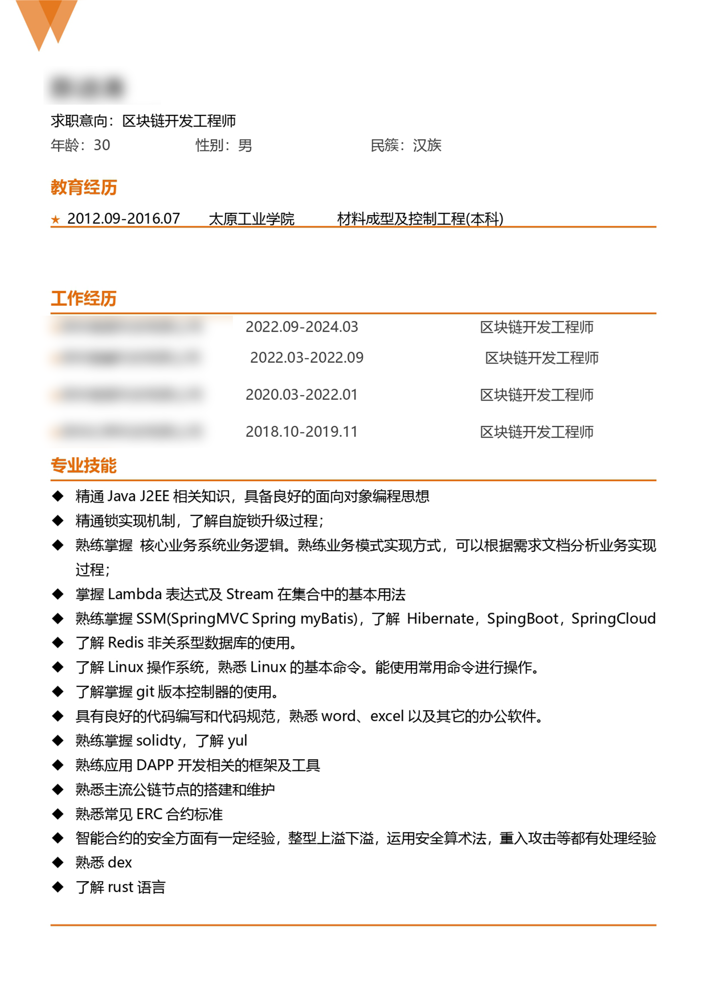
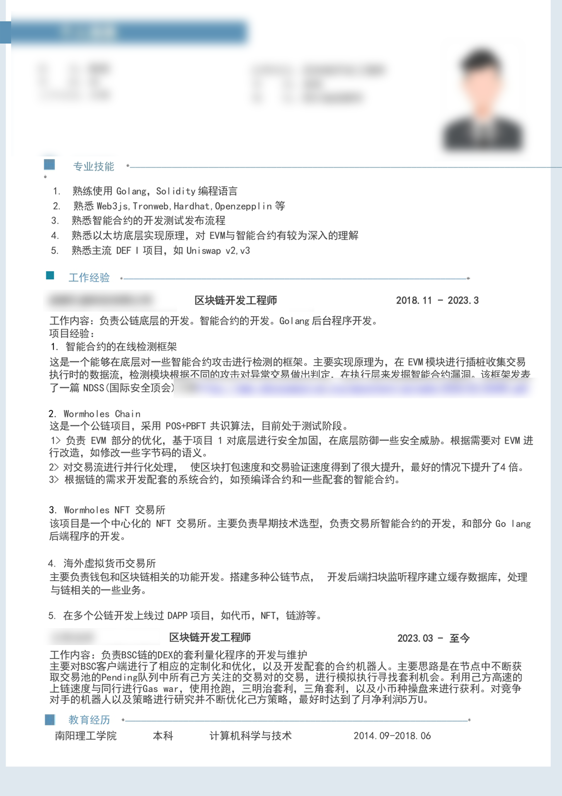
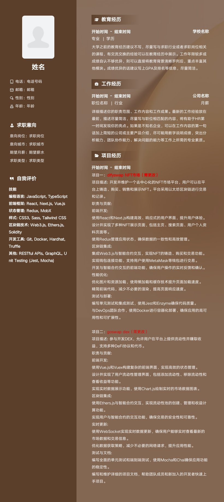

程序员简历模板

## 简历常见错误

1、信息过多，缺乏重点

信息过多的常见表现是十几行的技能列表， 我举一个血淋淋的例子：

2、无意义描述

第二个常见错误就是叙述项目经验的时候进行无意义的描述：

XXX平台

根据项目任务要求完成规划工作和按时完成软件开发。

完成爬虫模块，展示模块。

开发后台管理系统，实现自定义分页，第三方登录。

完成数据整理与入库功能。

HR 无法从这样的描述中得到有效的信息，也无法判断求职者的技术能力。项目经验是最能够突显技术能力的地方，应该按照

- 使用什么工具： 使用 Scrapy 开发异步爬虫系统
- 实现什么功能： 构建 IP 代理池，优化爬虫策略和防屏蔽规则
- 结果怎么样： 提升 200% 网页抓取速度

三个点来修改，这里的 200% 量化数据是画龙点睛之处。就算没做太多统计和优化，也可以展示 CPU 或者内存负载数据。

## **简历中必须写明的内容**

**- 个人信息（基础信息，特别注意联系方式和github信息、求职阐述）**

放上 Github 或者博客链接的前提是它能突显求职者的编程能力，如果 Github 既没贡献过开源项目，一年就 commit
了几次的话就不要放进去了。如果没写过技术博客，或者很久没更新的话，我建议在准备面试的这段时间，每周根据复习的主题写一篇总结性的博客。这样一方面能够通过写文字强化理解复习的内容，为技术面试做好准备，另一方面也能作为简历的加分项

求职阐述（求职意向、薪资意向，如果是远程会涉及到时间分配情况、工作完成度等）

**-** **技能专长（掌握的语言和掌握情况、产品和项目经理要多展示自己项目管理能力，比如使用Lark 或者 notion）**

> 像我在常见错误所指出，HR会直接在简历中搜索关键字，如果没有的话就会直接筛掉。所以技能列表可以按照类型把自己最擅长的工具列上去，熟悉度因为见仁见智，所以不用写，或者用进度条表示就好：
>
> 后端框架：Django, Flask,
>
> 前端框架：Vue, React, jQuery
>
> 数据库：Redis, MySQL
>
> 工具：Scrapy, Docker, Jenkins, Git
>
> 网络协议：TCP/IP, HTTP, Websocket
>
> 外语：大学英语六级，能流畅阅读英文文档

**- 工作经历（主要查看职业发展路径，推测候选人的个性特征，如稳定性、团队合作能力等）**

**- 项目经验（至少需要有1-2个web3 中高阶项目经验，且能够从整体角度去看待和延伸项目）**

不建议简历中出现项目的图片，更好的做法是在不影响排版的前提下附上项目链接。

**- 教育情况**

> 学校大家都会写，要注意的有几点，如果就读 211 / 985 等学校可以把学校放在前面，简介之后。另外，我碰到不少转专业的求职者直接不写原本的专业了，我觉得这毫无必要。HR
> 也不是傻的，看没写专业就知道是非科班的，还不如老老实实写下来。高绩点 / 专业课分数高 / 奖学金 / 比赛获奖可以选重要的加上：
>
> XXX大学 | 计算机科学
>
> 2013年- 2017年
>
> 计算机系统（85分/专业排名18/100），数据结构（90分/专业排名10/100）
>
> 绩点：3.7 | 获得一次国家励志奖学金
>
> 2015-2016学年获得美国大学生数学建模竞赛一等奖
>
> 2013-2014学年获得广东省“砺剑杯”科技创新大赛二等奖

## 模板简历

模板一：开发工程师

模板二：智能合约开发工程师

模板三：区块链开发工程师

模板四：前端开发程序员

