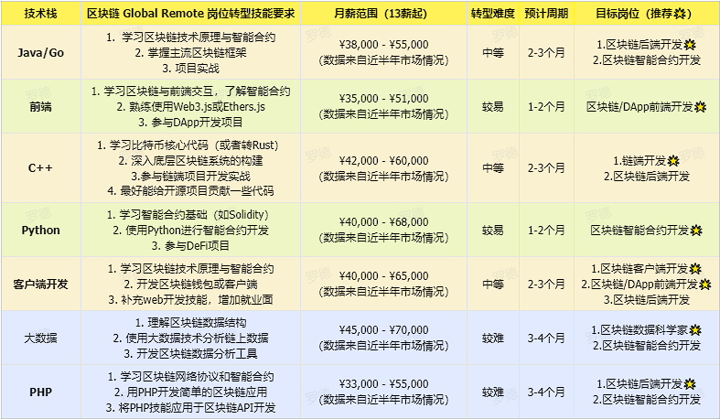
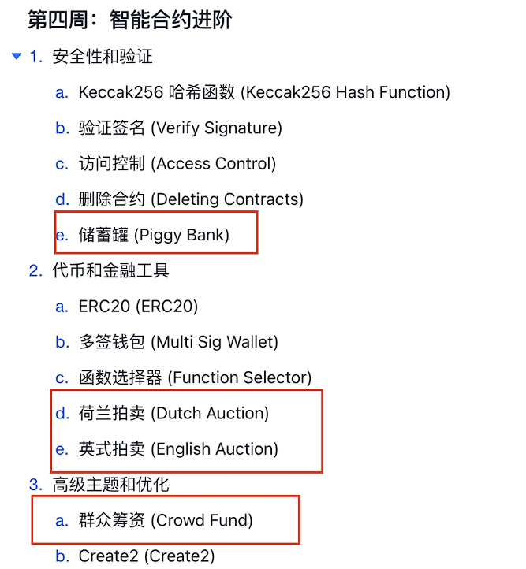
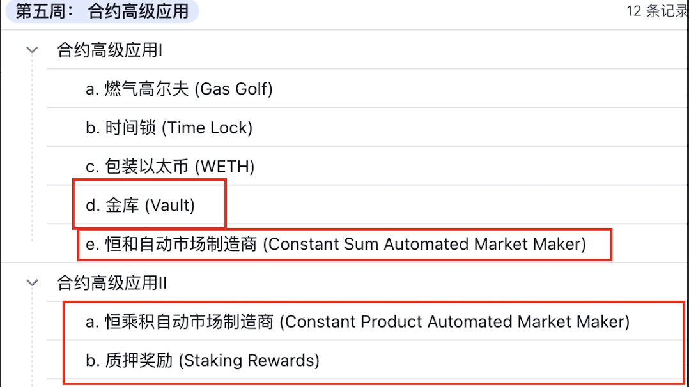

## No.5   区块链开发有哪些方向？哪些技术栈背景好转？

一**、我们需要关注区块链主要的开发岗位和方向**：

- 智能合约开发工程师
- 智能合约审计工程师
- 全栈开发工程师
- DApp前端开发工程师
- 区块链后端工程师
- 区块链安全工程师

- 钱包开发工程师
- 公链(L1/L2/L3)开发工程师
- 投研分析师
- 公链研究员
- 区块链密码学研究员

我用一张表详细描述了**从web2领域转型web3**，不同技术栈转型至区块链开发的**具体步骤、周期和目标岗位：**

技术栈区块链 Global Remote 岗位转型技能要求月薪范围（13薪起）转型难度预计周期目标岗位（推荐🌟）



- **智能合约开发**：对于绝大多数开发同学来说，转型区块链开发，建议先学区块链技术原理集合智能合约，就业方向是智能合约开发。
- **区块链前/后端开发**：如果具备web经验，比如前端、后端Go/Node/Java等，建议转区块链后端开发。
    - Java的解决方案：Java技术栈同学可以先用Java技术栈拆解区块链项目，然后直接去求职。工作中再切换语言。语言难度并不大。
    - 对于前端同学，如果原本不具备后端 Node 能力，那就学 DApp 前端，也够用。
- **相对转型周期更长的技术栈**：C#、Android、iOS、Php、Python大数据、算法、运维开发等。
    - 直接转智能合约也可以，但是建议可以先补充点 web 开发能力，这样更好就业，这件事也可以通过我们训练营的资源。
    - 其次，你同时学习区块链基础课程和任务，包括智能合约相关课程并不冲突。只是在第六周之后的项目实战阶段，会比较依赖你的web开发能力，否则项目任务没办法完成。


1. #### **加入计划，会经历六阶段**：

✅ **准备阶段**：建立对区块链开发的基本认识

✅ **原理基础**：补充技术原理和合约基础

✅ **明确方向**：选择更适合自己且快速转型的方向，其他的知识都可以在转型后慢慢提升

✅ **项目实战**：拆解企业级项目，上传代码作为自己简历的一部分

✅ **模拟面试与复盘**：参与模拟面试课程，掌握企业会提出的问题，做到心中有数

✅ **毕业后**：成为C2E 社区的OG成员，进入核心Web3圈子，与我们共享财富果实。

#### 第一周：掌握基本概念和用法，奠定智能合约编程的基础；

#### 第二周：掌握合约权限、深入了解数组映射、学习存储管理；

#### 第三周：掌握合约交互和调用，理解多重继承和函数可见性的概念；

#### 第四周：掌握代币标准和签名验证，提升合约的实用性和安全性；

#### 第五周：包装以太币和去中心化市场，提升合约的效率和功能；

#### 第六周：掌握ERC721，理解可升级代理的工作原理和实现方法；

#### 第七周：实现复杂数学运算和字节码合约，深入接口和回退机制；

#### 第八周：掌握核心算法开发、巩固智能合约、提升dapp开发技能；

#### 第九周：构建完整开发流程，掌握项目关键技能；

#### 第十周：投入求职阶段。





```
camera essay feature fresh column staff victory cake cream canyon rate parent
2.  8.
3. 9.cream
4. 10.canyon
5. 11.rate
6. 12.parent
```

