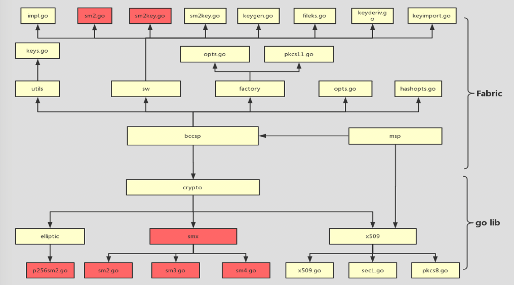
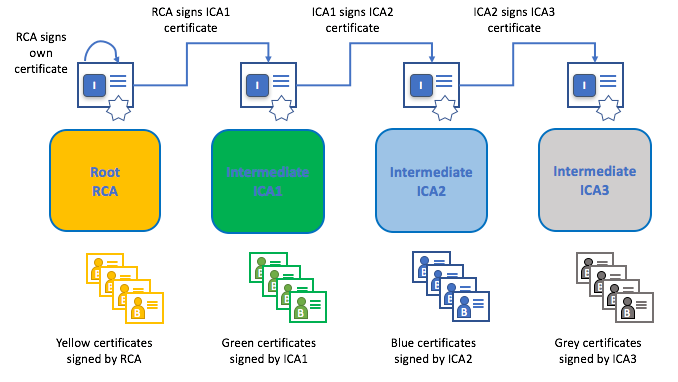

# 解决思路

- **定制化golang环境： ** 将算法实现和X509国密支持部分放在golang的标准库上，这样Fabric层面的适配就会少很多。这种缺点的是golang部分需要做定制，特别是牵扯到用户环境还要同时考虑到**本地和docker**环境两种方式下，golang层面应该如何完成适配。
- **一切交给Fabric: ** 把算法实现和X509的证书支持都放在Fabric层面来做。这种方式的好处是不用动golang的标准库，所有工作都收敛到Fabric上。但是缺点是X509的证书部分需要在上层做定制，所有**引入证书的地方，都需要做调整**。代码也会有较多冗余部分。

## 定制化golang环境

这种方法好处在于，能够在不影响整个Fabric架构的前提下，更好的完成国密支持，并且可以进行动态配置需要使用的算法，不失灵活性。

上图中所示为整个国密支持中，Fabric和golang lib层面所需要定制的部分。黄色代表需要修改部分，红色代表新增部分。

上层为Fabric需要处理的模块，主要集中在BCCSP部分。下层为golang层面需要处理的模块，主要集中在crypto中。

如果想在golang层面做支持的话，那么整个系统的构建环境就需要做一定的定制：

- 对于本地的构建环境来说，需要将golang替换成国密版本支持的
- 对于docker相关的，需要更改docker image中golang层的支持。Fabric中，对golang的支持，是放在fabric-baseimage中的。baseimage中，将特定版本的环境打包到镜像中，提供底层的支持。

>  baseimage相关内容可以从[官方仓库](https://github.com/hyperledger/fabric-baseimage)了解。

## 一切交给Fabric

先说不好的地方：

- 代码升级不方便，因为需要Fabric的代码进行改造，后续官方版本增加新功能需要同步进行代码改造。据目前Fabric版本(2.4)更新差异来看，版本之间，存在大量重构，做迁移比较麻烦。
- 相比之下，如果采用定制化golang环境，由于升级go版本需求频率低于升级Fabric版本，且改动golang标准库代码相对轻松，结构清晰，在升级迁移的时候可以花费少量经历，更为灵活。

好处是：

- 比定制化golang环境少打包.baseimage的docker镜像
- 相对改变golang标准库来说，在多个golang项目存在的情况下更加安全

完全在Fabric层实现改造，需要从以下三个方面着手：

- 其一，把国密的库进行移植，封装gm-crypto；
- 其二，扩展Fabric现有的bccsp模块；
- 其三，修改x509证书相关的地方。

> 综合考虑下两种实现方法，后期考虑做定制化golang方案

## 外围支持

除此之外，作为整个系统来看，Fabric做国密支持，也少不了外围的支持，包括Fabric-CA和Fabric-SDK。

### Fabric-CA国密改造

Fabric-CA主要是为了实现对加入联盟链的成员的身份控制以及数据生成保管。

> **CA：**即Certificate authority，证书授权者。就是颁发证书的机构。

CA可以考虑使用现有的国密CA系统，也可以考虑通过Fabric-CA来做搭建，目前采用后一种方案。

改造CA主要改动如下几个包：

- **Lib：**主要是接口的实现，主要在解析申请证书请求以及签发证书流程要替换为国密算法；
- **Util：**该包数据工具类，主要在证书的编解码等操作中扩展国密算法；
- **Vendor：**因为CA沿用Fabric中的BCCSP套件，所以需要替换对Fabric的包的引用，提供对国密算法的支持。

### Fabric-SDK国密改造

Fabric-SDK主要是一个区块链的大框架，每一个应用发布上去，可以调用我们提供的SDK的功能。而Client-SDK现在有很多种版本，所以有一些工作量在里面。好在每个版本的密码服务套件都是插件化的，可以从以下几个方面着手：

- **API：**主要是接口的定义
- **PKG：**主要是接口的实现
- **Vendor：**替换对Fabric包的引用，提供对国密算法的支持，这一点同CA类似。