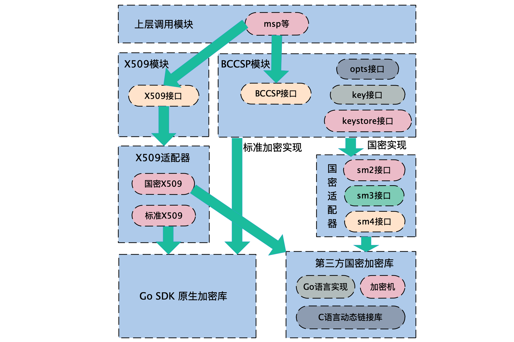
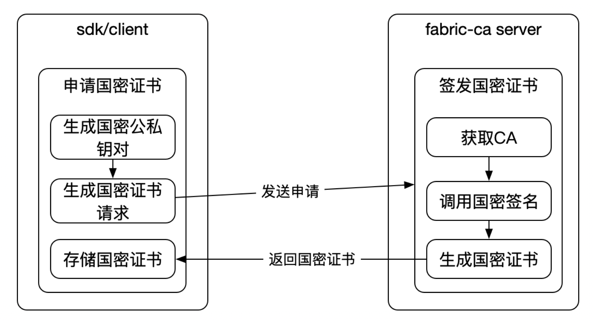
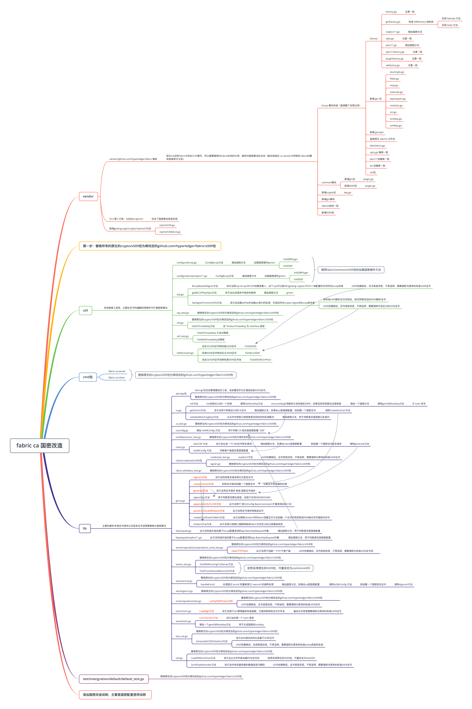

# 模块拆分

## fabric

> 此解释来自**fabric1.4.1**版本, 目前2023-10-17最新2.4.9, 版本改动很大, 仅参考

先来总体看一下fabric进行国密改造会涉及到的主要模块



1. 从上往下，首先是上层调用模块，这一块主要是msp等模块，主要是调用方, 为fabric提供成员加密服务，它的实现依赖于BCCSP模块和X509模块。
2. 我们先看**右边**，**BCCSP模块**主要是实现四套接口，分别是**BCCSP接口、opts接口、key接口以及keystore接口**
3. 其中以BCCSP接口为主，它包含了**加解密**、**签名验签**等主要方法，其他三套接口为辅，主要包含了用于**密钥管理和存储**的一些方法。
4. 接着往下，BCCSP模块有两套实现
   1. 一套是标准加密，它直接依赖于Go SDK原生的加密库(原生加密几乎都是这一套)
   2. 另一套是国密实现，需要依赖于第三方的提供的底层加密库，分为硬实现和软实现，其中硬实现就是加密机(pck目录)，软实现现在主要有Go语言实现和C语言动态链接库实现两种。

5. 考虑到fabric定义的BCCSP接口并不直接兼容于第三方提供的加密接口，因此需要做一个**国密适配器**，主要用于**适配上层的BCCSP模块**和**底层的第三方加密库**，这个国密适配器主要包含了SM2、SM3以及SM4三种国密算法的适配。

6. 然后我们看一下**左边**，X509模块主要提供的是有关证书的一系列方法。在这里fabric原先**默认是使用标准X509**的，底层直接调用的是Go SDK 原生的加密库。
7. 为了让X509支持国密的同时也兼容标准加密，这里我们就把证书相关的**接口抽象出来**，定义为X509接口。然后底层采用两套实现，**标准加密和非国密实现**，标准加密依旧是直接调用原生Go SDK标准加密库，而国密则是调用第三方的国密库。

8. 需要说明的是，在**调用BCCSP模块的加密服务时**，如果选择国密算法，需要加载一个国密的插件(适配器接口)，而如果是标准加密，则不需要加密国密插件；
9. 在调用X509模块的证书服务时，不管是国密X509证书还是标准X509证书均需要加密X509插件(抽象接口)。
10. 具体选择国密还是标准加密算法可通在orderer、peer和cli的**配置文件中的配置项进行指定**。

### 接口和方法一览

具体涉及到的接口和方法以及代码的调用逻辑


## fabric ca

Fabric-ca端通过改造使其可以用以**生成国密公私钥对**、**签发、吊销、查询国密类型的证书**。

证书申请和签发的流程如下图所示，所有改造工作都围绕**证书申请和签发**的流程展开的：



Fabric-ca主要使用Fabric的bccsp模块来完成加解密和签名验签的工作。

Client端负责请求签发国密证书和存储国密证书链的工作。

下面是对这些步骤的解释：

1. Fabric-ca使用Fabric的bccsp模块：Fabric-ca使用Fabric的bccsp模块来提供加解密和签名验签的功能。bccsp是区块链加密服务提供者，它提供了一组加密算法和密钥管理功能。
2. Client端请求签发国密证书：Client端首先生成国密的公私钥对，并将公钥编码到生成证书的请求中。然后，Client端将生成国密证书的请求发送给Fabric-ca的Server端。
3. 存储国密证书链：Client端需要使用支持国密适配的x509来解析证书，并将解析后的证书链写入到Client端的本地路径中。
4. Fabric-ca Server端签发国密证书：Fabric-ca Server端负责国密证书的签发、吊销、查询等功能。在接收到签发请求时，Server端调用国密的签名方法对证书请求进行签名，并将国密证书返回给Client端。

> 国密证书中包含了两个公钥：一个是Client端生成的国密公钥，用于加密和验签操作；另一个是Server端的公钥，用于验证证书的合法性。这样可以确保证书的完整性和可信度。

改造要点：

1. Fabric-ca/lib：主要是接口的实现，主要在解析申请证书请求以及签发证书流程要替换为国密算法；
2. Fabric-ca/util：该包数据工具类，主要在证书的编解码等操作中扩展国密算法；
3. Fabric-ca/vendor：因为CA沿用Fabric中的BCCSP套件，所以需要替换对Fabric的包的引用，提供对国密算法的支持。
   

### 接口和方法一览



## fabric sdk

SDK项目介绍

> 首先介绍一下sdk项目的架构。

```shell
├── internal
├── pkg
├── scripts
├── test
└── third_party
```

其中**internal**和**third_party**包含fabric相关核心代码。

pkg为**sdk核心代码**，对外提供接口进行服务。


**internal文件夹**

```sh
└── github.com
└── github.com
    └── hyperledger
        ├── fabric
        │   ├── bccsp
        │   ├── common
        │   ├── core
        │   ├── discovery
        │   ├── gossip
        │   ├── msp
        │   ├── protoutil
        │   ├── sdkinternal
        │   └── sdkpatch
        └── fabric-ca
            ├── api
            ├── lib
            ├── sdkpatch
            └── util
```

**third_party文件夹**

```sh
└── github.com
└── github.com
    └── hyperledger
        └── fabric
            ├── common
            ├── core
            └── internal
```

1. 添加国密**底层实现库** -> mod

2. 添加**国密插件和X509插件**(接口)

3. 添加gmfactory及相关接口

4. 定义公私钥基础类型并替换原有的公私钥

5. 将原生的 X509 库替换为自定义的 x509 库

6. **2.x 版本**不再支持RSA、去掉了插件plugin实现方式

7. 添加一个orderer字段，用于指定orderer配置
   