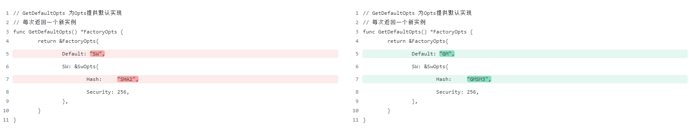
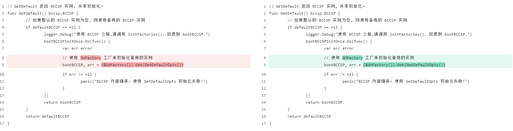
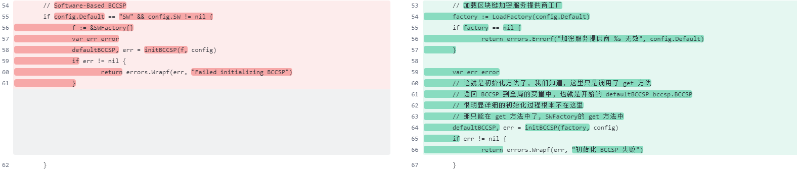

# 引入gm算法

```
	github.com/Hyperledger-TWGC/tjfoc-gm v1.4.0
```


# 初始化入口改造国密

## 默认加密算法配置

`bccsp/factory/opts.go`



改完使用GM的加密算法:

```go
// GetDefaultOpts 为Opts提供默认实现
// 每次返回一个新实例
func GetDefaultOpts() *FactoryOpts {
	return &FactoryOpts{
		Default: "GM",
		SW: &SwOpts{
			Hash:     "GMSM3",
			Security: 256,
		},
	}
}
```

## get加密实例方法调整默认



使用默认的配置加载国密:

```go
// GetDefault 返回 BCCSP 实例, 并非初始化。
func GetDefault() bccsp.BCCSP {
	// 如果默认的 BCCSP 实例为空, 则使用备用的 BCCSP 实例
	if defaultBCCSP == nil {
		logger.Debug("使用 BCCSP 之前,请调用 InitFactories(). 回退到 bootBCCSP.")
		bootBCCSPInitOnce.Do(func() {
			var err error
			// 使用 GMFactory 工厂来初始化备用的实例
			bootBCCSP, err = (&GMFactory{}).Get(GetDefaultOpts())
			if err != nil {
				panic("BCCSP 内部错误，使用 GetDefaultOpts 初始化失败!")
			}
		})
		return bootBCCSP
	}
	return defaultBCCSP
}
```


## nopkcs11

`bccsp/factory/nopkcs11.go`



补充gm实例的加载:

```go
// initFactories 初始化工厂
func initFactories(config *FactoryOpts) error {
	// 如果没有任何自定义配置, 则对默认选项采取一些预防措施
	if config == nil {
		config = GetDefaultOpts()
	}

	if config.Default == "" {
		config.Default = "SW"
	}

	if config.SW == nil {
		config.SW = GetDefaultOpts().SW
	}

	// 加载区块链加密服务提供商工厂
	factory := LoadFactory(config.Default)
	if factory == nil {
		return errors.Errorf("加密服务提供商 %s 无效", config.Default)
	}

	var err error
	// 这就是初始化方法了, 我们知道, 这里只是调用了 get 方法
	// 返回 BCCSP 到全局的变量中, 也就是开始的 defaultBCCSP bccsp.BCCSP
	// 很明显详细的初始化过程根本不在这里
	// 那只能在 get 方法中了, SWFactory的 get 方法中
	defaultBCCSP, err = initBCCSP(factory, config)
	if err != nil {
		return errors.Wrapf(err, "初始化 BCCSP 失败")
	}

	if defaultBCCSP == nil {
		return errors.Errorf("找不到默认值 `%s` BCCSP", config.Default)
	}

	return nil
}
```

补充加载的方法`LoadFactory`: 

```go
// LoadFactory 加载区块链加密服务提供商工厂
func LoadFactory(name string) BCCSPFactory {
    // 补充GMFactory
	factories := []BCCSPFactory{&SWFactory{}, &GMFactory{}}

	for _, factory := range factories {
		if name == factory.Name() {
			return factory
		}
	}

	return nil
}
```

# 密钥解析改造

`bccsp/utils/keys.go`

私钥转换为DER编码, 补充sm2非对称私钥的解析:

```go
// PrivateKeyToDER 用于将私钥转换为DER编码的字节数组
// DER是一种二进制编码格式，它使用固定的规则将数据编码为字节序列
// DER通常用于在网络通信和存储中传输和保存数据，如数字证书、私钥等
func PrivateKeyToDER(privateKey interface{}) ([]byte, error) {
	if privateKey == nil {
		return nil, errors.New("私钥。它一定不同于nil")
	}
	switch k := privateKey.(type) {
	case *ecdsa.PrivateKey:
		return x509.MarshalECPrivateKey(k)
	case *sm2.PrivateKey:
		return x509GM.MarshalSm2UnecryptedPrivateKey(k)
	default:
		return nil, errors.New("密钥类型无效。它必须是*sm2.PrivateKey、*ecdsa.PrivateKey、*rsa.PrivateKey")
	}
}
```

私钥转pem, 补充sm2非对称私钥的解析: 

```go
// PrivateKeyToPEM ecdsa私钥转pem
// PEM则是一种基于文本的编码格式，它使用Base64编码将数据转换为可打印的ASCII字符序列，并添加了起始标记和结束标记
// PEM则常用于将DER编码的数据转换为文本格式，以便在配置文件、邮件等文本环境中使用
func PrivateKeyToPEM(privateKey interface{}, pwd []byte) ([]byte, error) {
	// 验证输入
	if len(pwd) != 0 {
		return PrivateKeyToEncryptedPEM(privateKey, pwd)
	}
	if privateKey == nil {
		return nil, errors.New("无效密钥。它必须不同于nil.")
	}

	switch k := privateKey.(type) {
	case *sm2.PrivateKey:
		if k == nil {
			return nil, errors.New("sm2私钥无效。它必须不同于nil.")
		}
		return x509GM.WritePrivateKeyToPem(k, nil)
	case *ecdsa.PrivateKey:
		if k == nil {
			return nil, errors.New("ecdsa私钥无效。它必须不同于nil.")
		}

		// 获取曲线的oid
		oidNamedCurve, ok := oidFromNamedCurve(k.Curve)
		if !ok {
			return nil, errors.New("未知椭圆曲线")
		}

		// 将私钥的字节序列进行填充，以满足ASN.1编码的要求
		// based on https://golang.org/src/crypto/x509/sec1.go
		privateKeyBytes := k.D.Bytes()
		paddedPrivateKey := make([]byte, (k.Curve.Params().N.BitLen()+7)/8)
		copy(paddedPrivateKey[len(paddedPrivateKey)-len(privateKeyBytes):], privateKeyBytes)
		// 使用ASN.1编码将EC私钥封装为ASN.1结构, 省略NamedCurveOID的兼容性，因为它是可选的
		asn1Bytes, err := asn1.Marshal(ecPrivateKey{
			Version:    1,
			PrivateKey: paddedPrivateKey,
			PublicKey:  asn1.BitString{Bytes: elliptic.Marshal(k.Curve, k.X, k.Y)},
		})

		if err != nil {
			return nil, fmt.Errorf("将EC密钥封送至asn1 [%s]", err)
		}
		// 将其转换为PKCS#8格式的字节序列
		var pkcs8Key pkcs8Info
		pkcs8Key.Version = 0
		pkcs8Key.PrivateKeyAlgorithm = make([]asn1.ObjectIdentifier, 2)
		pkcs8Key.PrivateKeyAlgorithm[0] = oidPublicKeyECDSA
		pkcs8Key.PrivateKeyAlgorithm[1] = oidNamedCurve
		pkcs8Key.PrivateKey = asn1Bytes

		pkcs8Bytes, err := asn1.Marshal(pkcs8Key)
		if err != nil {
			return nil, fmt.Errorf("将EC密钥封送至asn1 [%s]", err)
		}
		// 将PKCS#8格式的私钥转换为PEM格式，并返回PEM编码的字节序列
		return pem.EncodeToMemory(
			&pem.Block{
				Type:  "PRIVATE KEY",
				Bytes: pkcs8Bytes,
			},
		), nil
	case *rsa.PrivateKey:
		if k == nil {
			return nil, errors.New("无效的rsa私钥。它必须不同于nil.")
		}
		raw := x509.MarshalPKCS1PrivateKey(k)

		return pem.EncodeToMemory(
			&pem.Block{
				Type:  "RSA PRIVATE KEY",
				Bytes: raw,
			},
		), nil
	default:
		return nil, errors.New("密钥类型无效。它必须是*sm2.PrivateKey、*ecdsa.PrivateKey、*rsa.PrivateKey")
	}
}
```

私钥转pem并加密, 补充sm2非对称私钥的解析: 

```go
// PrivateKeyToEncryptedPEM ecdsa私钥转pem, 并加密pem
// PEM则是一种基于文本的编码格式，它使用Base64编码将数据转换为可打印的ASCII字符序列，并添加了起始标记和结束标记
// PEM则常用于将DER编码的数据转换为文本格式，以便在配置文件、邮件等文本环境中使用
func PrivateKeyToEncryptedPEM(privateKey interface{}, pwd []byte) ([]byte, error) {
	if privateKey == nil {
		return nil, errors.New("无效的私钥。它一定不同于nil.")
	}

	switch k := privateKey.(type) {
	case *ecdsa.PrivateKey:
		if k == nil {
			return nil, errors.New("ecdsa私钥无效。它必须不同于nil.")
		}
		// 接受一个ECDSA私钥key作为参数，并返回经过编码的私钥的字节数组
		// 函数内部首先调用oidFromNamedCurve函数来获取给定椭圆曲线的OID（Object Identifier）。
		// 然后，调用marshalECPrivateKeyWithOID函数，将私钥和椭圆曲线的OID作为参数进行编码。
		// 最后，将编码后的私钥表示为字节数组，并返回。
		raw, err := x509.MarshalECPrivateKey(k)

		if err != nil {
			return nil, err
		}
		// 加密的pem
		block, err := x509.EncryptPEMBlock(
			rand.Reader,
			"PRIVATE KEY",
			raw,
			pwd,
			x509.PEMCipherAES256)

		if err != nil {
			return nil, err
		}

		return pem.EncodeToMemory(block), nil
	case *sm2.PrivateKey:
		if k == nil {
			return nil, errors.New("sm2私钥无效。它必须不同于nil.")
		}
		// 加密的pem
		return x509GM.WritePrivateKeyToPem(k, pwd)
	default:
		return nil, errors.New("密钥类型无效。它必须是*ecdsa.PrivateKey、*sm2.PrivateKey")
	}
}
```

der编码转私钥, 补充sm2非对称私钥的解析:

```go
// DERToPrivateKey der编码转ecdsa私钥
// // DER是一种二进制编码格式，它使用固定的规则将数据编码为字节序列
// // DER通常用于在网络通信和存储中传输和保存数据，如数字证书、私钥等
func DERToPrivateKey(der []byte) (key interface{}, err error) {
	// 尝试数据解析为PKCS1格式的私钥对象, PKCS#1编码是一种用于RSA密钥和签名的编码标准, 组合了asn1和der
	if key, err = x509.ParsePKCS1PrivateKey(der); err == nil {
		return key, nil
	}
	// 尝试数据解析为PKCS8格式的私钥对象, 多种算法(rsa、ecdsa)
	if key, err = x509.ParsePKCS8PrivateKey(der); err == nil {
		switch key.(type) {
		case *rsa.PrivateKey, *ecdsa.PrivateKey:
			return
		default:
			return nil, errors.New("在PKCS #8包装中发现未知的私钥类型")
		}
	}
	// 尝试数据解析为ECDSA格式的私钥对象
	if key, err = x509.ParseECPrivateKey(der); err == nil {
		return
	}
	// 尝试数据解析为GMSM2未加密私钥对象, 内部调用了ParseSm2PrivateKey
	if key, err = x509GM.ParsePKCS8UnecryptedPrivateKey(der); err == nil {
		return
	}
	// 尝试数据解析为GMSM2格式的私钥对象
	if key, err = x509GM.ParseSm2PrivateKey(der); err == nil {
		return
	}

	return nil, errors.New("密钥类型无效。支持的密钥类型RSA、ECDSA、GMSM2")
}
```

ecdsa公钥转pem, 补充sm2非对称公钥的解析:

```go
// PublicKeyToPEM ecdsa公钥转pem
func PublicKeyToPEM(publicKey interface{}, pwd []byte) ([]byte, error) {
	if len(pwd) != 0 {
		return PublicKeyToEncryptedPEM(publicKey, pwd)
	}

	if publicKey == nil {
		return nil, errors.New("公钥无效。它必须不同于nil.")
	}

	switch k := publicKey.(type) {
	case *ecdsa.PublicKey:
		if k == nil {
			return nil, errors.New("无效的ecdsa公钥。它一定不同于nil.")
		}
		PubASN1, err := x509.MarshalPKIXPublicKey(k)
		if err != nil {
			return nil, err
		}

		return pem.EncodeToMemory(
			&pem.Block{
				Type:  "PUBLIC KEY",
				Bytes: PubASN1,
			},
		), nil
	case *rsa.PublicKey:
		if k == nil {
			return nil, errors.New("rsa公钥无效。它必须不同于nil.")
		}
		PubASN1, err := x509.MarshalPKIXPublicKey(k)
		if err != nil {
			return nil, err
		}

		return pem.EncodeToMemory(
			&pem.Block{
				Type:  "RSA PUBLIC KEY",
				Bytes: PubASN1,
			},
		), nil
	case *sm2.PublicKey:
		if k == nil {
			return nil, errors.New("sm2公钥无效。它必须不同于nil.")
		}

		return x509GM.WritePublicKeyToPem(k)
	default:
		return nil, errors.New("密钥类型无效。它必须是*ecdsa.PublicKey、*rsa.PublicKey、*sm2.PublicKey")
	}
}
```

ecdsa公钥转pem并加密, 补充sm2非对称公钥的解析:

```go
// PublicKeyToEncryptedPEM ecdsa公钥转pem, 并加密
func PublicKeyToEncryptedPEM(publicKey interface{}, pwd []byte) ([]byte, error) {
	if publicKey == nil {
		return nil, errors.New("公钥无效。它必须不同于nil.")
	}
	if len(pwd) == 0 {
		return nil, errors.New("密码无效。它必须不同于nil.")
	}

	switch k := publicKey.(type) {
	case *ecdsa.PublicKey:
		if k == nil {
			return nil, errors.New("无效的ecdsa公钥。它一定不同于nil.")
		}
		raw, err := x509.MarshalPKIXPublicKey(k)
		if err != nil {
			return nil, err
		}

		block, err := x509.EncryptPEMBlock(
			rand.Reader,
			"PUBLIC KEY",
			raw,
			pwd,
			x509.PEMCipherAES256)

		if err != nil {
			return nil, err
		}

		return pem.EncodeToMemory(block), nil
	case *sm2.PublicKey:
		if k == nil {
			return nil, errors.New("无效的ecdsa公钥。它一定不同于nil.")
		}

		return x509GM.WritePublicKeyToPem(k)
	default:
		return nil, errors.New("密钥类型无效。它必须是*ecdsa.PublicKey、*sm2.PublicKey")
	}
}
```

ecdsa公钥转der, 补充sm2非对称公钥解析: 

```go
// PublicKeyToDER ecdsa公钥转der
func PublicKeyToDER(publicKey interface{}) ([]byte, error) {
	if publicKey == nil {
		return nil, errors.New("公钥无效。它必须不同于nil.")
	}

	switch k := publicKey.(type) {
	case *ecdsa.PublicKey:
		if k == nil {
			return nil, errors.New("无效的ecdsa公钥。它一定不同于nil.")
		}
		PubASN1, err := x509.MarshalPKIXPublicKey(k)
		if err != nil {
			return nil, err
		}

		return PubASN1, nil

	case *rsa.PublicKey:
		if k == nil {
			return nil, errors.New("rsa公钥无效。它必须不同于nil.")
		}
		PubASN1, err := x509.MarshalPKIXPublicKey(k)
		if err != nil {
			return nil, err
		}

		return PubASN1, nil

	case *sm2.PublicKey:
		if k == nil {
			return nil, errors.New("GMSM2公钥无效。它必须不同于nil.")
		}
		der, err := x509GM.MarshalSm2PublicKey(k)
		if err != nil {
			return nil, err
		}
		return der, nil

	default:
		return nil, errors.New("密钥类型无效。它必须是*ecdsa.PublicKey、*rsa.PublicKey、*sm2.PublicKey")
	}
}
```

