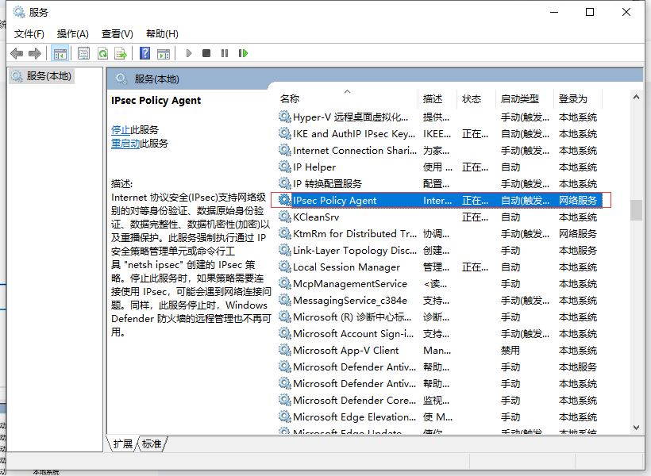
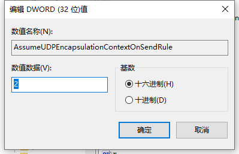
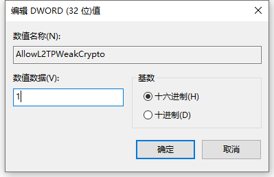
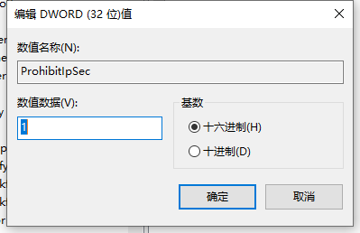

# 说明

如果是简单ipsec可能会被**GFW（中国防火墙）干扰**


# 创建配置文件

```sh
mkdir -p /usr/local/src/ipsec
```

```sh
tee /usr/local/src/ipsec/vpn.env <<-'EOF'
# 预共享密钥
VPN_IPSEC_PSK=59QGefmfDHNo+14J+95H/CGjvn0p4oYri6eNlGKk6U8=
# 用户账号
VPN_USER=luode
# 用户密码
VPN_PASSWORD=Ld@588588
# 允许分片（解决 MTU 问题）
VPN_FRAGMENTATION=yes
# 连接保活和重试
VPN_KEEPALIVE=yes        # 启用保活包
VPN_DUPLEX_DETECT=yes    # 检测双工模式
VPN_DISABLE_REDIRECT=yes # 禁用重定向（避免某些 ISP 干扰）
VPN_FORCE_KEEPALIVE=10   # 每 10 秒发送保活包
EOF
```


# 启动

```sh
docker run -itd \
--restart=always \
--name ipsec-vpn \
--env-file /usr/local/src/ipsec/vpn.env \
-p 500:500/udp \
-p 4500:4500/udp \
-d --privileged \
luode0320/ipsec-vpn:latest
```


# windows




修改客户机注册表。定位注册表：

HKEY_LOCAL_MACHINE\SYSTEM\CurrentControlSet\Services\PolicyAgent

新建DWORD (32位)值，名称：AssumeUDPEncapsulationContextOnSendRule，数据：2




定位注册表：

HKEY_LOCAL_MACHINE\System\CurrentControlSet\Services\Rasman\Parameters

点击allowL2TPweakcryphto 修改值为1




在空白出新建，然后单击DWORD(32) 值(D)，名称为："ProhibitIpSec"，设置值为1




重启电脑