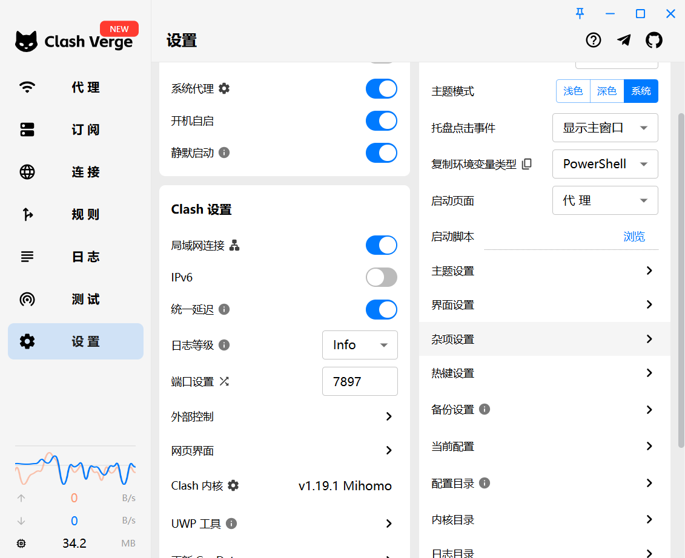
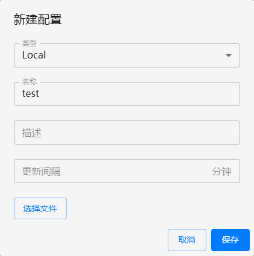

#  启动vpn服务端

```sh
# pc端
docker run -d \
  --restart=always \
  --name shadowsocks-pc \
  --cap-add=NET_ADMIN \
  -p 8300:8388/tcp \
  -p 8300:8388/udp \
  -e SERVER_ADDR=0.0.0.0 \
  -e SERVER_PORT=8388 \
  -e PASSWORD=Ld@588588 \
  -e METHOD=aes-256-gcm \
  -e FAST_OPEN=true \
  -e ARGS=--fast-open \
  luode0320/shadowsocks
  
# 移动端
docker run -d \
  --restart=always \
  --name shadowsocks-mobile \
  --cap-add=NET_ADMIN \
  -p 8399:8388/tcp \
  -p 8399:8388/udp \
  -e SERVER_ADDR=0.0.0.0 \
  -e SERVER_PORT=8388 \
  -e PASSWORD=Ld@588588 \
  -e METHOD=xchacha20-ietf-poly1305 \
  -e FAST_OPEN=true \
  -e ARGS=--fast-open \
  luode0320/shadowsocks
```

## 开放端口

```sh
# centos
firewall-cmd --permanent --add-port=8388/tcp
firewall-cmd --reload

# 允许8388/tcp端口（Ubuntu）
ufw allow 8388/tcp
```


# 安装vpn客户端

```
https://www.ilanzou.com/s/JcG0BWV9
```


本地新建一个`vpn.yaml`文件

```yaml
proxies:
  - name: shadowsocks-pc
    server: 111.111.111.111
    port: 8300
    type: ss
    password: Ld@588588
    cipher: aes-256-gcm
  - name: shadowsocks-mobile
    server: 111.111.111.111
    port: 8399
    type: ss
    password: Ld@588588
    cipher: xchacha20-ietf-poly1305

proxy-groups:
  - name: Proxy
    type: url-test      # 自动选择延迟最低的可用节点
    url: http://www.gstatic.com/generate_204
    interval: 10      # 每10s测试一次
    tolerance: 50      # 延迟相差50ms以内不切换
    proxies:
      - shadowsocks-pc
      - shadowsocks-mobile
  - name: Direct
    type: select
    proxies:
      - DIRECT
  - name: Reject
    type: select
    proxies:
      - REJECT

rules:
  - GEOIP,CN,Direct
  - GEOIP,US,Proxy
  - MATCH,Proxy
```





## 配置订阅:

1. 点击左侧订阅
2. 右上角新建
3. 设置Local类型
4. 选择刚刚新建的`vpn.yaml`文件
5. 保存连接

