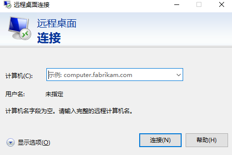
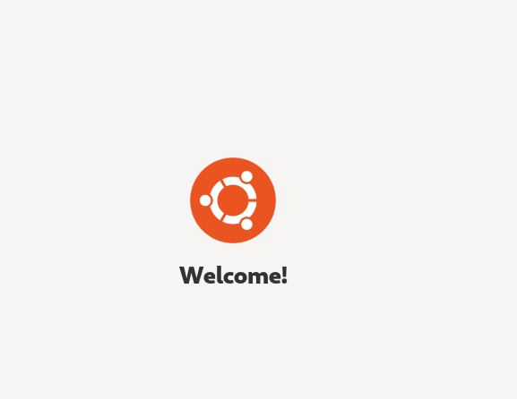

# 更新工具

```sh
apt update
```

# 安装

```sh
apt install ubuntu-desktop
```


# 启用显示管理器

```sh
systemctl enable gdm3
systemctl start gdm3
```


# 重启

```sh
reboot
```


# 安装连接工具

**安装**

```sh
apt update
apt install xrdp
systemctl enable xrdp
systemctl start xrdp
systemctl status xrdp
```


**添加用户组**

```sh
adduser xrdp ssl-cert
systemctl restart xrdp
systemctl status xrdp
```


**配置**

Xrdp 配置文件定位在`/etc/xrdp`目录。对于基本的 Xrdp 链接，你不需要对配置文件做任何改动。

Xrdp 使用默认的 X Window 桌面环境（Gnome or XFCE）。

主要的配置文件被命名为 xrdp.ini。这个文件被分成不同的段，允许你设置全局配置，例如安全，监听地址，创建不同的 xrdp 登录会话等。

不管什么时候你对配置文件做出修改，你需要重启 Xrdp 服务。

Xrdp 使用`startwm.sh`文件启动 X 会话。如果你想使用另外一个 X Window 桌面，编辑这个文件。


**开放端口** 

```sh
ufw allow from 192.168.33.0/24 to any port 3389
```


**连接**

现在你已经设置好你的 Xrdp 服务器，是时候打开你的 Xrdp 客户端并且连接到服务器。

如果你有一台 Windows 电脑，你可以使用默认的 RDP 客户端。在 Windows 搜索栏输入“remote”，并且点击“Remote Desktop Connection”。这将会打开一个 RDP 客户端。

在“Computer”区域输入远程服务器 IP地址:端口，并且点击“Connect”。



