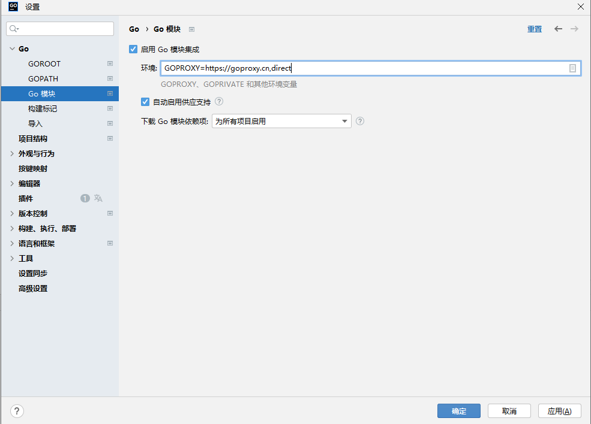

# 配置epel源

```shell
yum install -y epel-release
```

# 安装

```shell
yum install -y golang
```

# 查询

```shell
[root@rod ~]# go version
go version go1.19.10 linux/amd64
```

# linux代理

```shell
# 配置 GOPROXY 环境变量
export GOPROXY=https://goproxy.cn,direct
# 还可以设置不走 proxy 的私有仓库或组，多个用逗号相隔（可选）
export GOPRIVATE=git.mycompany.com,github.com/my/private
```

# windows代理

```shell
# 配置 GOPROXY 环境变量
$env:GOPROXY = "https://goproxy.cn,direct"
# 还可以设置不走 proxy 的私有仓库或组，多个用逗号相隔（可选）
$env:GOPRIVATE = "git.mycompany.com,github.com/my/private"
```

# Ide配置

```sh
GOPROXY=https://goproxy.cn,direct
```

