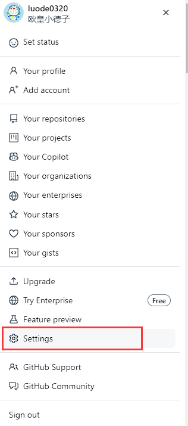
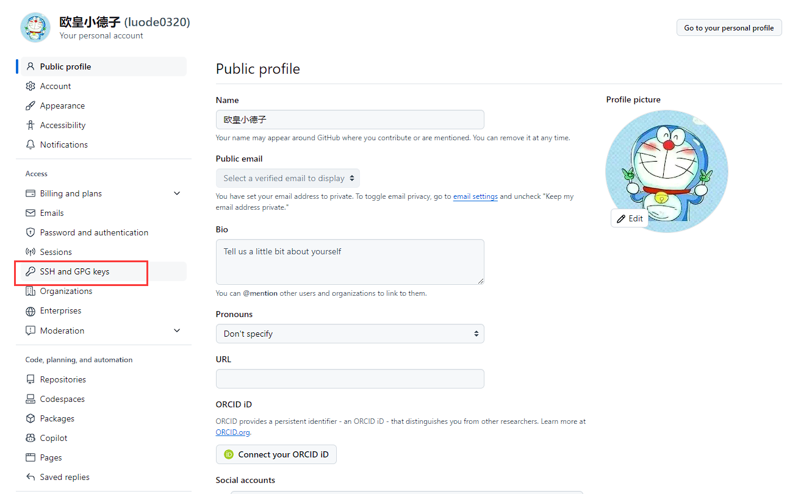
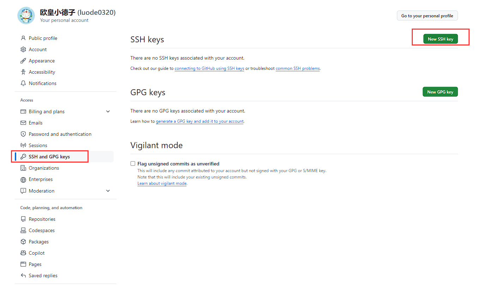
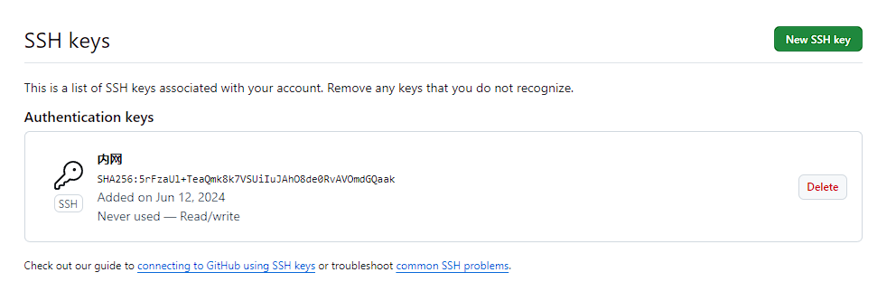

# 简介

> 有时候打包docker镜像的时候, 需要从GitHub仓库拉代码, 需要安装git

# yum安装

```sh
yum -y install git
```

# 拉取代码

```sh
# 克隆
git clone http://xxx

# 拉取
git pull http://xxx
```

# 创建SSH

```sh
# 看是否存在 id_rsa 和 id_rsa.pub文件，如果存在，说明已经有SSH Key
cd ~/.ssh
ls
```

```sh
# 不存在生成
ssh-keygen -t rsa -C "1846555387@qq.com"
```

```sh
# 看是否存在 id_rsa 和 id_rsa.pub文件，如果存在，说明已经有SSH Key
cd ~/.ssh
ls
```

```sh
# 获取公钥, 拷贝下来
cd ~/.ssh
cat id_rsa.pub
```

```sh
ssh-rsa AAAAB3NzaC1yc2EAAAADAQABAAABAQDGQMRZtV7rVYmBu+6FVuspvR5+n60ZM9BCrPk70Cxeolg7oZRNeWebcIZSnpH88bhjodtcLnIF+xI+Z0sCUOVUGY9g8qK1QwXsAIgMDdadXHCq5e00BIu7vB3sPJrxaWN2PS+UCqXWTmNT4nAzrkVnwv10WFB6/aP+UNy6aAChE9gas0wAAxbXnmkZKm3bbPeATVzktMKTjj7mXszWP+KKsg2u9JmZZpUuGY/41NuS+M8Gd8jtiUkXMUNu1Y7qH2CizqlzBuA6jM+zV7E6YakmB+3upuILiIOXf0WafaHmU/iJjLixKYHx0VEHT5j5VAHI+Jx7OFCsXl90SGef3qsd 1846555387@qq.com
```

# Github账号上添加公钥









# 验证是否设置成功

```sh
ssh -T git@github.com

The authenticity of host 'github.com (20.205.243.166)' can't be established.
ECDSA key fingerprint is SHA256:p2QAMXNIC1TJYWeIOttrVc98/R1BUFWu3/LiyKgUfQM.
ECDSA key fingerprint is MD5:7b:99:81:1e:4c:91:a5:0d:5a:2e:2e:80:13:3f:24:ca.
Are you sure you want to continue connecting (yes/no)? yes
Warning: Permanently added 'github.com,20.205.243.166' (ECDSA) to the list of known hosts.
Hi luode0320! You've successfully authenticated, but GitHub does not provide shell access.
```

