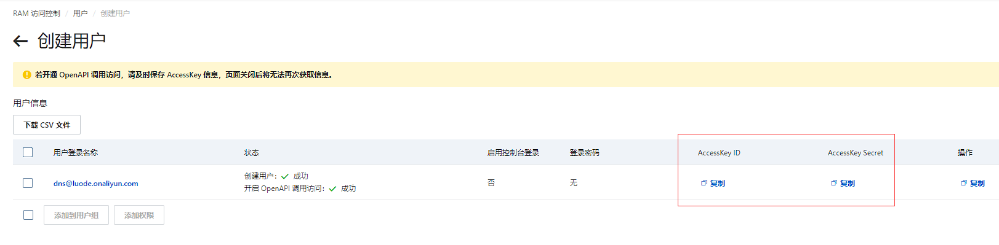

# 免费安装通用的ssl

适配所有域名, 不必去各大云服务商付费

# 简介

[acme.sh](https://github.com/acmesh-official/acme.sh) 是一个开源的 ACME 协议的客户端工具，用于自动化申请、更新和部署SSL/TLS 证书。

通过使用 acme.sh，用户可以轻松地在服务器上设置 HTTPS 加密连接，而无需手动操作。


# 安装 **acme.sh**

```sh
cd ~
curl https://get.acme.sh | sh -s email=1846555387@qq.com
```

- 把 acme.sh 安装到你的 **home** 目录下 `/root/.acme.sh`
- 自动为你创建 `cron job`, 每天 0:00 点自动检测所有的证书, 如果快过期了, 则会自动更新证书

```sh
# 启用别名
source ~/.bashrc
# 查看版本
acme.sh -v

# 开启自动更新脚本
acme.sh --upgrade --auto-upgrade
```


# 配置DNS API

> 我使用的阿里云的dns解析, 其他dns解析, 请自行百度配置


进入阿里云，在左侧栏搜索 “访问控制”，然后来到访问控制界面，如果没有开通，直接开通


然后在进入用户管理----创建用户-----勾选Openapi。


勾选用户, 点击添加权限, 补充dns权限


复制好出id和key, 等下要用, 阿里云这块就结束了



将刚刚的id和key, 临时配置到服务器

- 注意不同的云服务的key名称是不一样的
- 例如阿里的就是: Ali_Key和Ali_Secret

```sh
export Ali_Key="AccessKey"
export Ali_Secret="AccessKey Secret"
```

# 生成证书

```sh
acme.sh --issue --dns dns_ali -d *.luode.vip
```

```sh
[Thu May 16 23:01:46 CST 2024] Your cert is in: /root/.acme.sh/*.luode.vip_ecc/*.luode.vip.cer
[Thu May 16 23:01:46 CST 2024] Your cert key is in: /root/.acme.sh/*.luode.vip_ecc/*.luode.vip.key
[Thu May 16 23:01:46 CST 2024] The intermediate CA cert is in: /root/.acme.sh/*.luode.vip_ecc/ca.cer
[Thu May 16 23:01:46 CST 2024] And the full chain certs is there: /root/.acme.sh/*.luode.vip_ecc/fullchain.cer
```

到此位置, 证书就生成成功了


# 安装证书

脚本命令将证书安装拷到我们自动的nginx证书配置目录下，并重新加载 Nginx 配置

- 注意: 我这里只配了nginx, 不同的方式命令有所不同
- nginx这个证书的配置必须你自己在配置文件引用好
- 脚本只是覆盖这个路径的证书和重启nginx, 并不会修改nginx的任何配置

```sh
mkdir -p /usr/local/src/nginx/ssl

# 二进制nginx
acme.sh --installcert -d '*.luode.vip' \
--key-file /etc/nginx/ssl/luode.vip.key  \
--fullchain-file /etc/nginx/ssl/luode.vip.pem \
--reloadcmd "systemctl restart nginx"

# docker nginx
acme.sh --installcert -d '*.luode.vip' \
--key-file /usr/local/src/nginx/ssl/luode.vip.key  \
--fullchain-file /usr/local/src/nginx/ssl/luode.vip.pem \
--reloadcmd "docker restart nginx"
```

上面提到的申请和安装命令，执行过一次后，`acme.sh`便会记下你的操作，在证书即将到期前`cron job`会自动帮你执行一遍，非常的好用和贴心。


> 下面附nginx配置

nginx配置:

```conf
server {
    listen       80;
    server_name www.luode.vip;
	return 301 https://$host$request_uri;
    #error_page  404              /404.html;
    # redirect server error pages to the static page /50x.html
    #
    error_page   500 502 503 504  /50x.html;
    location = /50x.html {
        root   /usr/share/nginx/html;
    }

}

server {
    listen       443 ssl http2;
    listen       [::]:443 ssl http2;
    server_name  www.luode.vip;
    root         /usr/share/nginx/html;

    ssl_certificate "/etc/nginx/ssl/luode.vip.pem";
    ssl_certificate_key "/etc/nginx/ssl/luode.vip.key";
    ssl_session_cache shared:SSL:1m;
    ssl_session_timeout  10m;
    ssl_ciphers HIGH:!aNULL:!MD5;
    ssl_prefer_server_ciphers on;

    # 指定代理日志
    access_log /etc/nginx/www.log main;

    location / {

        root    /usr/share/nginx/html/public;
        index   index.html;

        proxy_pass http://localhost:12000;
        proxy_set_header Host $host;
        proxy_set_header X-Real-IP $remote_addr;
        proxy_cache my_cache;
        proxy_cache_revalidate on;
        proxy_cache_methods GET HEAD POST;
        proxy_cache_min_uses 3;
        proxy_cache_lock on;
        proxy_cache_use_stale error timeout http_500 http_502 http_503 http_504;

        proxy_next_upstream error timeout http_500 http_502 http_503 http_504;
        proxy_next_upstream_timeout 0;
        proxy_next_upstream_tries 1;
    }

    error_page 404 /404.html;
    location = /40x.html {
    }
}
```