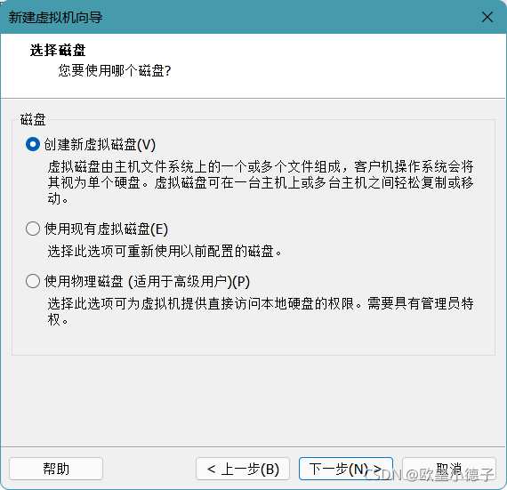
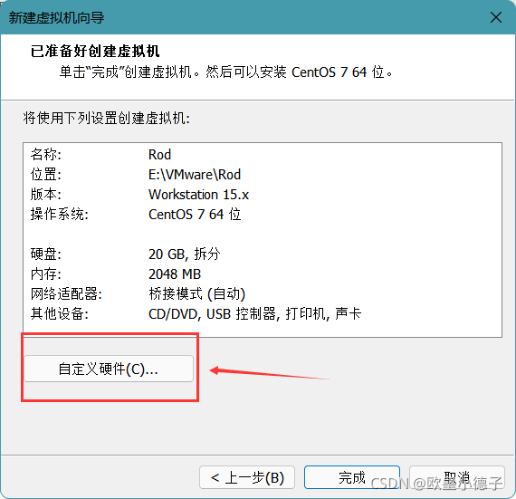
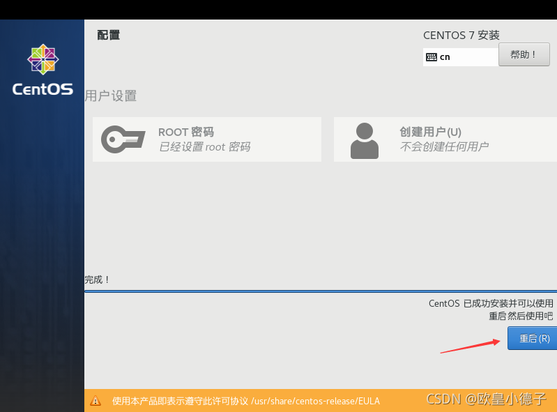

# 下载ISO文件
- 阿里云盘
- 链接：[https://www.aliyundrive.com/s/iMUgwXqR8oF](https://www.aliyundrive.com/s/iMUgwXqR8oF)
- 「CentOS-7-x86_64-DVD-2009.iso.EXE」(重命名去掉后缀EXE)

# 新建虚拟机
- 打开VMware选择 > 文件 > 新建虚拟机








# 安装Linux系统


- root密码过于简单需要按两次完成




# xshell连接
- ip addr => `192.168.9.25`


# 更新ip地址

```sh
# 查看ip所在网络
ip addr
ens32: <BROADCAST,MULTICAST,UP,LOWER_UP> mtu 1500 qdisc pfifo_fast state UP group default qlen 1000
    link/ether 00:0c:29:e5:1e:8f brd ff:ff:ff:ff:ff:ff
    inet 192.168.2.22/24 brd 192.168.2.255 scope global noprefixroute ens32
    valid_lft forever preferred_lft forever
    inet6 fe80::20c:29ff:fee5:1e8f/64 scope link
    valid_lft forever preferred_lft forever


# 修改文件ifcfg-ens32文件
cd /etc/sysconfig/network-scripts
vi ifcfg-ens32
TYPE=Ethernet
PROXY_METHOD=none
BROWSER_ONLY=no
BOOTPROTO=static
DEFROUTE=yes
#IPV4_FAILURE_FATAL=no
$IPV6INIT=yes
$IPV6_AUTOCONF=yes
$IPV6_DEFROUTE=yes
$IPV6_FAILURE_FATAL=no
$IPV6_ADDR_GEN_MODE=stable-privacy
NAME=ens32
DEVICE=ens32
ONBOOT=yes
IPV6_PRIVACY=no
IPADDR=192.168.3.3
NETWASK=255.255.255.0
GATEWAY=192.168.3.2
DNS1=114.114.114.114
DNS2=8.8.8.8

# 重启网络
service network restart
# 重启
reboot
```

# 更新vm配置

1. 配置网段


2. 配置网关


# 配置路由

根据前面NAT设置查看网络: vmnet8


右键属性, 点击ipv4


# 清理虚拟机磁盘

有时候虚拟机的磁盘已经清理了, 但是windwos的磁盘还是被占用, 需要清理

```sh
sudo /usr/bin/vmware-toolbox-cmd disk list
sudo /usr/bin/vmware-toolbox-cmd disk shrink /
```

