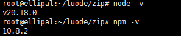

#### 一、下载二进制文件

网址：https://nodejs.org/zh-cn/download/prebuilt-binaries


#### 二、解压

- 拷贝到服务器


- 解压

```bash
cd /root/luode/zip
tar xf node-v20.18.0-linux-x64.tar.xz
```


#### 三、设置软连接

```bash
ln -s /root/luode/zip/node-v20.18.0-linux-x64/bin/npm   /usr/local/bin/ 
ln -s /root/luode/zip/node-v20.18.0-linux-x64/bin/node   /usr/local/bin/
```



#### 其他注意

查看网络问题:

```sh
npm config get registry
```

确保它指向的是正确的 NPM 镜像。通常，默认值是 `https://registry.npmjs.org/`，但如果你处于中国大陆地区，可以使用国内的镜像如：

```sh
# 阿里云
npm config set registry https://registry.npm.aliyun.com

# 默认
npm config set registry https://registry.npmjs.org

# 中国科技大学
npm config set registry https://mirrors.ustc.edu.cn/npm/
```

开启 npm 的调试模式:

```sh
npm install --verbose
```

清理 npm 缓存:

```sh
npm cache clean --force
```

尝试使用 Yarn:

```sh
npm install -g yarn
yarn install
```

使用 npx 执行 npm 安装:

```sh
npx npm install
```

检查代理设置:

```sh
npm config get proxy
npm config get https-proxy
# 更改代理,如果你有vpn, 设置vpn的端口
npm config set proxy http://127.0.0.1:7897
npm config set https-proxy http://127.0.0.1:7897
```

更新 npm:

```sh
npm install -g npm
npm install -g npm@latest
```

