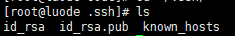
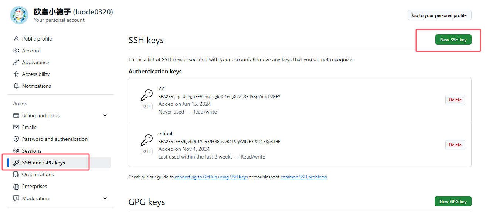

# ssh远程github

##### 第一步：检查本地主机是否已经存在ssh key

```sh
cd ~/.ssh
ls
```



如果存在，直接跳到第三步

##### 第二步：生成ssh key

如果不存在ssh key，使用如下命令生成

```sh
ssh-keygen -t rsa -C "1846555387@qq.com"
//执行后一直回车即可
```

##### 第三步：获取ssh key公钥内容（id_rsa.pub）

```sh
cd ~/.ssh
cat id_rsa.pub
```

复制该内容


##### 第四步：Github账号上添加公钥

进入Settings设置



##### 第五步：设置

设置你的git用户名及邮箱

```sh
git config --global user.name "luode"

git config --global user.email "1846555387@qq.com"
```


##### 第五步：验证是否设置成功

验证是否不需要输入密码

```sh
ssh -T git@github.com
```


# 错误问题

## dns域名映射问题(可能大)

手动设置dns

```sh
vi /etc/hosts
```

```sh
140.82.114.3 github.com
```

## 如果没成功, 需要输入密码, 使用带日志的命令, 查看日志

```sh
ssh -Tv git@github.com
# 连接日志
tail -f /var/log/secure
```

## 刷新ssh连接

```sh
ssh-keygen -R github.com
```

## 如果你使用了 SSH 代理（`ssh-agent`），可以通过以下命令检查代理中是否已添加密钥：

```sh
ssh-add -l
# 代理添加密钥
ssh-add /root/.ssh/id_rsa
```

## 防火墙问题

```sh
ping github.com

# 临时禁用防火墙测试是否是防火墙问题
systemctl status firewalld # 查看防火墙状态 
systemctl start firewalld  # 开启防火墙  
systemctl stop firewalld # 关闭防火墙 
```

## git是否使用了代理

```sh
git config --global --get http.proxy
git config --global --get https.proxy
git config --get http.proxy
git config --get https.proxy
echo $http_proxy
echo $https_proxy

# 取消代理
git config --global --unset http.proxy
git config --global --unset https.proxy
git config --unset http.proxy
git config --unset https.proxy
```

## 如果你的ssh版本很低, 看来会出很多问题, 需要百度解决, 或者升级ssh

```sh
[root@luode .ssh]# ssh -V
OpenSSH_7.4p1, OpenSSL 1.0.2k-fips  26 Jan 2017
```

## 