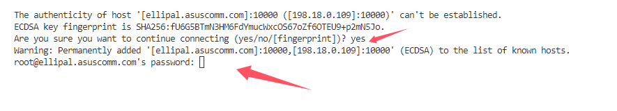
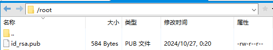

# 通过vscode远程开发

# 安装插件

**Remote - SSH**


# 选择远程（隧道/SSH）类别


# 在点进的config文件中输入以下内容

```config
# Read more about SSH config files: https://linux.die.net/man/5/ssh_config
Host 别名
    HostName <ip或者是域名>
    Port <端口>
    User <服务器用户名>
```

1. 这种方式连接的时候需要输入服务器的密码




- 选择服务器代码的目录(前提是服务器已经拉了代码了)


1. 免密登录

- 生成ssh使用的公钥/密钥对。（公钥给服务器用，秘钥给自己客户端用）

（1）直接使用终端在用户本机生成公钥和私钥

```sh
ssh-keygen -t rsa
```

（2）终端会出现以下提示，直接回车跳过


生成如下配置文件：


- **id_rsa**: 私钥, 我们自己使用
- **id_rsa.pub**: 公钥，服务器使用
- **config**: 远程配置, 就是前面配置的文件

(3) 将公钥拷贝到服务器上

```sh
 # 创建目录
 mkdir -p ~/.ssh
 # 进入目录
 cd ~/.ssh
 # 创建 authorized_keys 文件
 touch authorized_keys
```

(4) 把公钥文件id_rsa.pub拷贝到需要登录的服务器上（存储路径可以随意）



（5）将公钥id_rsa.pub填充到authorized_keys尾部(其实就是写进去)

```sh
cat /root/id_rsa.pub >> ~/.ssh/authorized_keys
```

（6）配置 SSH 客户端


配置私钥(刚刚生成的id_rsa):

```config
# Read more about SSH config files: https://linux.die.net/man/5/ssh_config
Host 别名
    HostName <ip或者是域名>
    Port <端口>
    User <服务器用户名>
    IdentityFile C:\Users\Administrator/.ssh/id_rsa
```

直接连接即可不用输入密码:

