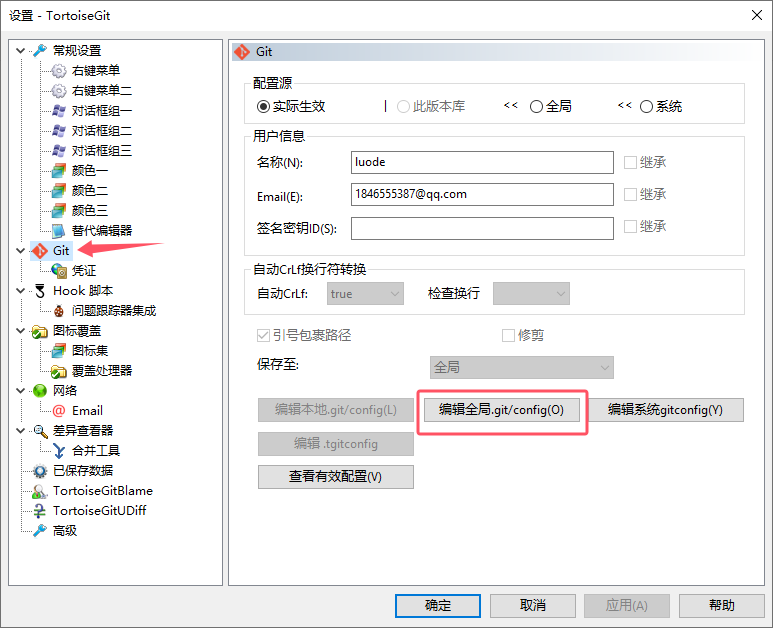
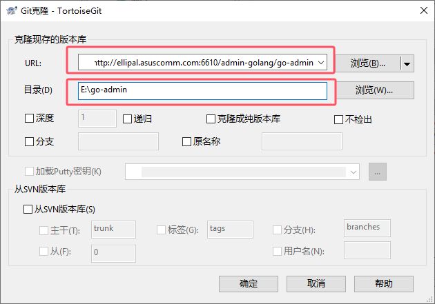
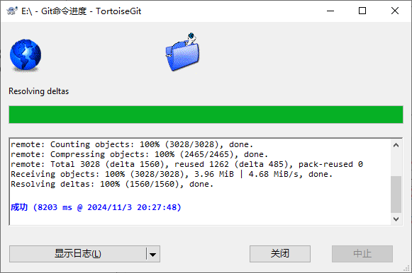

<!--
 * @Author: luode 1846555387@qq.com
 * @Date: 2024-11-03 18:16:32
 * @LastEditors: luode 1846555387@qq.com
 * @LastEditTime: 2024-11-09 18:08:38
 * @FilePath: \blog\data\6.服务器\3.部署基础软件\9、安装Git小乌龟.md
 * @Description: 这是默认设置,请设置`customMade`, 打开koroFileHeader查看配置 进行设置: https://github.com/OBKoro1/koro1FileHeader/wiki/%E9%85%8D%E7%BD%AE
-->
# 下载

[蓝奏云](https://www.ilanzou.com/s/rBIyHrQN)

[官网](https://tortoisegit.org/download/)


# 配置git名称

右键设置:




# 克隆项目

邮件Git克隆:






# 使用 SSHFS 挂载远程文件系统

这不是一个纯 Git 可视化工具，但你可以使用 SSHFS 将远程文件系统挂载到本地，然后使用任何本地的 Git 客户端来操作这些文件。

**安装 SSHFS**

```sh
# 基于centos
yum -y install epel-release
yum -y install sshfs

# 基于 Debian/Ubuntu 的系统
#sudo apt-get install sshfs     
```

**创建SSHFS挂载目录**

```sh
mkdir /usr/local/src/luode
```

**挂载**

当你已经创建你的挂载点目录之后，现在使用 root 用户运行下面的命令行

在 /usr/local/src/luode 目录下挂载远程的文件系统。视你的情况挂载目录可以是任何目录。

下面的命令行将会在本地的 /mnt/tecmint 目录下挂载一个叫远程的一个 /home/tecmint 目录。（不要忘了使用你的 IP 地址和挂载点替换 x.x.x.x）。