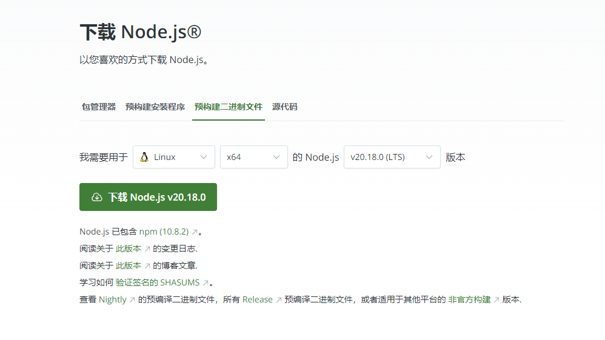
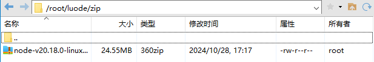
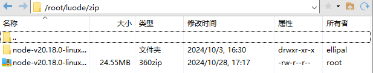
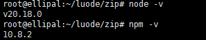

#### 一、下载二进制文件

网址：https://nodejs.org/zh-cn/download/prebuilt-binaries



#### 二、解压

- 拷贝到服务器



- 解压

```bash
cd /root/luode/zip
tar xf node-v20.18.0-linux-x64.tar.xz
```



#### 三、设置软连接

```bash
ln -s /root/luode/zip/node-v20.18.0-linux-x64/bin/npm   /usr/local/bin/ 
ln -s /root/luode/zip/node-v20.18.0-linux-x64/bin/node   /usr/local/bin/
```

