 

 

 **数据可信链网络脚本手册**

 

 

 

| 文档编号     | XH_DTCM_DD_1.0.0 |
| ------------ | ---------------- |
| 编   制      | 罗德             |
| 审   核      |                  |
| 最后更新日期 | 2023-06-08       |

 

 

 

 

广州新赫信息科技有限公司

二零二三年六月

修订记录

| ***\*版本号\**** | ***\*修订说明\****       | ***\*修订\*******\*人\**** | ***\*修订\*******\*日期\**** |
| ---------------- | ------------------------ | -------------------------- | ---------------------------- |
| V1.0.0           | 创建                     | 罗德                       | 2023-06-08                   |
| V1.0.1           | 补充动态更新通道peer组织 | 罗德                       | 2023-06-20                   |
| V1.0.2           | 证书脚本更新             | 罗德                       | 2023-09-01                   |
|                  |                          |                            |                              |
|                  |                          |                            |                              |
|                  |                          |                            |                              |
|                  |                          |                            |                              |
|                  |                          |                            |                              |

 

 

 

 

 

 

 

 

 

 

 

 

 

 

 

 

 

 

 

 

 

 

 

 

 

 

 

***\*目录\****

[第一章 操作ca证书脚本	](#_Toc1737666524 )

[1.1.1. 配置身份	](#_Toc1098867864 )

[1.1.2. 执行脚本	](#_Toc1620900755 )

[第二章 操作节点脚本	](#_Toc1871438803 )

[2.1. start启动	](#_Toc1649467896 )

[2.2. stop停止	](#_Toc494936268 )

[2.3. restart重启	](#_Toc1183743349 )

[2.4. list查询	](#_Toc608516042 )

[2.5. log日志	](#_Toc446393376 )

[2.6. open打开节点工具	](#_Toc1503812359 )

[2.7. resetting重置	](#_Toc1771618182 )

[第三章 操作通道脚本	](#_Toc612647802 )

[3.1. init初始化	](#_Toc972551285 )

[3.2. join加入通道	](#_Toc586227780 )

[3.3. list查询加入通道的节点	](#_Toc29425535 )

[3.4. json获取最新通道json	](#_Toc233621236 )

[3.5. addorg动态添加peer组织	](#_Toc990667264 )

[3.6. 更新通道配置	](#_Toc259827857 )

[3.7. sign 对更新配置签名	](#_Toc1745214345 )

[3.8. update 更新签名配置	](#_Toc197374641 )

[第四章 操作链码脚本	](#_Toc695890264 )

[4.1. install安装/升级	](#_Toc526551441 )

[4.2. commit提交	](#_Toc297968106 )

[4.3. query查询链码记录	](#_Toc978721515 )

[4.4. invoke调用链码	](#_Toc1647926243 )

[4.5. info链码信息	](#_Toc1695013260 )

 

 

**
**

 

init_ca.sh: 操作ca证书脚本

node.sh: 操作节点脚本

channel.sh: 操作通道脚本

chaincode.sh: 操作链码脚本

 

# 第一章 **操作ca证书脚本**

### 一.1.1. **配置身份**

编辑init_ca.sh脚本

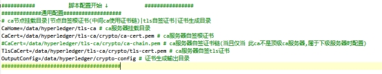 

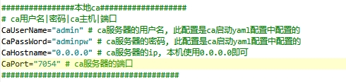 

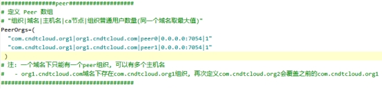 

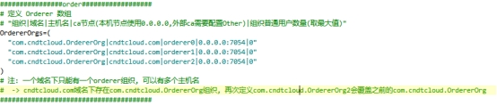 

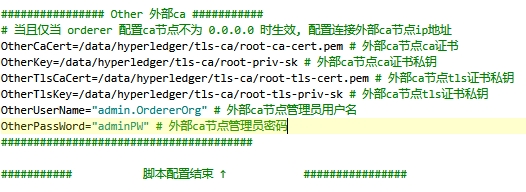 

### 一.1.2. **执行脚本**

./init_ca.sh

 

\# 无报错输出目录树

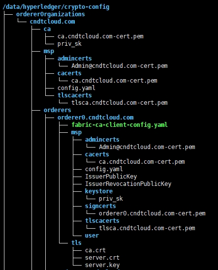 

# 第二章 **操作节点脚本**

 

***\*node.sh\****

 

## 二.1. **帮助(常用)**

./node.sh

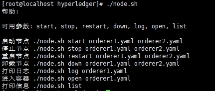 

## 二.2. **start启动(常用)**

 

\# start启动指定节点, 多个用空格分开

./node.sh start orderer0.yaml orderer1.yaml orderer2.yaml

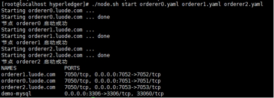 

\# start启动节点, 启动脚本目录下所有docker容器yaml配置

./node.sh start

 

 

 

 

 

 

 

## 二.3. **stop****停止(常用)**

\# stop停止指定节点, 多个用空格分开

./node.sh stop orderer0.yaml orderer1.yaml

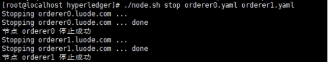 

\# stop停止节点, 停止脚本目录下所有docker容器yaml配置

./node.sh stop

 

## 二.4. **restart****重启(常用)**

\# restart重启指定节点, 多个用空格分开

./node.sh restart orderer0.yaml orderer1.yaml

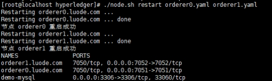 

 

## 二.5. **list****查询(常用)**

\# list查询所有启动的节点

./node.sh list

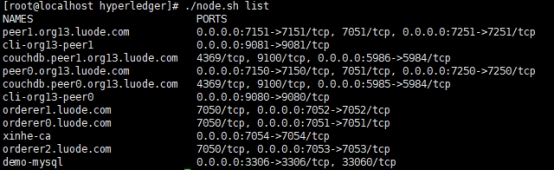 

 

 

 

 

## 二.6. **log****日志(常用)**

 

\# log查询指定节点日志

./node.sh log orderer0.yaml

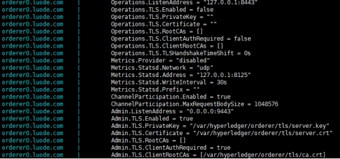 

 

## 二.7. **open打开节点工具**

\# 先使用 ./node.sh list 命令查询可用的cli容器

./node.sh list

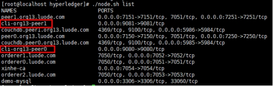 

\# open打开cli客户端容器, 选择操作cli工具客户端

./node.sh open cli-org13-peer0

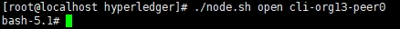 

 

 

## 二.8. **resetting重置**

\# 重置区块链网络, 重置读取区块网络, 包括容器、通道、链码

\# 无法挽救时使用

./node.sh resetting

 

# 第三章 **操作通道脚本**

***\*脚本:\**** ***\*channel.sh\****

***\*两种操作方式:\**** 

**1.** ***\*cicd一键部署通道\****

**2.** ***\*安装顺序执行init初始化、join加入通道\****

 

 

 

## 三.1. **通道配置文件**

\# 操作通道前, 手动修改通道配置文件configtx.yaml, 对域名等进行全局替换

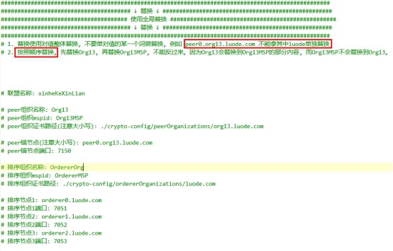 

 

 

 

 

 

 

 

 

 

 

 

## 三.2. **帮助**

./channel.sh

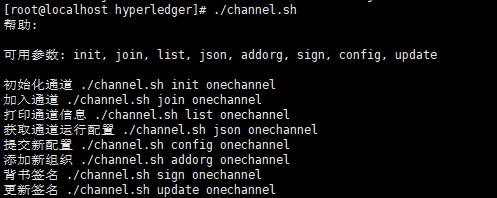 

## 三.3. **一键部署通道(常用)**

\# 每个peer节点都会有一个cli客户端操作工具

\# 1. 配置cli客户端与peer节点的容器名称

\# 2. 配置任意一个cli客户端与orderer节点的容器名称

\# 3. 配置通道名称即可一键部署新通道

 

\# 编辑脚本channel.sh

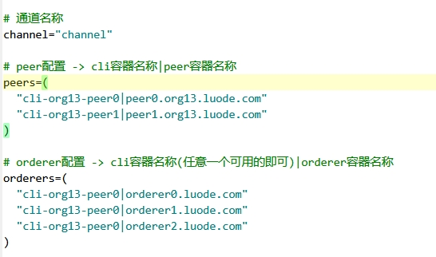 

 

./channel.sh cicd

 

\# 执行完成会打印加入通道的peer节点

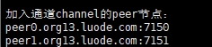 

 

 

 

 

 

 

 

 

 

 

 

 

 

 

## 三.4. **init****初始化**

\# 初始化前, 手动修改通道配置文件configtx.yaml, 对域名等信息进行全局替换

 

 

 

\# init初始化通道, onechannel:通道名称

./channel.sh init onechannel

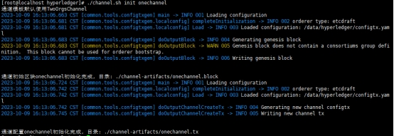 

 

## 三.5. **join****加入通道**

\# join加入通道, onechannel:通道名称

./channel.sh join onechannel

 

***\*示例:\****

\# 每一个cli代表一个peer节点, 选择一个cli执行后续脚本

\# 选择加入的节点, peer节点只能再对应的cli中加入

\# orderer节点可以选择任意一个cli执行加入, 只需要加入一次即可

\# 示例选择org13-peer0的cli工具, 将peer0加入通道, 并且将3个排序节点加入

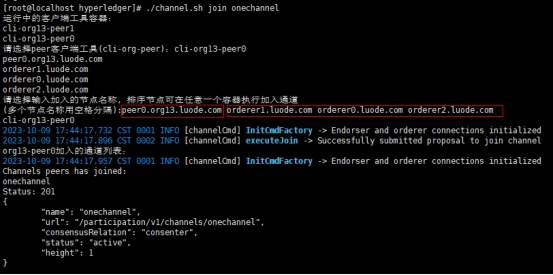 

\# 加入成功打印日志, peer 和 orderer会分别打印

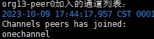 

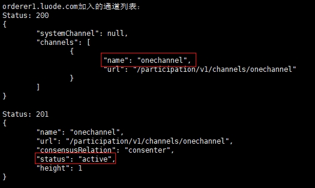 

 

 

\# 继续重复执行加入其他节点, 选择剩余未执行的peer节点cli工具容器

\# 示例选择将org13-peer1的cli工具, 将peer1加入通道, 排序节点加过一次就不需要重复加了

./channel.sh join onechannel

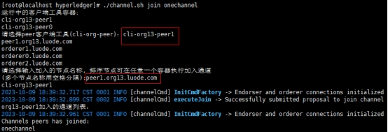 

***\*重复以上步骤执行所有需要加入的peer节点\****

 

 

## 三.6. **list查询通道****信息**

 

\# onechannel通道名称

./channel.sh list onechannel

 

***\*示例:\****

\# 选择一个加入了此通道的客户端cli工具, 查询通道信息

\# 可以看到有2个peer节点加入了通道

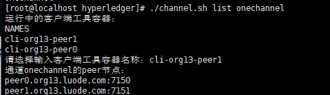 

 

 

 

 

 

 

 

 

## 三.7. **json获取最新通道****配置**

\# 获取通道最新通道json、block文件

\# 获取json的作用:

\# 1. 为了查询通道运行的配置信息

\# 2. 动态更新通道配置需要使用

./channel.sh json onechannel

 

\# 随便选取一个加入了此通道的cli工具类, 不同节点的通道配置都是相同的

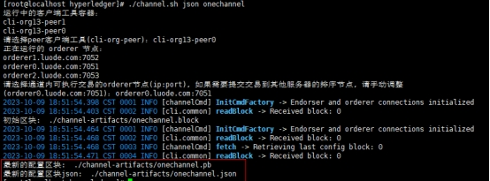 

## 三.8. **sign 对更新配置签名**

\# 此命令再addorg添加组织时用到,其他地方暂无使用

./channel.sh sign mychannel ./channel-artifacts/mychannel-addorg-Org16.json

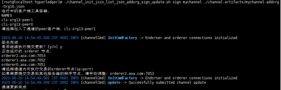 

## 三.9. **update 更新签名配置**

\# 此命令再addorg添加组织时用到, 其他地方暂无使用

./channel.sh update mychannel ./channel-artifacts/mychannel-addorg-Org16.json

 

 

 

 

 

 

 

## 三.10. **addorg动态添加peer组织**

\# 这个脚本的目的是在一个已经运行的通道中, 动态加入新的组织和节点

\# 需要完成动态添加新组织, 必需要对区块链网络有足够的熟悉

\# 这块的步骤目前的部署情况会相当的繁琐

\# 一共有6个步骤

 

### 三.10.1. **获取通道最新通道json、block文件**

./channel.sh json mychannel

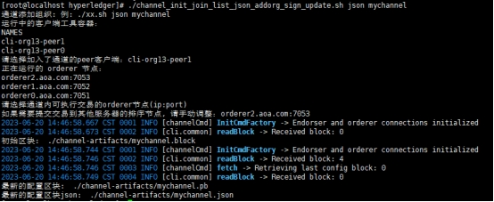 

 

### 三.10.2. **拷贝****最新通道json、block文件到****要****添加组织的服务器**

\# 如果新加的组织在同一个服务器就不需要拷贝

scp ./channel-artifacts/mychannel.block root@192.168.1.16:/data/hyperledger/channel-artifacts/mychannel.block

 

scp ./channel-artifacts/mychannel.json root@192.168.1.16:/data/hyperledger/channel-artifacts/mychannel.json

 

### 三.10.3. **configtx.yaml配置通道组织信息**

\# 需要添加一个Org16的新组织

\# 在yaml中配置新组织, 这个和创建通道的配置一样的

\# 只需要按照创建新通道初始化的流程来配置这个新的yaml就行

\# 我们只会用这个yaml配置来更新, 并不会新建一个通道

\# 以下参考, 请不要粘贴修改, 请按照通道初始化的流程全局替换: 

 

  \- &Org

​    Name: Org16

​    ID: Org16MSP

​    MSPDir: ./crypto-config/peerOrganizations/org16.bob.com/msp

​    Policies:

​      Readers:

​        Type: Signature

​        Rule: "OR('Org16MSP.member')"

​      Writers:

​        Type: Signature

​        Rule: "OR('Org16MSP.member')"

​      Admins:

​        Type: Signature

​        Rule: "OR('Org16MSP.admin')"

​      Endorsement:

​        Type: Signature

​        Rule: "OR('Org16MSP.peer')"

​    AnchorPeers:

​      \-  Host: peer0.org16.bob.com

​        Port: 7150    

 

 

 

 

 

### 三.10.4. **在新组织服务器执行addorg**

\# 在次之前请检查, 通道运行时的json文件已经拷贝到正确的位置

\# 通道配置文件configtx.yaml已经按照新组织配置完成

 

./channel.sh addorg mychannel

\# 这里添加一个组织Org16

\# 这里会自动执行7个子步骤, 执行完成会输出一个合并后的json配置文件

\# 此json文件需要一个已经加入了通道的节点执行背书、更新最新配置

\# 当前的节点是不可以执行的

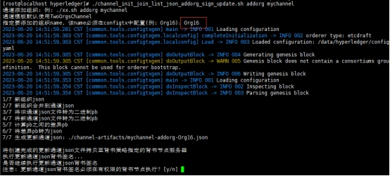 

 

 

 

 

 

 

 

 

 

 

 

 

 

 

 

### 三.10.5. **addorg生成的更新json拷贝到有通道权限的背书节点**

\# 如果是一台服务器, 就不需要拷贝, 输入y继续执行背书验证即可

\# 如果此服务器上没有任何节点加入过这个通道, 则需要拷走

scp ./channel-artifacts/mychannel-addorg-Org16.json root@192.168.1.13:/data/hyperledger/channel-artifacts/mychannel-addorg-Org16.json 

 

### 三.10.6. **执行背书验证**

./channel.sh sign mychannel ./channel-artifacts/mychannel-addorg-Org16.json

 

\# 选择加入了通道的cli客户端工具, 完成背书签名

\# 签名完成可立即选择继续提交更新, 完成组织添加

 

\# 至此, 新组织已经添加完成, 可以将此组织的节点加入通道了

### 三.10.7. **将新组织的peer节点加入通道**

./channel.sh join mychannel 

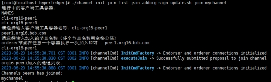 

 

 

## 三.11. **update** **更新****运行时****通道配置**

 

\# 这个脚本的目的是在一个已经运行的通道中, 动态更新一些通道配置

\# 如打包时间、超时时间、打包策略等。

\# 不支持新增节点的配置, 只支持现有的节点、通道修改配置

\# 需要完成动态更新通道配置, 必需要对区块链网络有足够的熟悉

 

### 三.11.1. **获取通道最新通道json、block文件**

\# 这里使用muchannel1通道测试

./channel.sh json mychannel1

 

\# 生成最新的通道运行时mychannel1.json配置

\# 后面只要修改这个配置, 再更新上去就可以了

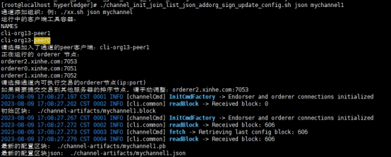 

 

 

 

 

 

 

 

 

 

 

 

 

 

 

### 三.11.2. **打开通道配置json文件, 修改通道配置**

\# 修改channel-artifacts/mychannel1.json

\# 这里以修改通道打包策略为例

\# 将打包超时时间设置为1s, 1s内打包交易数量不限制大小

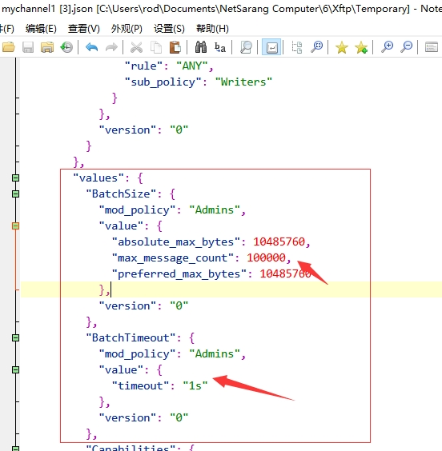 

 

 

 

 

 

 

 

### 三.11.3. **提交配置**

./channel.sh config mychannel1

\# 此命令会将json配置提交到通道的排序节点参与共识

\# 需要输入排序组织的msp, 选择一个加入了通道的cli客户端工具

\# 选择orderer排序节点(ip:端口)

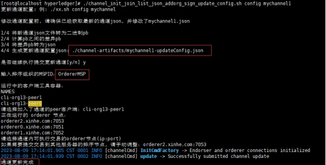 

\# 完成更新

 

 

 

 

 

 

 

 

 

 

 

 

 

 

 

 

 

 

 

 

 

 

 

 

 

# 第四章 **操作链码脚本**

 

***\*脚本:\**** ***\*chaincode.sh\****

***\*此脚本是用于安装内部链码使用, 安装外部链码无效\****

***\*(最新部署方式会使用外部链码)\****

 

## 四.1. **帮助**

./chaincode.sh

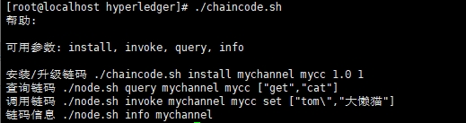 

 

## 四.2. **install****安装/升级(常用)**

\# onechannel: 通道名称, onecc:链码名称 1.0:版本 1:版本号

\# 默认版本1.0和版本号1, 升级一个存在的链码时, 需要指定版本和版本号

\# 注: 版本号全局唯一, 每升级一次应该手动递增+1

\# ./chaincode.sh install onechannel onecc 1.0 2

./chaincode.sh install onechannel onecc 1.0 1

 

***\*示例:\****

\# 选择一个cli工具, 每个工具代表要安装链码的peer节点

\# 此cli工具代表的peer节点必须已经加入了该通道才可以安装链码

\# 示例选择org13-peer0的cli工具

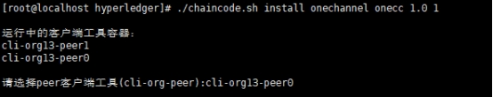 

\# 选择一个加入通道的排序节点

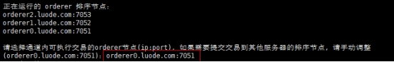 

\# 等待打包、安装、批准、提交、初始化、查询初始记录

\# 初始记录输出: 我是初始记录。说明链码安装完成, 初始记录已上链

 

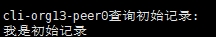 

 

 

 

 

 

 

## 四.3. **query查询链码记录**

\# query查询链码记录

\# onechannel:通道名称; onecc:链码名称; 

\# [\"get\",\"cat\"]: 链码参数; get: 链码方法; cat: 数据key

./chaincode.sh query onechannel onecc [\"get\",\"cat\"]

 

***\*示例:\****

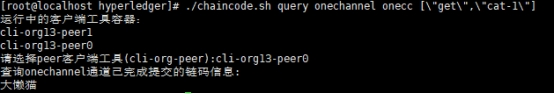 

 

## 四.4. **invoke****调用链码**

\# invoke调用链码, 执行链码方法, 添加一条测试记录

\# set: 链码方法名称

\# [\"tom\",\"小懒猫\"]: [key,value]

./chaincode.sh invoke onechannel onecc set [\"tom\",\"小懒猫\"]

***\*示例:\**** 

\# 注意: 记录id是唯一的, 不可重复, 默认存在一条cat-1不可再存

\# 选择cli客户端工具, 选择排序节点

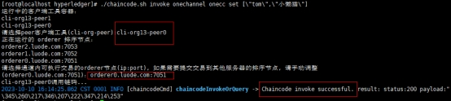 

\# 查询上链记录

./chaincode.sh query onechannel onecc [\"get\",\"tom\"]

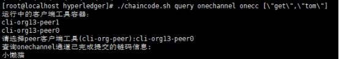 

 

 

 

 

 

 

 

## 四.5. **info****链码信息**

\# info链码信息, 查看链码版本等信息

./chaincode.sh info onechannel

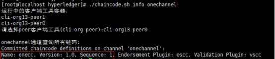 

 

#  